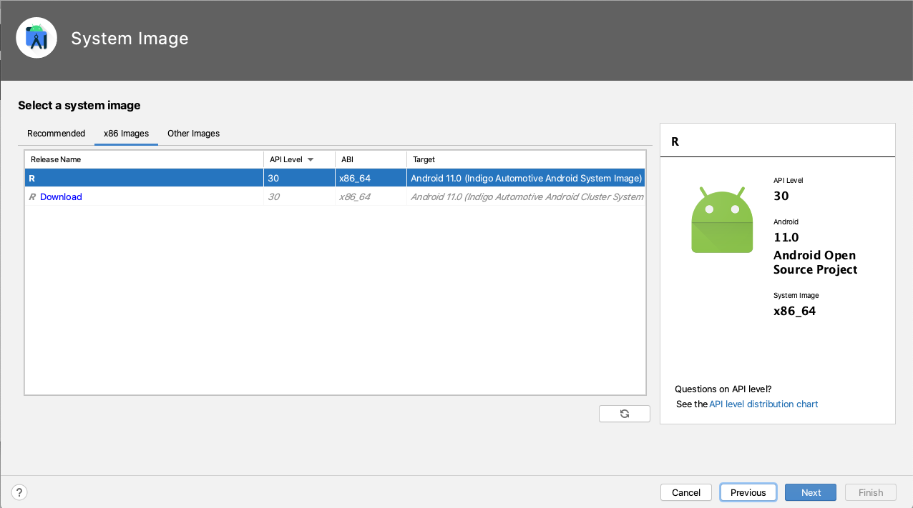
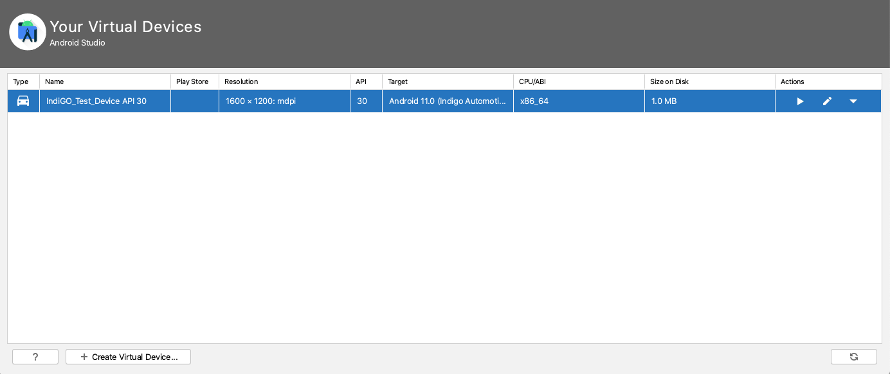
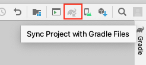

# IndiGO SDK getting started guide

This is a step-by-step guide on how to compile and run the IndiGO example application.

First you will need to install Android Studio using OpenJDK 11, get
TomTom Maps API keys and get access to our SDK downloads. Then you will be able to
compile and run your first IndiGO application.

## Install OpenJDK 11

The IndiGO SDK requires OpenJDK 11; other versions may work but are not supported. 

### Install OpenJDK for MAC

[AdoptOpenJDK](https://adoptopenjdk.net/) Java version 11, can easily be installed on MAC 
using Homebrew:

```bash
$ brew tap AdoptOpenJDK/openjdk
$ brew install --cask adoptopenjdk11
```

Other alternatives of the OpenJDK, instead of the AdoptOpenJDK release, can also be used 
(but it should be Java version 11).

### Install OpenJDK for Ubuntu

To install it, run the following command in a terminal:

```bash
$ sudo apt install openjdk-11-jdk
```

You might already have other versions of JDK installed. Verify this by running:

```bash
$ sudo update-java-alternatives -l
java-1.11.0-openjdk-amd64      1111       /usr/lib/jvm/java-1.11.0-openjdk-amd64
```

If you see the output above, then you only have OpenJDK and you are all set. If you see multiple
Java versions in the output, you need to make sure you have the correct one set as the default:

```bash
$ sudo update-java-alternatives -s java-1.11.0-openjdk-amd64
```

Then you can verify that the correct Java version is in use by running:

```bash
$ java --version
openjdk 11.0.11 2021-04-20
OpenJDK Runtime Environment (build 11.0.11+9-Ubuntu-0ubuntu2.20.04)
OpenJDK 64-Bit Server VM (build 11.0.11+9-Ubuntu-0ubuntu2.20.04, mixed mode, sharing)
```

As you can see above, OpenJDK 11 is in use.

## Install Android Studio

To install the Android Studio IDE, follow the instructions from the 
[official Android guide](https://developer.android.com/studio/install). 
Note that you need Android Studio minimum version 4.2.x for Java 11 to work correctly.

## Download and decompress IndiGO SDK

Download the latest version of the IndiGO SDK from 
[Nexus](https://repo.tomtom.com/#browse/browse:ivi:com%2Ftomtom%2Findigo%2Ftomtom-indigo-sdk).

Unzip the file (`tomtom-indigo-sdk-<versions>.tar.gz`) and you will find the example 
app source code inside it. Then follow the following instructions to setup an
environment in which to run IndiGO.

## Running IndiGO

IndiGO can run on Android emulators (AVDs) in addition to the reference / demo
hardware (Samsung Galaxy Tab S5e). A special Android emulator configuration has
been created for running IndiGO. This configuration contains a number of
customizations to the emulator hardware and the Android platform on which it
runs. This emulator can be used for development on top of IndiGO and runs
x86_64 AOSP with Android 11 Automotive. Note that the IndiGO platform will run 
on a standard Android device, with an IndiGO-supported CPU architecture. But it 
is implemented for the Android Automotive variant, thus some features may not work 
on a standard device.

The following sections describe how to download the correct Android emulator
configuration.

### Installing the IndiGO emulator

In Android Studio, go to `Tools -> SDK Manager -> SDK Update Sites` and add a
new entry with the following name and URL:

> Name: `TomTom IndiGO Update Site - Android 11 Emulators`
>
> URL: `https://repo.tomtom.com/repository/ivi/com/tomtom/ivi/ivi-automotive-sdk/aaos-system-images/center-display/12/center-display-12.xml`

Tick `Use Authentication`, enter your TomTom Nexus credentials and click `OK`.

Switch to the `SDK platforms` tab, tick `Show Package Details` on the bottom
right. Then locate the
`Indigo Automotive Android System Image Intel x86 Atom_64 System Image` item in
the list. You may need to expand the Android 11 section to see the right item.


Select the system image and start downloading it.

When the download has completed, a new emulator can be created.

To do this, close the SDK Manager and open the AVD Manager (Android Virtual Device Manager) in 
Android Studio. Click `Create Virtual Device`. 


You should now be presented with a list of different Android devices that the emulator can emulate. 

Firstly, the correct emulator device needs to be configured to be an automotive device as, by default, Android devices are 
categorized as phones or tablets.

In the `Tablet` category, look for an item called `IndiGO_Test_Device`.


Select `IndiGO_Test_Device` and click `Edit Device` to change the device type. In the `Configure Hardware Profile` dialog, 
change the `Device Type` from "Phone/Tablet" to "Android Automotive". Set the emulator's RAM to 3072MB, then click `Finish`. 


The hardware profile of the emulator that will be created should now be configured to be an automotive device.

Back on the `Select Hardware` dialog box, there should now be an item called `IndiGO_Test_Device` in the `Automotive` category.


Select this device and choose `Next` to continue creating the AVD.

Select `Android R` (API level 30) as the System Image, downloading it first if necessary (by clicking "Download" next to 
the Release Name). 



Click `Next` and then `Finish` to finish creating the emulator.

You should now see a new emulator device listed in the AVD Manager. 



This emulator can be started in the standard way by clicking the triangular `play` icon on the right.

## Installing the example application on a custom device

Some features of the IndiGO example application require system permissions. For instance, you won't be 
able to play music using Spotify nor use HVAC features. If you want to install the example app on a different 
emulator or device, you need to make sure that it is signed with the corresponding platform key.

The Indigo platform debug key and password files (used for the pre-created tablet and emulator images) 
are in the `keystore` directory in the example source. Drop in your own platform keys replacing the existing 
ones in that directory, rebuild and deploy.

## Get API Keys

You should have received API keys from TomTom. Those should be used in the
example app for navigation related features to work.

[TODO(IVI-3759)]: # (How to use the API keys inside the example app?)

## Compiling the IndiGO example app

The IndiGO example app can be built using Android Studio. 

Open the project by going to `File -> Open` and then selecting the `build.gradle.kts` file in the folder that
you unzipped the source code to.

Gradle Sync should start running automatically and Android Studio will configure the project and download its dependencies. 
If it does not, start it manually by clicking on the Gradle Sync icon. This step may take a few minutes.



Now you can browse the source code in the IDE.

Build and run the application by clicking the green `play` icon. Ensure that the device that the application will run on
is the IndiGO automotive emulator that was created earlier in this tutorial.

