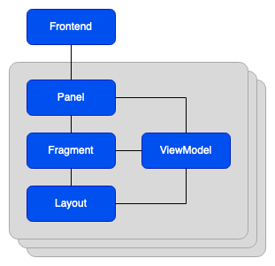

# How to create a frontend plug-in

## Introduction

Frontend plug-ins are the User Interface (UI) modules of the IndiGO platform. They are independent modules and can be included independently in the IndiGO platform at build time. As the platform is deployed as one APK, the frontend plug-ins all run in the UI thread. Frontend plug-ins are typically kept free of business logic, which is instead implemented in a service plug-in (which also run in separate threads from each other - see the service plug-in documentation). IndiGO comes with a number of default frontends and corresponding service plug-ins, for example; the media player, the phone application, etc.

Each frontend is registered with the frontend framework at runtime, by supplying a set of metadata which describes the frontend characteristics. Each metadata contains details such as:

- An identifier to uniquely identify the metadata.
- A `FrontendBuilder` factory which can be used by the framework to create the `Frontend` instance.
- Whether the `Frontend` should start at start-up (the default) or gets started on demand. 
- Optionally, a menu item can be added to the main menu to open the `Frontend`'s main task panel.

Each frontend can have one or more panels associated with it. A `Panel` is not bound to a specific `Context`. It encapsulates the `Fragment` displaying the UI.




## Creating a new frontend

In this example, we will create a new frontend for managing an account on the device. It will provide a login screen where you can enter a username and a password to login, and if the user is logged in, you have the option to logout again.

Creating a frontend consists of a number of steps:

- [Create the `Frontend` class, deriving the abstract `Frontend` class (see API doc).](#creating-the-frontend-class)
- [Create the `FrontendBuilder` class (see API doc).](#creating-the-frontendbuilder-class)
- [Create the `Panel` class, and a `Fragment` to display the content on the screen.](#creating-the-panel)
- [Define and register the metadata.](#defining-the-metadata)

### Creating the frontend class

Create a new frontend by deriving the `Frontend` framework class.

```kotlin
import com.tomtom.ivi.api.framework.frontend.Frontend
import com.tomtom.ivi.api.framework.frontend.FrontendContext

class AccountFrontend(frontendContext: FrontendContext) : Frontend(frontendContext) {
    // ...
}
```

There are no abstract methods in the `Frontend` class, but some methods, like the lifecycle ones, are good to consider implementing.

#### Frontend lifecycle methods

- `onCreate` - callback when the frontend is created.
- `onDestroy` - callback when the frontend is about to get destroyed.

#### Showing panels on the screen

There are two callbacks for when an event is triggered to show a `TaskPanel` on the screen.

- `createMainTaskPanel` - overridde to display a single `TaskPanel` when the UI is shown. 
- `openTaskPanels` - overridde when more control is needed over which panels should be shown.

The first one (``createMainTaskPanel``) should be overridden if a frontend only wants to display a single `TaskPanel` at a time when the UI is shown. The second one (`openTaskPanels`) should be overridden if more flexibility is needed in deciding what panels should be opened.
**Note:** that only one method should be overridden at a time, as only one of them will be called. The order is not guaranteed for future platform versions.

### Creating the FrontendBuilder class

Add a `AccountFrontendBuilder` class, derived from `FrontendBuilder` class. Override the `build()` method in the class and return an instance of the `AccountFrontend` class.

```kotlin
...
import com.tomtom.ivi.api.framework.frontend.FrontendBuilder

class AccountFrontendBuilder() {

    override fun build(frontendContext: FrontendContext) =
        AccountFrontend(frontendContext)
}
```

### Creating the panel

There are a number of specialised `Panel` classes that can be used in the platform (see `Panel` API documentation). For this example we will create a `Panel` class inheriting from the `TaskPanel` class.

A `TaskPanel` is typically launched by tapping one of the menu buttons, like opening Contacts; or some other UI event, like opening the Climate panel. It encapsulates a task that the user may perform, typically away from the map, going back to the map when the task is finished.

Derive from the `TaskPanel` class, and override the `createInitialFragmentInitializer()` method, which should return an instance of the `Fragment` class (described further down).

```kotlin
class AccountLoginPanel(frontendContext: FrontendContext)
    : TaskPanel(frontendContext, Mode.SIDE_BAR) {
{
    override fun createInitialFragmentInitializer() =
        IviFragment.Initializer(AccountLoginFragment(), this)
}
```

Also create a `ViewModel` class, derived from the `FrontendViewModel` class. The `ViewModel` is the ViewModel in the Model-View-ViewModel (MVVM) pattern, which role is to expose streams of data relevant to the view and streams of events to the model.

```kotlin
class AccountLoginViewModel(panel: AccountLoginPanel)
    : FrontendViewModel<AccountLoginPanel>(panel) {
    val username = MutableLiveData("")
    val password = MutableLiveData("")
    // ...

    fun onLoginClick() {
        // ...
    }
}
```

Finally create a `Fragment` class using the newly created `Panel` and `ViewModel` classes, overriding the `viewFactory` property. The IndiGO platform is designed to work well with the MVVM pattern, and this is used in the `onCreateView` callback as a convenience to inflate a data binding layout and using that in the fragment.
If an `onCreateView` custom implementation still is prefered, the `viewFactory` property can be left as null instead.

```kotlin
class AccountLoginFragment
    : IviFragment<AccountLoginPanel, AccountLoginViewModel>(AccountLoginViewModel::class) {
    override val viewFactory =
        ViewFactory(FrontendAccountLoginFragmentBinding::inflate) {
            it.viewModel = viewModel
        }
}
```

### Defining the metadata

Create the metadata used to register the `Frontend`, specifying the options relevant to your `Frontend`. This example will add a new icon to the menu, and it will be started on demand. See `FrontendMetadata` for a complete list of options.

```kotlin
val accountFrontendMetadata = FrontendMetadata(
    "AccountFrontend"
    FrontendStartupPolicy.LAUNCH_FRONTEND_ON_DEMAND,
    MenuItem(
        AccountFrontend::class.qualifiedName!!,
        R.drawable.frontend_account_menu_item_icon,
        R.string.frontend_account_menu_item_name
    )
) { AccountFrontendBuilder() }
```

This metadata can now be used to add this `Frontend` plug-in to the IndiGO application.

#### Adding metadata to the application

Each system frontend that is part of the IndiGO platform has an associated `FrontendMetadata` object, which is added to a default collection of `Frontend`s (held in `defaultFrontendMetadata`). This can be used as a base for adding a new `Frontend` or removing unwanted frontends.

In the example application, the newly created frontend replaces the system user-profile frontend.

```kotlin
import com.tomtom.ivi.api.defaults.frontends.defaultFrontendMetadata

class ExampleActivity : DefaultActivity() {
    override val frontendMetadata: Collection<FrontendMetadata> =
        defaultFrontendMetadata + frontendsToAdd - frontendsToRemove

    companion object {
        private val frontendsToAdd = listOf(
            accountFrontendMetadata
        )
        private val frontendsToRemove = listOf(
            userProfileFrontendMetadata
        )
    }
}
```

## Copyright

Copyright (c) 2020 - 2021 TomTom N.V. All rights reserved.

This software is the proprietary copyright of TomTom N.V. and its subsidiaries and may be used for
internal evaluation purposes or commercial use strictly subject to separate licensee agreement
between you and TomTom. If you are the licensee, you are only permitted to use this Software in
accordance with the terms of your license agreement. If you are not the licensee then you are not
authorised to use this software in any manner and should immediately return it to TomTom N.V.
