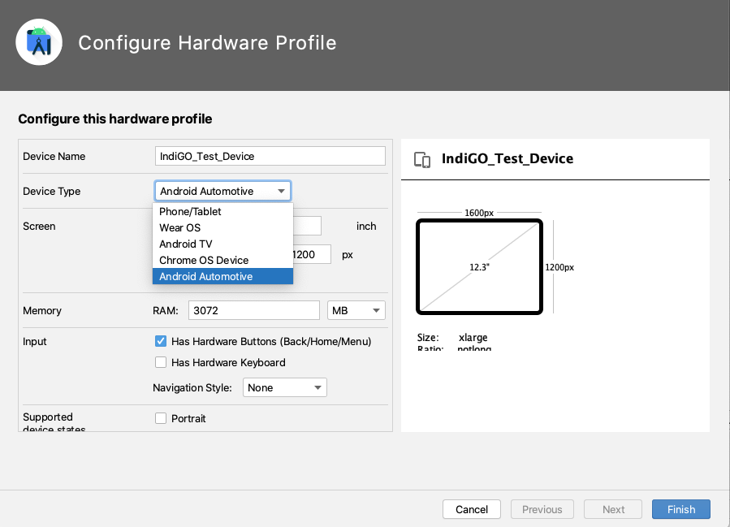
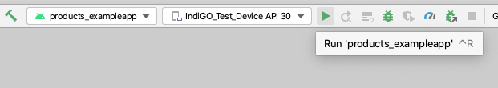

# IndiGO SDK getting started guide

This is a step-by-step guide on how to compile and run the IndiGO example application.

First you will need to install Android Studio using OpenJDK 11, get
TomTom Maps API keys and get access to our SDK downloads. Then you will be able to
compile and run your first IndiGO application.

## Install OpenJDK 11

The IndiGO SDK requires OpenJDK 11; other versions may work but are not supported.

### Install OpenJDK for MAC

[AdoptOpenJDK](https://adoptopenjdk.net/) Java version 11, can easily be installed on MAC
using Homebrew:

```bash
$ brew tap AdoptOpenJDK/openjdk
$ brew install --cask adoptopenjdk11
```

Other alternatives of the OpenJDK, instead of the AdoptOpenJDK release, can also be used
(but it should be Java version 11).

### Install OpenJDK for Ubuntu

To install it, run the following command in a terminal:

```bash
$ sudo apt install openjdk-11-jdk
```

You might already have other versions of JDK installed. Verify this by running:

```bash
$ sudo update-java-alternatives -l
java-1.11.0-openjdk-amd64      1111       /usr/lib/jvm/java-1.11.0-openjdk-amd64
```

If you see the output above, then you only have OpenJDK and you are all set. If you see multiple
Java versions in the output, you need to make sure you have the correct one set as the default:

```bash
$ sudo update-java-alternatives -s java-1.11.0-openjdk-amd64
```

Then you can verify that the correct Java version is in use by running:

```bash
$ java --version
openjdk 11.0.11 2021-04-20
OpenJDK Runtime Environment (build 11.0.11+9-Ubuntu-0ubuntu2.20.04)
OpenJDK 64-Bit Server VM (build 11.0.11+9-Ubuntu-0ubuntu2.20.04, mixed mode, sharing)
```

As you can see above, OpenJDK 11 is in use.

## Install Android Studio

To install the Android Studio IDE, follow the instructions from the
[official Android guide](https://developer.android.com/studio/install).
Note that you need Android Studio minimum version 4.2.x for Java 11 to work correctly.

## Download and decompress IndiGO SDK

Download the latest version of the IndiGO SDK from
[Nexus](https://repo.tomtom.com/#browse/browse:ivi:com%2Ftomtom%2Findigo%2Ftomtom-indigo-sdk).

Unzip the file (`tomtom-indigo-sdk-<versions>.tar.gz`) and you will find the example
app source code inside it. Then follow the following instructions to setup an
environment in which to run IndiGO.

## Running IndiGO

IndiGO can run on Android emulators (AVDs) in addition to the reference / demo
hardware (Samsung Galaxy Tab S5e). A special Android emulator configuration has
been created for running IndiGO. This configuration contains a number of
customizations to the emulator hardware and the Android platform on which it
runs. This emulator can be used for development on top of IndiGO and runs
x86_64 AOSP with Android 11 Automotive. Note that the IndiGO platform will run
on a standard Android device, with an IndiGO-supported CPU architecture. But it
is implemented for the Android Automotive variant, thus some features may not work
on a standard device.

The following sections describe how to download the correct Android emulator
configuration.

### Installing the IndiGO emulator

First add the following file `docs/resources/devices.xml` (from the Example source), to your
`~/.android/` folder (or for Windows: `%UserProfile%\.android\`). If Android Studio is running,
make sure it is restarted, so that the new file is picked up.

Thereafter in Android Studio, go to `Tools -> SDK Manager -> SDK Update Sites` and add a
new entry with the following name and URL:

> Name: `TomTom IndiGO Update Site - Android 11 Emulators`
>
> URL: `https://repo.tomtom.com/repository/ivi/com/tomtom/ivi/ivi-automotive-sdk/aaos-system-images/center-display/12/center-display-12.xml`

Tick `Use Authentication`, enter your TomTom Nexus credentials and click `OK`.

Switch to the `SDK platforms` tab, tick `Show Package Details` on the bottom
right. Then locate the
`Indigo Automotive Android System Image Intel x86 Atom_64 System Image` item in
the list. You may need to expand the Android 11 section to see the right item.


Select the system image and start downloading it.

When the download has completed, a new emulator can be created.

To do this, close the SDK Manager and open the AVD Manager (Android Virtual Device Manager) in
Android Studio. Click `Create Virtual Device`.


You should now be presented with a list of different Android devices that the emulator can emulate.

Firstly, the correct emulator device needs to be configured to be an automotive device as, by default, Android devices
are categorized as phones or tablets.

In the `Tablet` category, look for an item called `IndiGO_Test_Device`.


Select `IndiGO_Test_Device`, and click `Edit Device...` to the right of the screen.

If you are using a Mac(book) __without__ an M1 processor:

- In the `Configure Hardware Profile` dialog, change the
  `Device Type` from "Phone/Tablet" to "Android Automotive".

If you are using a Mac(book) __with__ an M1 processor:

- There is no Android Automotive emulator available for this chip yet, so keep the
  `Device Type` as "Phone/Tablet"

For both types of processors:

- Set the emulator's RAM to 3072 MB, and then click `Finish`.




The hardware profile of the emulator that will be created should now be configured to be an automotive device.

Back on the `Select Hardware` dialog box, there should now be an item called `IndiGO_Test_Device` in the `Automotive`
category.

If you are using a Mac(book) __with__ an M1 processor, select the `Tablet` category instead, to see the `IndiGO_Test_Device`.


Select this device and choose `Next` to continue creating the AVD.

Now the correct System Image of the emulator needs to be selected.

If you are using a Mac(book) __without__ an M1 processor:

- Select the `x86 Images` tab, and choose `Android R` (API level 30) as the System Image, downloading it first if necessary (by clicking "Download"
  next to the Release Name).


If you are using a Mac(book) __with__ an M1 processor:

- Select the `Other Images` tab, and choose `Android S` for an `arm64-v8a` system image downloading it first if necessary (by
  clicking "Download" next to the Release Name).


Click `Next` and then `Finish` to finish creating the emulator.

You should now see a new emulator device listed in the AVD Manager.


This emulator can be started in the standard way by clicking the triangular `play` icon on the right.

## Installing the example application on a custom device

Some features of the IndiGO example application require system permissions. For instance, you won't be
able to play music using Spotify nor use HVAC features. If you want to install the example app on a different
emulator or device, you need to make sure that it is signed with the corresponding platform key.

The Indigo platform debug key and password files (used for the pre-created tablet and emulator images)
are in the `keystore` directory in the example source. Drop in your own platform keys replacing the existing
ones in that directory, rebuild and deploy.

## Get API Keys

You should have received API keys from TomTom. Those should be used in the
example app for navigation related features to work.

[TODO(IVI-3759)]: # "How to use the API keys inside the example app?"

## Compiling the IndiGO example app

### Accessing the binary artifact repository

In order to access IndiGO platform dependencies from the IVI Nexus repository (a binary repository hosted by TomTom),
credentials need to be provided. This can be done in different ways:

**Specifying credentials from the cmdline**

```bash
./gradlew -PnexusUsername=<username> -PnexusPassword=<password> build
```

**Storing credentials globally in the gradle.properties file**

You can also store the credentials in your `gradle.properties` file, in the folder specified by the `GRADLE_USER_HOME`
environment variable, this is usually in the `~/.gradle/` folder.

In the `~/.gradle/gradle.properties` file, add the following

```bash
nexusUsername=<username>
nexusPassword=<password>
```

### Building with Android Studio

The IndiGO example app can be built using Android Studio.

Open the project by going to `File -> Open` and then selecting the `build.gradle.kts` file in the folder that
you unzipped the source code to.

Gradle Sync should start running automatically and Android Studio will configure the project and download its
dependencies. If it does not, start it manually by clicking on the Gradle Sync icon. This step may take a few minutes.


Now you can browse the source code in the IDE.

Build and run the application by clicking on the green `play` icon. Ensure that the device that the application will
run on is the IndiGO automotive emulator that was created earlier in this tutorial.





# Frequently Asked Questions

## 1) When I compile there are a lot of unresolved dependencies

**Missing credentials**

For example, you get the following compilation errors:

```bash
Execution failed for task ':buildSrc:compileKotlin'.
> Could not resolve all files for configuration ':buildSrc:compileClasspath'.
   > Could not find com.tomtom.ivi.gradle:api_plugins_platform:1.0.1859.
     Searched in the following locations:
     etc...
```
Then your Nexus credentials may be stored incorrectly, or be missing.
Check that you have stored them inside `~/.gradle/gradle.properties`, in the format:
```bash
nexusUsername=<username>
nexusPassword=<password>
```
__Note:__ that the username and password should __not__ be surrounded by quotation marks.

If they are in the correct place, then the `GRADLE_USER_HOME` environment variable may be set to something else than
the `~/.gradle/` folder. Check the variable and move the `gradle.properties` file to the correct place. You
can also see what it is set to during the build, by compiling with `--debug` and look for `Gradle user home:` in the
log.

**Incorrect Nexus repository credentials**

If you see `Received status code 401 from server: Unauthorized` in the build output, then gradle can find the
credentials, but they are incorrect.

For example:

```bash
> Could not GET 'https://repo.tomtom.com/repository/ivi/com/tomtom/ivi/gradle/api_plugins_platform/1.0.1859/api_plugins_platform-1.0.1859.pom'. Received status code 401 from server: Unauthorized
```


## 2) There is no map and/or search does not work

When you start the application for the first time, you should see a map of the world, as a background to the
application.

If this is not there, it may mean that the device/emulator cannot connect to a network.

Enable Wi-Fi in Settings on the emulator and then Cold Boot the emulator from the AVD Manager.

To do this:

**Enable Wi-Fi in Settings on the emulator**
- Press the Home button (the circle in the sidebar outside the emulator screen)
- Select `Car Launcher as Home` -> `Just Once`
- Press the Android application icon (nine dots in a grid) on the bottom of the screen
- Scroll down and open `Settings`
- Select `Network & internet`
- Enable Wi-Fi by pressing the toggle button so it turns blue
- Shut down the emulator by selecting `Quit` in the emulator menu

**Cold Boot the emulator**

In Android Studio go to: `Tools -> Avd Manager`. On the right-hand side of each configured AVD there is a down arrow,
which launches a context menu, press the down arrow (instead of pressing the green Play button), and select
`Cold Boot Now` to cold boot the emulator.

For a real device, make sure that it has a working Internet connection.


## 3) How do I open the Debug Menu?

IndiGO provides a debug menu with various debug/developer options for accessing functionality that would  
normally not be available to an end-user (for example: starting a route demo).

Open the debug menu on the emulator by pressing the backtick ("\`") key on your keyboard.

On a real device, long press the "volume down" key.

To close the menu, perform the same action again.


## 4) How do I start a Route Demo?

A route demo is a simulation of a drive along a currently planned route on the device, this may be useful to see what
happens at the various points along the route, without the need to go for an actual drive.

To plan a route, long press on any point on the map, and a route will be planned from the current position, to this
position.

In order to allow position simulation, you first need to enable Developer Options in Android:

- Go to the Settings menu
    - On the emulator follow these steps:
        - Press Home button (the circle in the sidebar outside the emulator screen)
        - Select `Car Launcher as Home` -> `Just Once`
        - Press the Android application icon (nine dots in a grid) on the bottom of the screen
        - Scroll down and open `Settings`
- Scroll down and open System, then open About
- Find "Build number" and tap this seven times, you should see a "You are now a developer!" toast appear, to confirm
  that developer options are enabled

Enable mock location

- Go back to the System menu and scroll down to "Developer options"
- Scroll down and select "Select mock location app"
- Select "IVI Example"

This setting is persistent until you uninstall the application.

Then close the emulator and cold boot it, to start it again.

Cold boot the emulator:
In Android Studio go to: `Tools -> Avd Manager`. On the right-hand side of each configured AVD there is a down arrow,
which launches a context menu, press the down arrow (instead of pressing the green Play button), and select
`Cold Boot Now` to cold boot the emulator.

**Start a Route Demo**

- Make sure a route is planned
- Open the debug menu
- Scroll right until you find the 'Navigation' tab.
- Press "START ROUTE DEMO"
- And close the debug menu

## 5) I am using a Mac(book) with an M1 chip and cannot start the Android emulator

Attempting to start the Android emulator results in `The emulator process for AVD IndiGO_Emulator was killed`
and installing the emulator accelerator package from the Android Update Site results in
`Your CPU does not support VT-x. Unfortunately, your computer does not support hardware accelerated virtualization.`

The M1 Apple Silicon chip is not an Intel-based chip and so the hardware accelerated virtualization package does
not work on this processor architecture. Special setup is required to get the Android emulator (not just the
IndiGO-specific one) to work. Official support for this chip from Android is still in progress.

In the instructions above, for configuring an Android Virtual Device, there are special exceptions for computers
with this processor, please check that you have followed those exceptions.

## 6) I am using a Mac and the Android emulator is slow at starting

The emulator for Mac may be slow at starting up on some configurations, especially the first time. To alleviate that
problem, there are a few things you can try.

Locate the `config.ini` file for the AVD you're using when running IndiGO in the emulator. If you have followed the
instructions [here](#installing-the-indigo-emulator), it should be in this location:

```bash
~/.android/avd/IndiGO_Test_Device_API_30.avd/config.ini
```

Otherwise it should be one of the other `.avd` directories in `~/.android/avd/`.

Enabling sound may cause the emulator to use a high CPU percentage. If you don't need sound, try disabling it:

```bash
hw.audioInput=no
hw.audioOutput=no
```

Also check that you have sufficient RAM:

```bash
hw.ramSize=3072
```


## 7) RuntimeException: Required support for OpenGL standard derivatives is missing.

When you launch the application on emulator, it crashes and restarts in a never-ending loop. Look
in the logcat log, and if you get the following error, you need to set the OpenGL ES API level to
3.1 in the emulator.

```bash
com.tomtom.ivi.example.product.exampleapp E/AndroidRuntime: FATAL EXCEPTION: GLThread 667
    Process: com.tomtom.ivi.example.product.exampleapp, PID: 5705
    java.lang.RuntimeException: Required support for OpenGL standard derivatives is missing.
        at com.tomtom.navkit.map.TomTomNavKitMapJNI.SurfaceAdapter_onSurfaceCreated(Native Method)
        at com.tomtom.navkit.map.SurfaceAdapter.onSurfaceCreated(SurfaceAdapter.java:170)
        at com.tomtom.navkit.map.sdk.MapView$Renderer.onSurfaceCreated(MapView.java:320)
        at android.opengl.GLSurfaceView$GLThread.guardedRun(GLSurfaceView.java:1541)
        at android.opengl.GLSurfaceView$GLThread.run(GLSurfaceView.java:1272)
        
```


To fix this:

- Go to the Extended Controls menu of the emulator (this is in the sidebar next to the emulator
  when it's running), press the three dots at the bottom of the bar.
- Go down and select Settings on the left hand side.
- Then select the "Advanced" tab at the top right.
- It should say "Desktop native OpenGL" to the left, and "Renderer maximum (up to OpenGL ES 3.1)",
  see picture below.
- Then restart the emulator, for the settings change to take effect.


