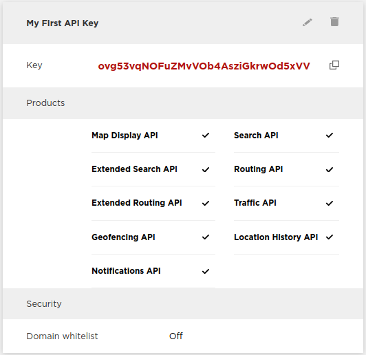
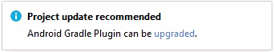
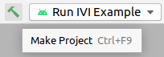
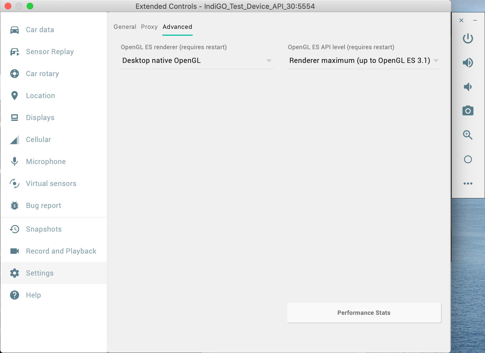
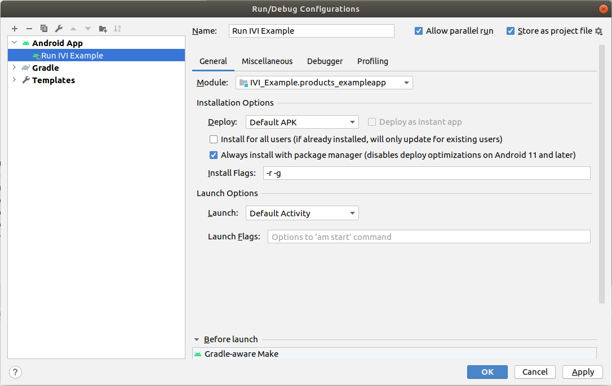

This is a step-by-step guide on how to compile and run the IndiGO example application.

An overview of this guide's content:

1. [Installing OpenJDK 11](#installing-openjdk-11)
    1. [OpenJDK for Ubuntu](#openjdk-for-ubuntu)
    1. [OpenJDK for Mac](#openjdk-for-mac)
    1. [OpenJDK for Windows](#openjdk-for-windows)
1. [Installing IndiGO SDK](#installing-indigo-sdk)
1. [Getting NavKit2 API key](#getting-the-navkit2-api-key)
    1. [Register as a TomTom Developer](#registering-as-a-tomtom-developer)
    1. [Installing the API key](#installing-the-api-key)
    1. [Evaluation agreement](#evaluation-agreement)
1. [Accessing the artifact repository](#accessing-the-artifact-repository)
    1. [Specifying credentials from the commandline](#specifying-credentials-from-the-command-line)
    1. [Storing credentials globally](#storing-credentials-globally)
1. [Installing Android Studio](#installing-android-studio)
    1. [Gradle plugin for Android Studio](#gradle-plugin-for-android-studio)
    1. [Building with Android Studio](#building-with-android-studio)
1. [The IndiGO emulator](#the-indigo-emulator)
    1. [The IndiGO emulator image](#the-indigo-emulator-image)
    1. [The IndiGO emulator device](#the-indigo-emulator-device)
1. [Installing on a custom device](#installing-on-a-custom-device)
1. [Frequently Asked Questions](#frequently-asked-questions-faq)

The IndiGO SDK requires a working Android development environment, including an OpenJDK 11 
installation. You also need access to our SDK binaries, and for navigation related features to work, 
an API key for NavKit2. Then you will be able to compile and run your first IndiGO application.

# Installing OpenJDK 11

The IndiGO SDK requires OpenJDK 11. Other versions may work but are not supported.

## OpenJDK for Ubuntu

To install it, run the following command in a terminal:

```bash
$ sudo apt install openjdk-11-jdk
```

You might already have other versions of JDK installed. Verify this by running:

```bash
$ sudo update-java-alternatives -l
java-1.11.0-openjdk-amd64      1111       /usr/lib/jvm/java-1.11.0-openjdk-amd64
```

If you see the output above, then you only have OpenJDK and you are all set. If you see multiple
Java versions in the output, you need to make sure you have the correct one set as the default:

```bash
$ sudo update-java-alternatives -s java-1.11.0-openjdk-amd64
```

Then you can verify that the correct Java version is in use by running:

```bash
$ java --version
openjdk 11.0.11 2021-04-20
OpenJDK Runtime Environment (build 11.0.11+9-Ubuntu-0ubuntu2.20.04)
OpenJDK 64-Bit Server VM (build 11.0.11+9-Ubuntu-0ubuntu2.20.04, mixed mode, sharing)
```

## OpenJDK for Mac

[AdoptOpenJDK](https://adoptopenjdk.net/) Java version 11 can easily be installed on MAC
using Homebrew:

```bash
$ brew tap AdoptOpenJDK/openjdk
$ brew install --cask adoptopenjdk11
```

Other alternatives of the OpenJDK can also be used, as long as they are Java version 11.

## OpenJDK for Windows

Download the OpenJDK installer from [AdoptOpenJDK](https://adoptopenjdk.net/releases.html):

- Select `OpenJDK 11 (LTS)` as Version.
- Select `HotSpot` as JVM.
- Select `Windows` as Operating System.
- Select `x64` as Architecture.
- Download the JDK file with the `.msi` extension.

Install the downloaded JDK file:

- During installation, when you arrive at `Custom Setup` screen, press the cross next to
   `Set JAVA_HOME` settings and select: `Will be installed on local hard drive`.
- When finished installing, open the command prompt to make sure you are now using `OpenJDK 11`:

```cmd
    C:\Users\User>java -version

    openjdk version "11.0.11" 2021-04-20
    OpenJDK Runtime Environment AdoptOpenJDK-11.0.11+9 (build 11.0.11+9)
    OpenJDK 64-Bit Server VM AdoptOpenJDK-11.0.11+9 (build 11.0.11+9, mixed mode)
```

# Installing IndiGO SDK

Download the latest version of the IndiGO SDK from
[Nexus](https://repo.tomtom.com/#browse/browse:ivi:com%2Ftomtom%2Findigo%2Ftomtom-indigo-sdk).

After logging in to Nexus you can find the SDK versions under `com -> tomtom -> indigo -> 
tomtom-indigo-sdk`:

- Click on the `+` icon left of the latest version to open this folder.
- Click on the `tomtom-indigo-sdk-<versions>.tar.gz` file to see its details in the panel on the right.
- Click the link at `Path` in the panel on the right to start downloading the SDK.

Extract the downloaded file and you find the example app source code inside it. Then follow the
instructions below to setup an environment in which to run IndiGO.

__Windows Notes:__

- Use [WinRAR](https://www.win-rar.com/predownload.html?&L=0) to extract the downloaded file.
- Extract to a folder with a short name, for example `C:\Indigo`.
- The IndiGO SDK contains some files with a long path name, especially in the `docs` folder, but the
  path length on Windows is restricted to 260 characters. See
  [this article in Microsoft Developer](https://docs.microsoft.com/en-us/windows/win32/fileio/maximum-file-path-limitation)
  if you wish to use longer path names.
  
__Windows Note:__

The IndiGO SDK contains some files with a long path name, especially in the `docs` folder, but the
path length on Windows is restricted to 260 characters. See
[this article in Microsoft Developer](https://docs.microsoft.com/en-us/windows/win32/fileio/maximum-file-path-limitation)
if you wish to use longer path names.

# Getting the NavKit2 API key

The IndiGO SDK uses TomTom's online NavKit2 services, for which an API key is required. An
evaluation key with limited authorisation can be acquired immediately. After signing TomTom's
evaluation agreement, these restrictions are removed and you can experience the full functionality
of the IndiGO SDK and NavKit2.

## Registering as a TomTom Developer

- Navigate to [developer.tomtom.com](https://developer.tomtom.com/) and click `Register`, then fill
out the registration form.
- You will receive a confirmation email; click `Activate Account` and go to your
[TomTom Developer dashboard](https://developer.tomtom.com/user/me/apps).
- The API key you get assigned should be used in the IndiGO SDK, but it must still be authorized by
TomTom for the NavKit2 features used by IndiGO. See also section
[Evaluation agreement](#evaluation-agreement).



## Installing the API key

Now that you received your NavKit2 API key, it can be used with the IndiGO SDK.

- Set the `navkit2ApiKey` property to your NavKit2 API key in the top-level `local.properties` file
or in your `gradle.properties` file. The `local.properties` file is located in your local SDK
folder. The `gradle.properties` file is located in the folder specified by the `GRADLE_USER_HOME`
environment variable, usually `~/.gradle/`. See
[How to configure the NavKit2 API key](how-to-configure-the-navkit2-api-key.html) for details and
alternatives ways to configure the key.

__Windows:__ Use the `%UserProfile%\.gradle` folder.

## Evaluation agreement

The initial API key has restrictions on the functionality and the amount of requests you can do.
To enjoy the full functionality, apply for an evaluation agreement with TomTom.

- For now: Ask your TomTom contact person to establish an evaluation agreement.
- Later: In your TomTom Developer Portal, request evaluating the Digital Cockpit.

__Note:__ You will not get a new API key, but the restrictions on your API key will be removed by
TomTom.

# Accessing the artifact repository

In order to access IndiGO platform dependencies from the IVI Nexus repository (a binary repository
hosted by TomTom), credentials need to be provided. This can be done in different ways:

## Specifying credentials from the command line

You can add credentials with the following command:

__Linux or Mac:__ 
```bash
    ./gradlew -PnexusUsername=<username> -PnexusPassword=<password> build
```

__Windows:__
```bash
    .\gradlew.bat -PnexusUsername=<username> -PnexusPassword=<password> build
```

## Storing credentials globally

You can also store the credentials in your `gradle.properties` file, in the folder specified by
the `GRADLE_USER_HOME` environment variable, usually `~/.gradle/`.

__Windows:__ Use the `gradle.properties` file in the `%UserProfile%\.gradle` folder.

In your `gradle.properties` file, add the following:

```bash
    nexusUsername=<your-username>
    nexusPassword=<your-password>
```

# Installing Android Studio

To install the Android Studio IDE, follow the instructions from the
[official Android guide](https://developer.android.com/studio/install).
Note that you need a minimum version of 4.2.x of Android Studio for Java 11 to work correctly.

In the dialog box `Import Android Studio Settings` select `Do not import settings` and click `OK`.


## Gradle plugin for Android Studio

Android Studio may propose upgrading its Gradle plugin:



You can safely upgrade to version 4.2.2, but do _NOT_ upgrade to a higher version because the
IndiGO SDK is not yet compatible with it.

## Building with Android Studio

The IndiGO example app can be built using Android Studio:

Open the project:

- In dialog box `Welcome to Android Studio` select `Open an Existing Project`.

- When this dialog does not show, you can open the project via `File -> Open`.

- Select the `build.gradle.kts` file from the
  `examples/products_indigo_examples_<version>-sources` folder where you extracted the source code.

Ensure that Android Studio uses `OpenJDK11`:

- Go to `File -> Project Structure -> SDK Location`.

- Under `JDK Location` select the OpenJDK version that you downloaded earlier, then click `OK`.

Gradle Sync should start running automatically, then Android Studio will configure the project and
download its dependencies. If it does not, start it manually by clicking on the Gradle Sync icon.
This step may take a few minutes.


Now you can browse the source code in the IDE.

Build the application by clicking on the green `hammer` icon:



__Note:__ Building the application may report an error like:

```bash
    License for package Android SDK Build-Tools 30.0.2 not accepted.
```

To solve this, open the SDK Manager via `Tools -> SDK Manager` in tab `SDK Tools`, tick
`Show Package Details` and install the required package and/or accept its license terms.

# The IndiGO emulator

IndiGO can run on Android emulators (Android Virtual Devices, AVDs) in addition to the reference /
demo hardware (Samsung Galaxy Tab S5e). A special Android emulator configuration has been created
for running IndiGO. This configuration contains a number of customizations to the emulator hardware
and the Android platform on which it runs. This emulator can be used for development on top of
IndiGO and runs x86\_64 AOSP with Android 11 Automotive.

__Note:__ The IndiGO platform also runs on a standard Android device, with an IndiGO-supported CPU
architecture. However, some features may not work as IndiGO is implemented for the Android
Automotive variant.

## The IndiGO emulator image

Follow these steps to install the IndiGO emulator image in Android Studio:

- Add the file `docs/resources/devices.xml` (from the `examples` source), to your `~/.android/`
folder.
    - __Windows:__ Add the file to your `%UserProfile%\.android\` folder.

- If Android Studio is running, make sure it is restarted, so that the new file is picked up.

- Open the SDK Manager via `Tools -> SDK Manager`.

- In the SDK Manager, select tab `SDK Update Sites` and add a new entry with the following name and
URL:
    - Name: `TomTom IndiGO Update Site - Android 11 Emulators`
    - URL: `https://aaos.blob.core.windows.net/indigo-automotive/repo-sys-img.xml`

- Tick `Use Authentication`, enter your TomTom Nexus credentials and click `Apply` to activate this update site.

- Switch to tab `SDK platforms` and tick `Show Package Details` on the bottom right. Then locate
the `Indigo Automotive Android System Image` in the list. You may need to expand the Android 11
section to see this item.


- Select the system image and click `Apply` to start downloading it. When the download completes, 
close the SDK Manager.

## The IndiGO emulator device

Follow these steps to create an emulator device based on the IndiGO emulator:

- Open the AVD Manager (Android Virtual Device Manager) via `Tools -> AVD Manager`.

- Click `Create Virtual Device`:


- You should now be presented with a list of devices definitions.

- In the `Automotive` category, find item `IndiGO_Test_Device`:


- Select `IndiGO_Test_Device`, and click `Edit Device...` at the right side of the screen. This
  shows the dialog `Configure Hardware Profile` for the `IndiGO_Test_Device`.
  
- Set the emulator's RAM to 3072 MB, and click `Finish`.

- The hardware profile of the emulator is now configured to be an automotive device. This will be
used for emulator devices to be created.
    - __Mac(book) _with_ an M1 processor:__ No Android Automotive emulator is available for this chip
      yet, so you need to change the `Device Type` from `Android Automotive` to `Phone/Tablet`.
      
- Back in dialog `Select Hardware`, you now see in category `Automotive` an item called
`IndiGO_Test_Device`:
    - __Mac(book) _with_ an M1 processor:__ You see this item in category `Tablet`.
  


- Select this device `IndiGO_Test_Device` and choose `Next` to continue creating the AVD.

- Select tab `x86 Images` and choose `Android R` (API level 30) as the System Image, downloading
it first if necessary (by clicking "Download" next to the Release Name).
    - __Mac(book) _with_ an M1 processor:__ Select tab `Other Images` and choose `Android S` for
  `arm64-v8a` as the System Image.


- Click `Next` then `Finish`.

- You now see a new IndiGO emulator device listed in the AVD Manager:


- Click the triangular `play` icon on the right to start the emulator.

- Enable wifi:
    - Click the Home button (circle) in the sidebar next to the emulator screen.
    - Select `Car Launcher as Home` -> `Just Once`.
    - Press the Android Applications icon (nine dots in a grid) on the bottom of the screen.
    - Scroll down and open `Settings`.
    - Select `Network & internet`.
    - Enable `Wi-Fi` by pressing the toggle button so it turns blue.

- Set the emulator's OpenGL ES API level to 3.1:
    - Click the three dots at the bottom in the sidebar next to the emulator screen. This opens the
      `Extended Controls` menu.
    - Select `Settings` at the left.
    - Select the `Advanced` tab at the top.
    - This should say `Desktop native OpenGL` and `Renderer maximum (up to OpenGL ES 3.1)`, see
      picture below.
    - Close the `Extended Controls` menu.
      


- Now restart the emulator, for the new settings to take effect:
    - Click the `x` in the upper-right corner of the emulator sidebar.
    - In Android Studio go to: `Tools -> AVD Manager`.
    - On the right-hand side of each configured AVD there is a down-arrow that launches a context
      menu. Press the down-arrow (instead of pressing the green Play button), and select 
      `Cold Boot Now`.

- Build and run the application by clicking on the green `play` icon. Ensure that the device that
the application will run on is the IndiGO automotive emulator that was created earlier in this
tutorial.


Emulator devices can also be managed with the Gradle tasks:

- `createTestEmulator`, `startTestEmulator`, `stopTestEmulator`, `deleteTestEmulator`
  to manage a headless device suitable for testing.

- `createDevelopmentEmulator`, `startDevelopmentEmulator`, `stopDevelopmentEmulator`,
  `deleteDevelopmentEmulator` to manage a device suitable for development.

- `killEmulators` to forcibly stop any running emulator instances.

Emulator devices, which are created with the Gradle tasks, are visible in the Device Manager in
Android Studio.

__Note:__ Emulator devices, which are created with the Gradle tasks, have wifi enabled.

## Installing on a custom device

Some features of the IndiGO example application require system permissions. For instance, you won't
be able to play music using Spotify nor use HVAC features. If you want to install the example app on
a different emulator or device, you need to make sure that it is signed with the corresponding
platform key.

The Indigo platform debug key and password files, used for the pre-created tablet and emulator
images, are in the `keystore` directory in the example source. Drop in your own platform keys,
replacing the existing ones in that directory, then rebuild and deploy.

# Frequently Asked Questions (FAQ)

Table of content:

1. [When building, there are a lot of unresolved dependencies](#when-building-there-are-a-lot-of-unresolved-dependencies)
    1. [Missing credentials](#missing-credentials)
    1. [Incorrect Nexus repository credentials](#incorrect-nexus-repository-credentials)
1. [There is no map and/or search does not work](#there-is-no-map-andor-search-does-not-work)
1. [How to open/close the Debug Menu?](#how-to-openclose-the-debug-menu)
1. [How to start a Route Demo?](#how-to-start-a-route-demo)
1. [I am using a Mac(book) with an M1 chip and cannot start the android emulator](#i-am-using-a-macbook-with-an-m1-chip-and-cannot-start-the-android-emulator)
1. [The Android emulator is slow at starting](#the-android-emulator-is-slow-at-starting)
1. [RuntimeException: Required support for OpenGL standard derivatives is missing](#runtimeexception-required-support-for-opengl-standard-derivatives-is-missing)
1. [Android Studio does not install the application](#android-studio-does-not-install-the-application)

## When building, there are a lot of unresolved dependencies

### Missing credentials

For example, when you get the following compilation errors, then your Nexus credentials may be
stored incorrectly or are missing.

```bash
Execution failed for task ':buildSrc:compileKotlin'.
> Could not resolve all files for configuration ':buildSrc:compileClasspath'.
   > Could not find com.tomtom.ivi.platform.gradle:api_framework_config:1.0.2264.
     Searched in the following locations:
     etc...
```

Check that you have stored the credentials properly in file `~/.gradle/gradle.properties`.

__Windows:__ File `%UserProfile%\.gradle\gradle.properties`

__Note:__ The username and password should __not__ be surrounded by quotation marks.

If your credentials are properly stored, then the environment variable `GRADLE_USER_HOME` may point
to a folder other than `~/.gradle/`. Check this environment variable and move your
`gradle.properties` file to the correct location. You can check where it points to during the build
when compiling with `--debug` and look in the logs for `Gradle user home:`

__Windows:__ Folder `%UserProfile%\.gradle\`

### Incorrect Nexus repository credentials

If your build output contains `Received status code 401 from server: Unauthorized`, then gradle does
find the credentials, but the server rejects them. So the credentials are incorrect.

For example:

```bash
> Could not GET 'https://repo.tomtom.com/repository/ivi/com/tomtom/ivi/gradle/api_plugins_platform/1.0.1859/api_plugins_platform-1.0.1859.pom'. Received status code 401 from server: Unauthorized
```

## There is no map and/or search does not work

When you start the application for the first time, you should see a map of the world as background
to the application. If this is not there, it may mean that the device/emulator cannot connect to a
network.

On the emulator in `Settings` enable `Wi-Fi` and then cold boot the emulator from the AVD
Manager, as explained [_above_](#the-indigo-emulator-device) under `Enable wifi` and
`Now restart the emulator`.

For a real device, make sure that it has a working Internet connection.


## How to open/close the Debug Menu?

IndiGO provides a debug menu giving access to functionality that are not normally available to the
end-user. For example, starting a route demo.

Opening the debug menu:

- On the emulator, press the backtick ("\`") key on your keyboard.
- On a real device, long press the "volume down" key.

To close the debug menu, perform the same action again.

## How to start a Route Demo?

A route demo is a simulation of a drive along a currently planned route on the device, this may be
useful to see what happens at the various points along the route, without the need to go for an
actual drive.

To plan a route, long press on any point on the map, and a route will be planned from the current
position, to this location.

In order to allow position simulation, you first need to enable Developer Options in Android:

- On the emulator, go to the Settings menu as follows:
    - Press Home button (the circle in the sidebar outside the emulator screen).
    - Select `Car Launcher as Home -> Just Once`.
    - Press the Android application icon (nine dots in a grid) at the bottom of the screen.
    - Scroll down and open `Settings`.
- Scroll down and open `System`, then open `About`.
- Find `Build number` and tap this seven times, after which a `You are now a developer!` toast
  appears to confirm that developer options are enabled.

Enable location mocking:

- Go back to the System menu and scroll down to `Developer options`.
- Scroll down and select `Select mock location app`.
- Select `IVI Example`.
- This setting is persistent until you uninstall the application.

Then close the emulator and cold boot it, to start it again.

Cold Boot the emulator:

- In Android Studio go to: `Tools -> AVD Manager`.
- On the right-hand side of each configured AVD there is a down-arrow that launches a context menu.
Press the down-arrow (instead of pressing the green Play button), and select `Cold Boot Now`.

Start a Route Demo:

- Make sure a route is planned.
- Open the debug menu.
- Scroll right until you find the `Navigation` tab.
- Press `START ROUTE DEMO`.
- Close the debug menu.

## I am using a Mac(book) with an M1 chip and cannot start the Android emulator

Attempting to start the Android emulator results in:

> `The emulator process for AVD IndiGO_Emulator was killed`

and installing the emulator accelerator package from the Android Update Site results in:

> `Your CPU does not support VT-x. Unfortunately, your computer does not support hardware
accelerated virtualization.`

The Apple M1 processor is not an Intel-based chip and the hardware-accelerated virtualization
package does not work on this processor architecture. Special setup is required to get even the
default Android emulator working, so this is not just an IndiGO-specific problem. Official Android
support for this chip is still in progress.

The instructions above on how to configure an Android Virtual Device, specify exceptions for
computers with the M1 processor. Please verify that you have followed those exceptions.

## The Android emulator is slow at starting

The emulator may be slow at starting up on some configurations, especially the first time and
especially on an Apple Mac(book).

Locate the `config.ini` file for the AVD you are using when running IndiGO in the emulator. If you 
have followed the instructions [here](#the-indigo-emulator), it should be at the
following location:

__Linux or Mac:__ `~/.android/avd/IndiGO_Test_Device_API_30.avd/config.ini`

__Windows:__ `%UserProfile%\.android\avd\IndiGO_Test_Device_API_30.avd\config.ini`

Otherwise it could be in one of the other `.avd` folders at that location.

To alleviate this problem, you can try a few things:

- Try disabling sound, as it may cause the emulator to generate a high CPU load:

```bash
    hw.audioInput=no
    hw.audioOutput=no
```

- Check that you have sufficient RAM:

```bash
    hw.ramSize=3072
```

## RuntimeException: Required support for OpenGL standard derivatives is missing

When you launch the application on emulator, it crashes and restarts in a never-ending loop. Look
in the logcat and if you get the following error, you need to set the emulator's OpenGL ES API
level to 3.1:

```bash
com.tomtom.ivi.example.product.exampleapp E/AndroidRuntime: FATAL EXCEPTION: GLThread 667
    Process: com.tomtom.ivi.example.product.exampleapp, PID: 5705
    java.lang.RuntimeException: Required support for OpenGL standard derivatives is missing.
        at com.tomtom.navkit.map.TomTomNavKitMapJNI.SurfaceAdapter_onSurfaceCreated(Native Method)
        at com.tomtom.navkit.map.SurfaceAdapter.onSurfaceCreated(SurfaceAdapter.java:170)
        at com.tomtom.navkit.map.sdk.MapView$Renderer.onSurfaceCreated(MapView.java:320)
        at android.opengl.GLSurfaceView$GLThread.guardedRun(GLSurfaceView.java:1541)
        at android.opengl.GLSurfaceView$GLThread.run(GLSurfaceView.java:1272)
```

To fix this, set the emulator's OpenGL ES API level to 3.1 and restart the emulator, as explained
[_above_](#the-indigo-emulator-device) under `Set the Emulator's OpenGL` and
`Now restart the emulator`.

## Android Studio does not install the application

Sometimes Android Studio does not install your new application after a rebuild but instead launches
a previously installed version present on the emulator or target device. To solve this, enable the
package manager to handle installs:

- Open dialog `Run/Debug Configurations` via `Run -> Edit Configurations...`.
- In this dialog tick the box `Always install with package manager`.

Configuration `Run IVI Example` as delivered with the SDK has these settings pre-configured.



