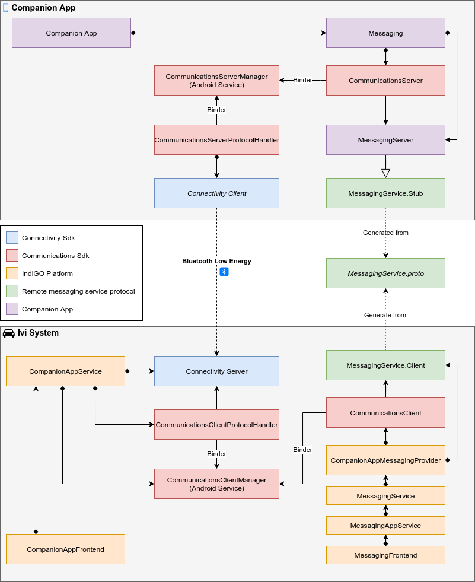

# How to communicate with a companion app

## Glossary

| Term             | Description                                                                                                                                          |
| ---------------- | ---------------------------------------------------------------------------------------------------------------------------------------------------- |
| Service provider | The companion app provides multiple services with which the IVI side can communicate. These services we call service providers.                      |
| Proxy            | An object that provides the service interface and when called into will cause the call to be forwarded to the *service provider* it is connected to. |
| Client           | The object on the IVI side that subscribes to a particular service and instanciates *proxies* for each *service provider* that is available.         |

## Introduction
The IndiGO platform provides a framework which allows data communication with companion apps via
services which can be extended for different kind of purposes. A companion app runs on the user's
phone and therefore can be used to extend the experience of the IVI system with functionality that
is available on that phone. For instance, it can be used to extend the messaging experience by
capturing message notification (WhatsApp, Facebook Messenger, etc.) on the phone and pass them on to
the IVI system. Or it can pass on calendar events or other data. Or it can be used to share a
navigation destination from an app on the phone with the IVI system.

A Bluetooth Low Energy connection is used to connect companion apps with the IVI system. On top of
which we provide a high level service oriented framework that can be easily extended with custom
services. 

Services are defined using Protobuf service definitions and can contain remote procedure calls as
well as live data properties that can be observed.

The companion app will *provide* services and thus can be seen as the server side. The IVI side can
call into those services and therefore can be seen as the client side.

We therefore call the companion app side of a service the *Service Provider* and the IVI side we
call the *Client*.

Multiple companion apps can be connected at the same time, which means that there can be multiple
connections from the IVI system to companion apps for a single service. Each service only has one
client on the IVI side, but that client can spawn multiple service proxies; one to each companion
app. Vice versa, a companion app can only be connected to one IVI system at a time, therefore there
is always a maximum of one client connected to a service provider from the view of the companion
app.


Service interfaces are described using Protobuf files. These are used to generated classes that can
be directly integrated into the IVI system and the companion app.
* *Stub* classes are generated for the companion side, that can be implemented to provide the
  service functionality.
* *proxy* classes are generated for the IVI side, that can be called into directly. All calls into
  the *proxy* classes will be directly forwarded to the companion app and all observed properties
  will be automatically updated when their data changes on the companion app side.

Because a service definition is used by both the IVI system and the companion app, it is necessary
to put the service definition in a library that can be imported by both.

__Note__
*Currently connecting multiple companion apps to the IVI system is not yet supported by the
connectivity sdk.*

## Overview
This shows an overview of the components involved in the communication between the IVI system and
the Companion App, with messaging as an example.



As you can see in the overview diagram, there are two levels of communications:
* **Connectivity Sdk**: Takes care of the low level Bluetooth Low Energy connection between the IVI
  system and the Companion App.
* **Communications Sdk**: Takes care of the high level remote services communications.

The *Connectivity Sdk* is used to setup the low level Bluetooth Low Energy connection. The
*Communications Sdk* uses this connection by implementing a [CommunicationsClientProtocolHandler]
for the IVI side and a [CommunicationsServerProtocolHandler] on the companion app side. This
provides the possibility of transparently replacing the *Connectivity Sdk* with a different low
level connection.

For each service on the companion app side a [CommunicationsServer] instance is created and is
provided with a factory that creates the implementation of the generated *Stub* class for the
service. All [CommunicationsServer] instances can reside in different processes, which makes it
possible to have loosly coupled and modular service implementation on the companion app side.

For each service on the IVI side a [CommunicationsClient] instance is created and is provided with
the meta data that was generated from the Protobuf service definition. All [CommunicationsClient]
instances can reside in different processes, which makes it possible to also have loosly coupled and
modular services on the IVI side.

A [CommunicationsClient] instance creates client service *proxy* instances for each companion app
that is connected, which support The particular service.

To learn how to create a new remote companion app service, see
[How to create a new remote companion service](how-to-create-a-new-remote-companion-service.md)

To use this, two things need to be done:
- [Setting up communications using Bluetooth Low Energy on the IVI side](#setting-up-communications-using-bluetooth-low-energy-on-the-ivi-side).
- [Setting up communications using Bluetooth Low Energy on the companion app side](#setting-up-communications-using-bluetooth-low-energy-on-the-companion-app-side).

## Setting up communications using Bluetooth Low Energy on the IVI side

For the communications sdk to be able to connect to a companion app using Bluetooth Low Energy we
need to provide it with a [CommunicationsClientProtocolHandler] that transmits data over the
Bluetooth Low Energy connection.

This is generally done inside a separate service. The protocol handler will bind to the
[CommunicationsCLientManager] service.

The connectivity sdk is provided to setup a Bluetooth Low Energy connection. The IVI side is the
peripheral (or server) side of this connection. So we need to set it up to listen to incoming
Bluetooth Low Energy connections.

Please note that it is not necessary to implement this yourself (or yourselves), because this functionality is
already provided by the IndiGO platform [StockCompanionAppService].

If you do want a custom implementation, or you want to replace part of it with another method, this
is how that would work.

### Dependencies

```
    implementation("com.tomtom.sdk:sdk-connectivity-server-bt-le:0.2.173")

    implementation("com.tomtom.ivi.sdk.communications:sdk_communications_client:0.1.51")
    implementation("com.tomtom.ivi.sdk.communications:sdk_communications_common:0.1.51")
```

### Setting up the connectivity server

First you need a [BleConnectivityServer]. This takes care of listening for new Bluetooth Low Energy
connections and the low level data transfer once a connection is established.

```kotlin
    private val bleConnectivityServer: ConnectivityServer by lazy {
        val connectionParams = BleConnectivityServerConfig.Builder(context).build()
        BleConnectivityServerFactory.create(connectionParams)
    }
```

Before the `bleConnectivityServer` can start to listen for incoming Bluetooth Low Energy connections
a listener needs to be provided which will be notified of incoming messages.

Currently two kinds of messages are supported.
* **LocationMessage**: Indicates a map location (*this is deprecated and will be replaced with a
  high level service in the future*).
* **RawMessage**: This is a raw data message wich is used for the communications sdk to transmit
  data.

```kotlin
    private val messageReceivedListener = object : ConnectivityServer.MessageReceivedListener {
        override fun onReceivedMessage(message: Message) {
            when (message) {
                is LocationMessage ->
                    // Do something with the location message.
                is RawMessage -> {
                    communicationsClientProtocolHandler.onProtocolReceivedMessage(
                        message.data
                    )
                }
                else -> {
                    // Unsupported message type.
                }
            }
        }

        override fun onError(throwable: Throwable) {
            // An error happened while receiving a message.
        }
    }
```

To start listening the `bleConnectivityServer` also needs a listener that is used for the
asynchronous result of the `start` function.

```kotlin
    private val connectivityApiConnectedListener = object : ConnectivityServer.StartCallback {
        override fun onSuccess() {
            // All is fine.
        }

        override fun onError(exception: BleServerException) {
            // Unable to start listenening for Bluetooth Low Energy connections.
        }
    }
```

Now we just need to start the `bleConnectivityServer`.

```kotlin
    fun start() {
        bleConnectivityServer.registerMessageReceivedListener(messageReceivedListener)
        bleConnectivityServer.start(connectivityApiConnectedListener)
    }
```

### Setting up the Communications Sdk

Next a [CommunicationsClientProtocolHandler] needs to be defined to connect the
`bleConnectivityServer` to the communications sdk. This can be done by inheriting from the
[AbstractCommunicationsClientProtocolHandler] and implementing the abstract `protocolSendMessage`
function.

```kotlin
    private val communicationsClientProtocolHandler =
        object : AbstractCommunicationsClientProtocolHandler(
            CommunicationsProtocolHandlerContext(context, lifecycleOwner)
        ) {
            override suspend fun protocolSendMessage(
                data: ByteArray
            ) : Boolean = suspendCancellableCoroutine<Boolean> { continuation ->
                bleConnectivityServer.send(
                    RawMessage(data),
                    object : ConnectivityServer.SendCallback {
                        override fun onComplete() {
                            continuation.resumeWith(Result.success(true))
                        }

                        override fun onError(exception: BleServerException) {
                            continuation.resumeWith(Result.failure(exception))
                        }

                        override fun onNext(sendDetails: SendDetails) {
                            // Do nothing.
                        }
                    }
                )
            }
        }
```

The [AbstractCommunicationsClientProtocolHandler] will automatically register itself with the
[CommunicationsClientManager].

## Setting up communications using Bluetooth Low Energy on the companion app side

For the communications sdk to be able to provide services to the IVI system using Bluetooth Low
Energy we need to provide it with a [CommunicationsServerProtocolHandler] that transmits data over
the Bluetooth Low Energy connection.

The connectivity sdk is provided to setup a Bluetooth Low Energy connection. The companion app side
is the central (or client) side of this connection. So we need to set it up to scan for Bluetooth
Low Energy devices and connect to them. After which a [CommunicationsServerProtocolHandler] can be
instanciated that transfers data using the Bluetooth Low Energy connection.

### Dependencies

The following dependencies are needed:

```
    implementation("com.tomtom.ivi.sdk.ca:sdk-connectivity-bt-le:0.2.3")
    implementation("com.tomtom.ivi.sdk.ca:sdk-connectivity-ble-scanner:0.2.3")

    implementation("com.tomtom.ivi.sdk.communications:sdk_communications_server:0.1.51")
    implementation("com.tomtom.ivi.sdk.communications:sdk_communications_common:0.1.51")
```

### Permissions

Make sure you have fine grained location access. This is necessary for using Bluetooth Low Energy on
Android.

This should be in the manifest:

```
<uses-permission android:name="android.permission.ACCESS_FINE_LOCATION" />
```

Also request the permission runtime:

```kotlin
    if (ActivityCompat.checkSelfPermission(
            this,
            Manifest.permission.ACCESS_FINE_LOCATION
        ) != PackageManager.PERMISSION_GRANTED
    ) {
        ActivityCompat.requestPermissions(
            this,
            arrayOf(
                Manifest.permission.ACCESS_FINE_LOCATION
            ),
            0
        )
        return false;
    }
```

### Scanning for an IVI system

Here is an example on how to implement scanning for local Bluetooth Low Energy devices.

```kotlin
    bleScanner = BleScannerFactory.create(applicationContext)

    bleScanner?.scan(
        object : ScanCallback {
            override fun onDeviceFound(device: Device) {
                // Do something with the found device.
            }

            override fun onError(exception: BleScannerException) {
                // An error occured while scanning.
            }
        })
```

When scanning is done, make sure to stop the scanner.

```kotlin
    bleScanner.stop()
```

### Connecting to the IVI system

After available devices have been found and the one that is the IVI system is selected,
it is possible to connect to it. Make sure you approve all pairing dialogues, if any appear.

```kotlin
    val config = BleClientConfig(applicationContext, iviSystemDeviceMacAddress)
    client = BleClientFactory.create(config)

    client.registerConnectionListener(object : ConnectionStateListener {
        override fun onStateChange(connectionState: ConnectionState) {
            // Is updated with the current state of the connection.
        }
    })

    client.connect(object : ConnectCallback {
        override fun onSuccess() {
            // Connection was successful.
        }

        override fun onError(exception: BleClientException) {
            // An error occured while trying to connect.
        }
    })

```

### Setting up the Communications Sdk

When the connection is succesfully established a communications protocol handler can be
created that sends data using the connected Bluetooth Low Energy device.

```kotlin
    private val communicationsServerProtocolHandler =
        object : AbstractCommunicationsServerProtocolHandler(
            CommunicationsProtocolHandlerContext(context, lifecycleOwner)
        ) {
            private var registeredHeadUnit: HeadUnit? = null

            override suspend fun protocolSendMessage(
                data: ByteArray
            ) : Boolean = suspendCancellableCoroutine { continuation ->
                client.send(
                    RawMessage(data),
                    object : SendCallback {
                        override fun onError(exception: BleClientException) {
                            continuation.resumeWith(Result.success(false))
                        }

                        override fun onSuccess() {
                            continuation.resumeWith(Result.success(true))
                        }
                    }
                )
            }
        }
```

Next we need to listen to for incoming messages. Please note that this listener can only be
registered to the client once it is connected to the IVI system.

```kotlin
    val messageReceivedListener = object : MessageReceivedListener {
        override fun onMessageReceived(message: Message) {
            communicationsServerProtocolHandler.onProtocolReceivedMessage(message.data)
        }
    }

    client.registerMessageReceivedListener(messageReceivedListener)
```

__Note:__ It is also possible to send a `LocationMessage`, which is used for `sendDestination`.

```kotlin
suspend fun sendDestination(latitude: Double, longitude: Double, freeFormAddress: String) =
    suspendCancellableCoroutine { continuation ->
        client.send(
            LocationMessage(latitude, longitude, freeFormAddress),
            object : SendCallback {
                override fun onError(exception: BleClientException) {
                    continuation.resumeWith(Result.success(false))
                }

                override fun onSuccess() {
                    continuation.resumeWith(Result.success(true))
                }
            }
        )    
    }
```

The [AbstractCommunicationsServerProtocolHandler] will automatically register itself with the
[CommunicationsServerManager].

## Copyright

Copyright (c) 2020 - 2021 TomTom N.V. All rights reserved.

This software is the proprietary copyright of TomTom N.V. and its subsidiaries and may be used for
internal evaluation purposes or commercial use strictly subject to separate licensee agreement
between you and TomTom. If you are the licensee, you are only permitted to use this Software in
accordance with the terms of your license agreement. If you are not the licensee then you are not
authorised to use this software in any manner and should immediately return it to TomTom N.V.
