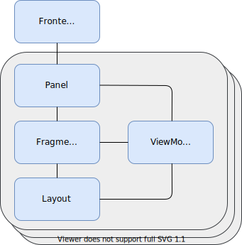

# How to create a frontend plugin

## Introduction

Frontend plugins are the User Interface (UI) modules of the IndiGO platform. They are independent
modules and can be included independently in the IndiGO platform at build time. As the platform is 
deployed as one APK, the frontend plugins all run in the UI thread. Frontend plugins are typically 
kept free of business logic, which is instead implemented in a service plugin (which also run in 
separate threads from each other - see the service plugin documentation). IndiGO comes with a 
number of default frontends and corresponding service plugins, for example; the media player, the 
phone application, etc.

Each frontend is registered with the frontend framework at runtime, by supplying a set of metadata 
which describes the frontend characteristics. Each metadata contains details such as:

- An identifier to uniquely identify the metadata.
- A `FrontendBuilder` factory which can be used by the framework to create the `Frontend` instance.
- Whether the `Frontend` should start at start-up (the default) or gets started on demand.
- Optionally, a menu item can be added to the main menu to open the `Frontend`'s main task panel.

Each frontend can have one or more panels associated with it. A `Panel` is not bound to a specific 
`Context`. It encapsulates the `Fragment` displaying the UI.

A menu item can be associated to a `Frontend`. This menu item is added to the main menu to open
the `Frontend`'s main task panel and can be used to create the frontend on demand.

Each frontend can have one or more panels associated with it. A `Panel` is not bound to a specific
`Context`. It encapsulates the `Fragment` displaying the UI.



## Creating a new frontend

In this example, we will create a new frontend for managing an account on the device. It will
provide a login screen where you can enter a username and a password to login, and if the user is
logged in, you have the option to logout again. We will also add a menu item that will be
associated to the new frontend. The final step will be to let the new frontend replace IndiGO's
user profile frontend.

Creating a frontend and the menu item consists of a number of steps:

- [Creating the `Frontend` class, deriving the abstract `Frontend` class (see API doc).](#creating-the-frontend-class)
- [Creating the `FrontendBuilder` class (see API doc).](#creating-the-frontendbuilder-class)
- [Creating the `Panel` class, and a `Fragment` to display the content on the screen.](#creating-the-panel)
- [Creating a `MenuItem`.](#creating-a-menu-item)
- [Defining the frontend and menu item build config.](#defining-the-frontend-and-menu-item-build-config)
- [Registering the frontend and menu item build config.](#registering-the-frontend-and-menu-item-build-config)

### Creating the frontend class

Create a new frontend by deriving the `Frontend` framework class.

```kotlin
import com.tomtom.ivi.api.framework.frontend.Frontend
import com.tomtom.ivi.api.framework.frontend.FrontendContext

class AccountFrontend(frontendContext: FrontendContext) : Frontend(frontendContext) {
    // ...
}
```

There are no abstract methods in the `Frontend` class, but some methods, like the lifecycle ones
(see below), are good to consider implementing.

#### Frontend lifecycle methods

- `onCreate` - callback when the frontend is created.
- `onDestroy` - callback when the frontend is about to get destroyed.

#### Showing panels on the screen

There are two callbacks for when an event is triggered to show a `TaskPanel` on the screen.

- `createMainTaskPanel` - override it to display a single `TaskPanel` when the UI is shown.
- `openTaskPanels` - override it when more control is needed over which panels should be shown.

**Note:** A frontend class must override only one of the two methods.

### Creating the FrontendBuilder class

Add an `AccountFrontendBuilder` class, derived from `FrontendBuilder` class. Override the `build()`
method in the class and return a new instance of the `AccountFrontend` class.

```kotlin
import com.tomtom.ivi.api.framework.frontend.FrontendBuilder

class AccountFrontendBuilder: FrontendBuilder() {

    override fun build(frontendContext: FrontendContext) =
        AccountFrontend(frontendContext)
}
```

The builder class must follow a specific naming convention. It must have a "FrontendBuilder"
suffix and must start with an upper case character.

### Creating the panel

There are a number of specialised `Panel` classes that can be used in the platform (see `Panel`
API documentation). For this example we will create a `Panel` class inheriting from the
`TaskPanel` class.

A `TaskPanel` is typically launched by tapping one of the menu items, like opening Contacts;
or some other UI event, like opening the Climate panel. It encapsulates a task that the user may
perform, typically away from the map, going back to the map when the task is finished.

Derive from the `TaskPanel` class, and override the `createInitialFragmentInitializer()` method,
which should return a new instance of the `Fragment` class (described further down).

```kotlin
class AccountLoginPanel(frontendContext: FrontendContext) :
    TaskPanel(frontendContext, Mode.SIDE_BAR) {

    override fun createInitialFragmentInitializer() =
        IviFragment.Initializer(AccountLoginFragment(), this)
}
```

Also create a `ViewModel` class, derived from the `FrontendViewModel` class. The `ViewModel` is the
ViewModel in the Model-View-ViewModel (MVVM) pattern, which role is to expose streams of data
relevant to the view and streams of events to the model.

```kotlin
class AccountLoginViewModel(panel: AccountLoginPanel) :
    FrontendViewModel<AccountLoginPanel>(panel) {

    val username = MutableLiveData("")
    val password = MutableLiveData("")
    // ...

    fun onLoginClick() {
        // ...
    }
}
```

Finally create a `Fragment` class using the newly created `Panel` and `ViewModel` classes,
overriding the `viewFactory` property. The IndiGO platform is designed to work well with the MVVM
pattern, and this is used in the `onCreateView` callback as a convenience to inflate a data 
binding layout and using that in the fragment. If an `onCreateView` custom implementation still is 
preferred, the `viewFactory` property can be left as null instead.

```kotlin
class AccountLoginFragment :
    IviFragment<AccountLoginPanel, AccountLoginViewModel>(AccountLoginViewModel::class) {

    override val viewFactory = ViewFactory(FrontendAccountLoginFragmentBinding::inflate)
}
```

### Creating a menu item

In this tutorial a menu item is added to the main menu that will open the main task panel of the
`AccountFrontend`. To add the menu item to the main menu we need a `MenuItem` instance.

Create an `AccountMenuItem.kt` file, add a property in the file and assign it a `MenuItem`
instance. The name of the property must follow a specific naming convention. It must have a
"MenuItem" suffix and must start with a lower case character.

```kotlin
val accountMenuItem = MenuItem(
    AccountFrontend::class.qualifiedName!!,
    R.drawable.frontend_account_menu_item_icon,
    R.string.frontend_account_menu_item_name
)
```

The `MenuItem` constructor takes a unique ID, a `DrawableResolver` and a `StringResolver`. The
latter two resolve the icon and the name of the menu item. In the above example the resolvers are
defined as Android resources.

### Defining the frontend and menu item build config

Create the frontend and menu item build configurations. These configuration will be used to
register the frontend and the menu item to the framework at build time.

Define a frontend implementation and a menu item implementation in the top-level
`frontends-and-menuitems.gradle.kts` file so it can be used in all projects, including tests.

**<rootDir>/frontends-and-menuitems.gradle.kts**

```kotlin
import com.tomtom.ivi.buildsrc.dependencies.ExampleModuleReference
import com.tomtom.ivi.gradle.api.common.iviapplication.config.FrontendCreationPolicy
import com.tomtom.ivi.gradle.api.common.iviapplication.config.FrontendConfig

/**
 * Defines the implementation and the configuration of the account frontend.
 */
val accountFrontend by extra {
    FrontendConfig(
        // Needs to match with the name of the builder class.
        frontendBuilderName = "AccountFrontendBuilder",
        // The module containing the frontend implementation.
        implementationModule = ExampleModuleReference("frontends_account"),
        // Create the frontend on demand. It will be created when the menu item is selected.
        creationPolicy = FrontendCreationPolicy.CREATE_ON_DEMAND
    )
}

val accountMenuItem by extra {
    // We can use `FrontendConfig.toMenuItem()` as the menu item is defined in the same module as
    // the frontend implementation. The argument given needs to match with the property that
    // was created earlier in the tutorial.
    accountFrontend.toMenuItem("accountMenuItem")
}
```

The above build configurations use the `ExampleModuleReference` to resolve a module name into
the full-qualified package. It is defined once and used for all configurations. See
[How to integrate Indigo in Gradle](how-to-integrate-indigo-in-gradle.md#module-references)
for details.

### Registering the frontend and menu item build config

The last step is to register the frontend and the menu item to build configurations in the main
application's build script.

**modules/products/exampleapp/build.gradle.kts**

```kotlin
import com.tomtom.ivi.gradle.api.common.iviapplication.config.FrontendConfig
import com.tomtom.ivi.gradle.api.common.iviapplication.config.IviInstanceIdentifier
import com.tomtom.ivi.gradle.api.common.iviapplication.config.MenuItemConfig
import com.tomtom.ivi.gradle.api.plugin.platform.ivi

// Define the frontends and menu items as defined in top-level `frontends-and-menuitems.gradle.kts`
// file.
apply(from = rootProject.file("frontends-and-menuitems.gradle.kts"))

// Use Gradle's extra extensions to obtain the `accountFrontend` and `accountMenuItem` configs as
// defined in the top-level `frontends-and-menuitems.gradle.kts` file.
val accountFrontend: FrontendConfig by project.extra
val accountMenuItem: MenuItemConfig by project.extra

plugins {
    // Apply the plugin to use to default frontends and menu items.
    id("com.tomtom.ivi.defaults.core")
}

ivi {
    application {
        enabled = true
        iviInstances {
            create(IviInstanceIdentifier.default) {
                // Use the default frontends and menu items as defined by the
                // `com.tomtom.ivi.defaults.core` plugin.
                useDefaults()
                frontends {
                    // Register the `accountFrontend`.
                    add(accountFrontend)
                }
                menuItems {
                    // Register the `accountMenuItem` and associate it with the `accountFrontend`.
                    addLast(accountMenuItem to accountFrontend)
                }
            }
        }
    }
}

// The rest of the build script, dependencies, etc.
```

The above example adds the `accountFrontend` and the `accountMenuItem` to the default IVI
instance. A vehicle may have multiple infotainment screens. Each infotainment screen is an IVI
instance. See [How to configure the runtime deployment](how-to-configure-the-runtime-deployment.md)
for more details about IVI instance configurations.

The final step is to let the new frontend replace IndiGO's user profile frontend. For this
we have to use 'replace' instead of `add`. The same applies for the user profile menu item.

**modules/products/exampleapp/build.gradle.kts**

```kotlin
import com.tomtom.ivi.gradle.api.common.iviapplication.config.FrontendConfig
import com.tomtom.ivi.gradle.api.common.iviapplication.config.IviInstanceIdentifier
import com.tomtom.ivi.gradle.api.common.iviapplication.config.MenuItemConfig
import com.tomtom.ivi.gradle.api.plugin.defaultsplatform.userProfileFrontend
import com.tomtom.ivi.gradle.api.plugin.defaultsplatform.userProfileMenuItem
import com.tomtom.ivi.gradle.api.plugin.platform.ivi

// Define the frontends and menu items as defined in top-level `frontends-and-menuitems.gradle.kts`
// file.
apply(from = rootProject.file("frontends-and-menuitems.gradle.kts"))

// Use Gradle's extra extensions to obtain the `accountFrontend` and `accountMenuItem` configs as
// defined in the top-level `frontends-and-menuitems.gradle.kts` file.
val accountFrontend: FrontendConfig by project.extra
val accountMenuItem: MenuItemConfig by project.extra

plugins {
    // Apply the plugin to use to default frontends and menu items.
    id("com.tomtom.ivi.defaults.core")
}

ivi {
    application {
        enabled = true
        iviInstances {
            create(IviInstanceIdentifier.default) {
                // Use the default frontends and menu items as defined by the
                // `com.tomtom.ivi.defaults.core` plugin.
                useDefaults()
                frontends {
                    // Replace the IndiGO's user profile frontend with the `accountFrontend`.
                    replace(userProfileFrontend, accountFrontend)
                }
                menuItems {
                    // Replace the IndiGO's user profile menu item with the `accountMenuItem`
                    // and associate it with the `accountFrontend`.
                    replace(userProfileMenuItem, accountMenuItem to accountFrontend)
                }
            }
        }
    }
}

// The rest of the build script, dependencies, etc.
```

The above example replaces the `userProfileFrontend` with the `accountFrontend` and replaces
the `userProfileMenuItem` with the `accountMenuItem`.

## Copyright

Copyright (c) 2020 - 2021 TomTom N.V. All rights reserved.

This software is the proprietary copyright of TomTom N.V. and its subsidiaries and may be used for
internal evaluation purposes or commercial use strictly subject to separate licensee agreement
between you and TomTom. If you are the licensee, you are only permitted to use this Software in
accordance with the terms of your license agreement. If you are not the licensee then you are not
authorised to use this software in any manner and should immediately return it to TomTom N.V.
