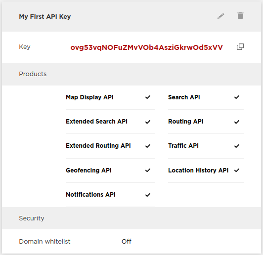

The IndiGO SDK uses TomTom's online NavKit2 services, for which an API key is required. An
evaluation key with limited authorisation can be acquired immediately. After signing TomTom's
evaluation agreement, these restrictions are removed and you can experience the full functionality
of the IndiGO SDK and NavKit2.

## Registering as a TomTom Developer

- Navigate to [developer.tomtom.com](https://developer.tomtom.com/) and click `Register`, then fill
  out the registration form.
- You will receive a confirmation email; click `Activate Account` and go to your
  [TomTom Developer dashboard](https://developer.tomtom.com/user/me/apps).
- The API key you get assigned should be used in the IndiGO SDK, but it must still be authorised by
  TomTom for the NavKit2 features used by IndiGO. See also section
  [Evaluation agreement](#evaluation-agreement).

## Installing the API key

Now that you received your NavKit2 API key, it can be used with the IndiGO SDK.

- Set the `navkit2ApiKey` property to your NavKit2 API key in the top level `local.properties` file
  or in your `gradle.properties` file. The `local.properties` file is located in your local SDK
  folder. The `gradle.properties` file is located in the folder specified by the `GRADLE_USER_HOME`
  environment variable, usually `~/.gradle/`. See
  [How to configure the NavKit2 API key](how-to-configure-the-navkit2-api-key.html) for details and
  alternatives ways to configure the key.

__Windows:__ Use the `%UserProfile%\.gradle` folder.

## Evaluation agreement

The initial API key has restrictions on the functionality and the amount of requests you can do.
To enjoy the full functionality, apply for an evaluation agreement with TomTom.

- For now: Ask your TomTom contact person to establish an evaluation agreement.
- Later: In your TomTom Developer Portal, request evaluating the Digital Cockpit.

__Note:__ You will not get a new API key, but the restrictions on your API key will be removed by
TomTom.

Next step: [Accessing the Artifact repository](4.%20accessing-the-artifact-repository.html).
