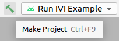

To install the Android Studio IDE, follow the instructions from the
[official Android guide](https://developer.android.com/studio/install).
Note that you need a minimum version of 4.2.x of Android Studio for Java 11 to work correctly.

In the dialog box `Import Android Studio Settings` select `Do not import settings` and click `OK`.


## Gradle plugin for Android Studio

Android Studio may propose upgrading its Gradle plugin:


You can safely upgrade to version 4.2.2, but do _NOT_ upgrade to a higher version because the
IndiGO SDK is not yet compatible with it.

## Building with Android Studio

The IndiGO example app can be built using Android Studio:

Open the project:

- In dialog box `Welcome to Android Studio` select `Open an Existing Project`.

- When this dialog does not show, you can open the project via `File -> Open`.

- Select the `build.gradle.kts` file from the
  `examples/products_indigo_examples_<version>-sources` folder where you extracted the source code.

Ensure that Android Studio uses `OpenJDK11`:

- Go to `File -> Project Structure -> SDK Location`.

- Under `JDK Location` select the OpenJDK version that you downloaded earlier, then click `OK`.

Gradle Sync should start running automatically, then Android Studio will configure the project and
download its dependencies. If it does not, start it manually by clicking on the Gradle Sync icon.
This step may take a few minutes.


Now you can browse the source code in the IDE.

Build the application by clicking on the green `hammer` icon:



__Note:__ Building the application may report an error like:

```bash
    License for package Android SDK Build-Tools 30.0.2 not accepted.
```

To solve this, open the SDK Manager via `Tools -> SDK Manager` in tab `SDK Tools`, tick
`Show Package Details` and install the required package and/or accept its license terms.

Next step: [The IndiGO emulator](6.%20the-indigo-emulator.html).
