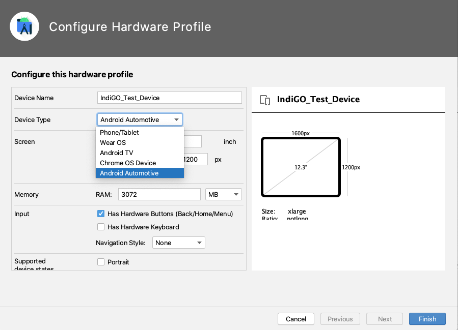

IndiGO can run on Android emulators (Android Virtual Devices, AVDs) in addition to the reference /
demo hardware (Samsung Galaxy Tab S5e). A special Android emulator configuration has been created
for running IndiGO. This configuration contains a number of customizations to the emulator hardware
and the Android platform on which it runs. This emulator can be used for development on top of
IndiGO and runs x86\_64 AOSP with Android 11 Automotive.

__Note:__ The IndiGO platform also runs on a standard Android device, with an IndiGO-supported CPU
architecture. However, some features may not work as IndiGO is implemented for the Android
Automotive variant.

## The IndiGO emulator image

Follow these steps to install the IndiGO emulator image in Android Studio:

- Add the file `docs/resources/devices.xml` (from the `examples` source), to your `~/.android/`
  folder.
    - __Windows:__ Add the file to your `%UserProfile%\.android\` folder.

- If Android Studio is running, make sure it is restarted, so that the new file is picked up.

- Open the SDK Manager via `Tools -> SDK Manager`.

- In the SDK Manager, select tab `SDK Update Sites` and add a new entry with the following name and
  URL:
    - Name: `TomTom IndiGO Update Site - Android 11 Emulators`
    - URL: `https://aaos.blob.core.windows.net/indigo-automotive/repo-sys-img.xml`

- Tick `Use Authentication`, enter your TomTom Nexus credentials and click `Apply` to activate this update site.

- Switch to tab `SDK platforms` and tick `Show Package Details` on the bottom right. Then locate
  the `Indigo Automotive Android System Image` in the list. You may need to expand the Android 11
  section to see this item.

- Select the system image and click `Apply` to start downloading it. When the download completes,
  close the SDK Manager.

## The IndiGO emulator device

Follow these steps to create an emulator device based on the IndiGO emulator:

- Open the AVD Manager (Android Virtual Device Manager) via `Tools -> AVD Manager`.

- Click `Create Virtual Device`:

- You should now be presented with a list of devices definitions.

- In the `Tablet` category, find item `IndiGO_Test_Device`:

- Select `IndiGO_Test_Device`, and click `Edit Device...` at the right side of the screen. This
  shows the dialog `Configure Hardware Profile` for the `IndiGO_Test_Device`.

- Change the `Device Type` from "Phone/Tablet" to "Android Automotive":

- Set the emulator's RAM to 3072 MB, and click `Finish`.

- The hardware profile of the emulator is now configured to be an automotive device. This will be
  used for emulator devices to be created.
    - __Mac(book) _with_ an M1 processor:__ No Android Automotive emulator is available for this chip
      yet, so keep the `Device Type` as `Phone/Tablet`.

- Back in dialog `Select Hardware`, you now see in category `Automotive` an item called
  `IndiGO_Test_Device`:
    - __Mac(book) _with_ an M1 processor:__ You see this item in category `Tablet`.

- Select this device `IndiGO_Test_Device` and choose `Next` to continue creating the AVD.

- Select tab `x86 Images` and choose `Android R` (API level 30) as the System Image, downloading
  it first if necessary (by clicking "Download" next to the Release Name).
    - __Mac(book) _with_ an M1 processor:__ Select tab `Other Images` and choose `Android S` for
      `arm64-v8a` as the System Image.

- Click `Next` then `Finish`.

- You now see a new IndiGO emulator device listed in the AVD Manager:

- Click the triangular `play` icon on the right to start the emulator.

- Enable wifi:
    - Click the Home button (circle) in the sidebar next to the emulator screen.
    - Select `Car Launcher as Home` -> `Just Once`.
    - Press the Android Applications icon (nine dots in a grid) on the bottom of the screen.
    - Scroll down and open `Settings`.
    - Select `Network & internet`.
    - Enable `Wi-Fi` by pressing the toggle button so it turns blue.

- Set the emulator's OpenGL ES API level to 3.1:
    - Click the three dots at the bottom in the sidebar next to the emulator screen. This opens the
      `Extended Controls` menu.
    - Select `Settings` at the left.
    - Select the `Advanced` tab at the top.
    - This should say `Desktop native OpenGL` and `Renderer maximum (up to OpenGL ES 3.1)`, see
      picture below.
    - Close the `Extended Controls` menu.

- Now restart the emulator, for the new settings to take effect:
    - Click the `x` in the upper-right corner of the emulator sidebar.
    - In Android Studio go to: `Tools -> AVD Manager`.
    - On the right-hand side of each configured AVD there is a down-arrow that launches a context
      menu. Press the down-arrow (instead of pressing the green Play button), and select
      `Cold Boot Now`.

- Build and run the application by clicking on the green `play` icon. Ensure that the device that
  the application will run on is the IndiGO automotive emulator that was created earlier in this
  tutorial.

 
