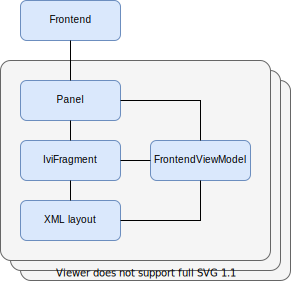

Frontend plugins are the User Interface (UI) modules of the IndiGO platform. Each frontend is an 
independent module encapsulating the UI of some distinct functionality in the platform. The IndiGO 
platform provides a number of default, or _stock_, frontend plugins, like the media player, or the 
phone, etc.

Each frontend is developed against a common set of stable platform APIs. These APIs can be used to 
create new frontends for the platform, or replace a stock plugin with your own customised 
version.

The configuration and inclusion of the frontend plugins in the IndiGO product are done at build 
time, thus only the applicable frontend plugins are included in the deployed product.

The IndiGO product is built and deployed as one Android 
[APK](https://developer.android.com/guide/components/fundamentals). 
Therefore, the plugins cannot be replaced, or updated individually after the product has been 
installed on a device, but this requires a new build to be re-installed.

## Stock frontend plugins

There are a number of stock plugins in the IndiGO platform. The following picture shows the default 
view when you launch the example application that comes with IndiGO. Highlighted in red it shows 
the HVAC frontend along the bottom and the main menu frontend on the left side with menu items 
that launch other frontends.

Here is an example of one of the stock frontends launched, containing the UI for the contacts 
functionality. The Frontend and the associated menu item is highlighted in red. 

## Frontends and panels

Each frontend can have one or more panels associated with it. A panel encapsulates the fragment
displaying the UI and it is not bound to a specific Android context.

A menu item can be associated with a frontend. This menu item is added to the main menu to open
the frontend's main task panel and can also be used to create the frontend on demand.

IndiGO frontends are designed around using the 
[MVVM pattern](https://en.wikipedia.org/wiki/Model%E2%80%93view%E2%80%93viewmodel) 
and [Android's Data Binding Library](https://developer.android.com/topic/libraries/data-binding). 
IndiGO has many convenience classes to simplify using these. The `api_framework_frontend` module 
([see the API reference documentation](/indigo/api-reference/indigo-api-reference)) 
contains the classes needed to create your own frontend, panel, fragment using a viewmodel for the 
data-binding.

- Frontend - To create your own frontend, derive the `Frontend` class.
- Panel - To create your own panel for the frontend, you can derive from any of the panel classes 
in package `com.tomtom.ivi.api.framework.frontend.panels`. Which panel to derive from depends on 
how the panel should be presented. For example, deriving from `TaskPanel` allows you to implement 
a panel that can be opened through a menu item.
- Fragment - To create your own fragment, derive the `IviFragment` class to take advantage of the 
convenience methods for inflating and binding your layout and view model.
- ViewModel - Derive `FrontendViewModel` to create a view model that binds your panel and layout 
together.

## Registration

Each frontend is registered by supplying a set of metadata at build-time 
which describes the frontend characteristics. Each metadata contains details such as:

- A factory class which can be used by the framework to create the instance.
- Whether the frontend should start at start-up (the default) or start on demand.
- Optionally, a menu item can be added to the main menu to open the frontend's main task panel.

The configuration in the gradle build files can also specify whether or not this frontend should 
be replacing an existing stock frontend.

## More information

For more details on how to create a `Frontend`, see the 
[How to create a frontend plugin](/indigo/documentation/tutorials-and-examples/basics/create-a-frontend-plugin) 
page.

