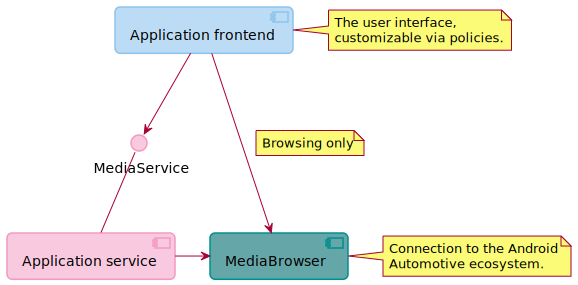
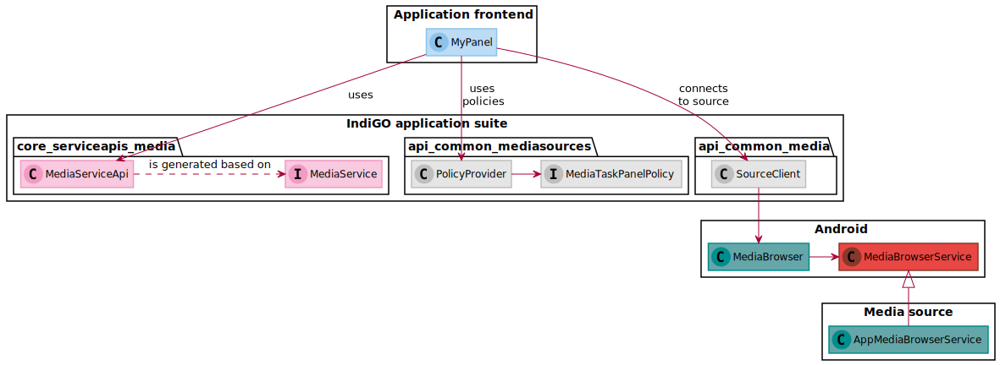

Media plays an important part in users’ digital life and is the most used function of infotainment
systems. This encompasses radio, music, podcasts and audio books. IndiGO provides a way to browse
and stream content from any audio source.

Media sources (or sources) are apps that provide media content. Sources provide content in a
hierarchy. For example, an album contains tracks, and an artist overview may contain all albums.
The source determines how it organizes its content.

This document explains the structure of the media domain in two parts: a high-level overview,
followed by a detailed overview.

## High-level overview

The IndiGO Application Suite provides flexible architecture components to allow a wide range of
media sources to be integrated, and to provide the end-user with a consistent user interface
through which they can browse and play media.

The following diagram shows a high-level overview of the architecture of media in IndiGO. It
displays the following components:
- The media application frontend. This is the user interface.
- The media service interface. This interface defines how a frontend (or potentially another
  service) can interact with the media application service.
- The media application service. This is the service that implements the media service interface.
- The `MediaBrowser`. This is the connection to the [Android Automotive media ecosystem](#android-automotive-media-ecosystem).

Below, we'll explain the following major topics:
- [Media](#media)
  - [High-level overview](#high-level-overview)
    - [Android Automotive media ecosystem](#android-automotive-media-ecosystem)
    - [Division of responsibility](#division-of-responsibility)
    - [Available stock components](#available-stock-components)
  - [Detailed overview](#detailed-overview)
    - [Configuring media application frontend](#configuring-media-application-frontend)
    - [Media library](#media-library)
    - [Media sources library](#media-sources-library)
      - [Panels](#panels)
      - [Media controls](#media-controls)
      - [Policies](#policies)

### Android Automotive media ecosystem

IndiGO hooks into the existing Android Automotive media ecosystem. All developers developing a
media app on Android can develop their app in this standardized way. Many media apps on the market
today, made for Android Automotive OS or for Android Auto, already conform to this standard.
Because of that, they are automatically supported by IndiGO.

The Android Automotive media standard is well documented. To familiarize with this topic, the
[Build media apps for cars](https://developer.android.com/training/cars/media) and 
[Add Android Automotive OS support to your media app](https://developer.android.com/training/cars/media/automotive-os)
docs from Android are available.

### Division of responsibility

The [high-level overview](#high-level-overview) shows the application frontend (the user interface),
the media service interface, and an application service.

To understand how responsibilities are divided between them, the first component to consider is
the media service interface. Its functions can be divided into three categories:
- The currently available sources.
- The current status. For example:
  - What is currently playing?
  - Which source is playing it?
- Actions. These are commands that can be sent to a source. For example: pause playback. The
  service signals which actions are currently available, and has the ability to send (or launch)
  them.

The service offers no way to browse media content. This is done in the frontend itself for
performance reasons: sending content via inter-process communication between service and frontend
is slow. As a result, both the frontend and the service use the Android Automotive media API.

The frontend displays the current media state as offered by the application service, and allows
the browsing of media content for all installed media sources. It offers a list of available
sources, and when one is selected, allows the user to browse through its content hierarchy, and to
start and control media playback.

### Available stock components

By default, the IndiGO platform offers a delightful user interface that provides a browsable
hierarchy of media content which can be played and/or browsed from installed media sources.

This user interface can be customized, expanded upon, and even replaced, to accommodate different
types of media sources (for example: radio, video playing) while ensuring that the visual style
holds up to the highest standards for user experience simplicity and distraction-free usage.

The stock application frontend can be configured using the
[MediaConfiguration](com.tomtom.ivi.api.common.mediasources.MediaConfiguration) class,
see [configuring media frontend](#configuring-media-application-frontend) for more details.

If that is not sufficient, it is possible to completely replace the stock frontend and/or service
with custom implementations.

## Detailed overview

Let's take a look at the various components in the media domain, and how they connect and interact.

This diagram shows the most relevant components:
- The media service, see [division of responsibility](#division-of-responsibility).
- The source client, which is contained in the [media library](#media-library).
- The [PolicyProvider](com.tomtom.ivi.api.common.mediasources.policies.PolicyProvider), which
  provides [policies](#policies). For example, the
  [MediaTaskPanelPolicy](com.tomtom.ivi.api.common.mediasources.policies.MediaTaskPanelPolicy)
  can be used to create [panels](#panels).

### Configuring media application frontend

- To simply customize how the content is displayed on screen, [policies](#policies) can be used.
- Adding support for a custom media action provided by a source (for example, a "like" or an "add to
  playlist" functionality) is easy, by creating a new [media control](#media-controls).
- For more complex use cases, it is possible to create [custom panels](#panels) to show an entirely
  different user interface for a source.

### Media library

The media library, documented in [api_common_media], can be used to directly and easily retrieve
media content for a custom implementation.

### Media sources library

The media sources library, documented in [api_common_mediasources], contains the building blocks for
more thorough customization of media frontends.

#### Panels

The Android Media API standardizes support for all sorts of media content, such as radio, which
might not be suitable for the standard user interface offered by the stock media application
frontend.

To ensure the most straightforward development of support for such alternative sources, a number
of facilities are provided to immediately start building suitable user interfaces.
The [api_common_mediasources] module contains these facilities.

#### Media controls

A media source may offer custom actions. Custom actions are actions that add unique capabilities
specific to one source, such as liking a song. These actions may need to be integrated into the
user interface so that the end-user can access them.

Creating a media control can be the way to do that. A media control is a visual control for a
media-related command. They appear in the following locations:
- The playback controls. This is the bottom bar in the stock media frontend.
- The mini player. This is the process bar from the stock media frontend that appears when the
  frontend is closed.

Further information is available in the [api_common_mediasources] module, and more
specifically, in the
[MediaControl](com.tomtom.ivi.api.common.mediasources.controls.MediaControl) page.

#### Policies

When integrating a new media source into a product, the media content it offers may be a challenge
to display properly to the user: even if the Android standard is quite well known and documented,
there are still some small areas where inconsistencies can occur, and policies offer a way to level
those out.

Policies are the simplest way to customize the content offered by a media source, so that the
stock Media user interface can display it in the best way; for example by modifying media titles
when they're given as a single "artist - track name" string, or by changing how a specific type of
media is displayed.

Further information is available in the [api_common_mediasources] module, and more specifically in
the [PolicyProvider](com.tomtom.ivi.api.common.mediasources.policies.PolicyProvider) page.

