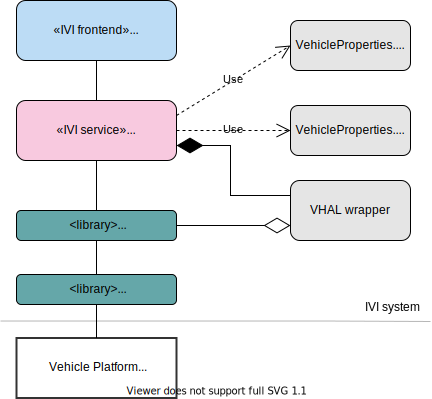

The vehicle functions domain APIs and modules enable IndiGO to interact with the vehicle, like
opening a window, setting the Air Conditioning temperature, or being informed about the current
speed.

## Introduction

An IndiGO-based system consists of multiple parts: the vehicle platform, Android services, and
IndiGO. The _vehicle platform_ is the part that Android Car uses to communicate with the vehicle.

Because vehicle platforms differ from brand to brand, and sometimes even from model to model,
IndiGO provides an abstraction of that vehicle platform. By adding an `IviService` layer on top of
Android Car, IndiGO can communicate with each vehicle using the same interface.

This interface uses its own definitions of the properties a vehicle platform may expose and
enables property observers to obtain the values of these properties, as well as a means of changing
their value.



As shown in the diagram, IndiGO has a single interface for all types of vehicle platforms. In the
`core_common_vehiclefunctions` module we define the different types of vehicle properties and how
we communicate with them.

The vehicle function services are built on top of Android Car, which in turn uses the Vehicle
Hardware Abstraction Layer (VHAL). Working our way up we can describe how to write or use a vehicle
function service.

All communication is asynchronous. This means that you can make vehicle property change requests
and the current thread will not be blocked. Any effects of your request will come in the shape of
vehicle property value changes, or in the shape of an error callback. In the background, the
vehicle platform decides what should happen, changes the vehicle's state, and updates the vehicle's
properties, sending any changed values back to IndiGO.

## Android VHAL interface

The Android VHAL abstracts away the vehicle properties. This interface is best described in
[Android's VHAL overview](https://source.android.com/devices/automotive/vhal/properties) and the
[Android's HAL definition](https://source.android.com/reference/hal/structvehicle__hw__device). In
summary it offers the following:

- A method to list all configurations of properties supported by the VHAL. A single configuration
  describes:
  - access mode (read, write, read/write),
  - change mode (static, on change, continuous),
  - value type, and
  - min/max sample rate.
- A method to set a property value per zone, with an error return value if the vehicle system owning
  the property has not been properly initialized yet.
- A method to get a property value per zone, with an error return value if there is no data
  available.
- A method to subscribe to property changes per zone. Subscription type can be _on change_ or
  _continuous_ with a given update frequency or sample rate.
- An error callback method.

## Android Car interface

The Android Car interface relies on the
[`CarPropertyManager`](https://developer.android.com/reference/android/car/hardware/property/CarPropertyManager).
It uses the VHAL interface definition to create an implementation. In summary it offers the
following:

- A type-safe and zone-dependent `getProperty` method.
- A type-safe and zone-dependent `setProperty` method.
- A method to check a property availability.
- A method to get a property configuration:
  - access mode,
  - change mode,
  - min/max sample rate,
  - min/max value,
  - value type,
  - supported zones.
- A method to get the configuration of all properties.
- A method to subscribe to changes at a certain rate: 1Hz, 5Hz, 10Hz, 100Hz, _on change_.
- An error callback method triggered for errors when setting a property fails: access denied,
  invalid arg, property not available, try again, unknown.
- Methods may take multiple seconds to complete.
- Exceptions are thrown in case of errors.

## IndiGO interface

The following list of restrictions drove the design of the IndiGO Vehicle Functions:

- A vehicle function service supports an API to discover vehicle capabilities.
- A vehicle function service exposes error states provided by the VHAL.
- A vehicle function service API does not depend on Android Car.
- The state exposed by the interfaces of the vehicle application services and vehicle function
  services is always initialized and set to _unavailable_ if not all dependent layers are yet
  initialized.
- The VHAL validates data conformity of the exposed properties. An error is reported in the case of
  non-conformity.

## Vehicle properties

Vehicle properties are always in one of three states:

- _unsupported_, when a property is _not_ supported by the vehicle platform.
- _supported_, when a property is supported by the vehicle platform.
- _available_, when a property is supported _and_ has a valid value.

Instead of using state flags, the vehicle function service APIs use nullable parameters:

- The property is `null` when the vehicle property is unsupported.
- The value of the property is `null` when the property is (temporarily) not available.

Usage:

```kotlin
when {
  property == null -> unsupported()
  property.value == null -> supportedButNotAvailable()
  else -> supportedAndAvailable()
}
```

Or, when the supported state is not relevant:

```kotlin
when (property?.value) {
  null -> unsupportedOrNotAvailable()
  else -> supportedAndAvailable()
}
```

## Implementing a vehicle functions service

A vehicle functions service interface should have the `@IviService` annotation so IndiGO can
discover it:

```kotlin
\@IviService ( serviceId = "com.tomtom.ivi.service.example" )
interface VehicleExampleService {
    // ...
}
```

### Readable properties

The interface should provide a readable and observable value of any readable vehicle property.
The vehicle functions service ensures that the value is within a specified range.

```kotlin
    val [propertyName]: [type]Property?
    val [zonePropertyName]: [type]ZoneProperty?
```

### Writable properties

The interface should provide a setter function for any writable properties. It should return
`false` if the property could not be updated, for example when the property is not (yet) available.
The `@IviServiceFun` annotation and `suspend` are required to expose the service function to the
generated API version of this service.

__Note:__ These are only possible for vehicle properties with write access.

```kotlin
\@IviServiceFun
suspend fun set[PropertyName](value: [type]): Boolean
```

### Zoned writable properties

The interface should provide a setter function for any writable properties which work in a certain
area. It should return `false` if the property could not be updated, for example when the property
is not (yet) available. The `@IviServiceFun` annotation and `suspend` are required to expose the
service function to the generated API version of this service.

__Note:__ These are only possible for vehicle properties with write access.

```kotlin
\@IviServiceFun
suspend fun set[PropertyName](area: PropertyArea, value: [type]): Boolean

}
```

See also [Areas](#property-areas).

### Property Availability

The availability of a property is decided based on various factors:

- If the underlying layers are not ready yet, the property is unavailable.
- If an error occurs while reading the property, the property may become (temporarily) unavailable.
- Certain business rules may cause the property to become (temporarily) unavailable, like legal
  restrictions or country restrictions.

### Property Areas

Some vehicle properties may have zoned values within a certain area, like the driver seat zone for
the seat heating property in the `SEAT` area, or the passenger side window zone in the `WINDOW`
area. An area describes which part of a vehicle a property belongs to, while the zone signifies
which part, or parts, of that area a value is about.

Take the cabin temperature for example. Let's assume that the vehicle allows the temperature on two
sides of the vehicle, left and right, to be set separately. Because the cabin temperature concerns
the location where people are sitting, the `SEAT` area should be used. The VHAL supports three
rows of three seats, so the rows need to be split unevenly into two zones: _left/center_ and
_right_. By setting the cabin temperature for the _left/center_ zone in the `SEAT` area separately,
the _right_ zone temperature is unaffected, and vice versa.

If there is no specific area applicable to the property, then the `VehicleProperties.[type]
Property` types are used. If the area _is_ relevant, then the `VehicleZoneProperty` type is used,
providing a value per area.

An area must be a sub-type of `WINDOW`, `SEAT`, `DOOR`, `MIRROR`, or `WHEEL`. It must also include
a zone, like: `WINDOW_ROW_1_LEFT` or `SEAT_ROW_2_CENTER`. See
`com.tomtom.ivi.api.common.vehiclefunctions` for more examples.

## Related modules

The [core_serviceapis_vehicleevstatus] module shows the definition of a simple vehicle functions
service. It only exposes the current battery level for an Electric Vehicle (EV) or a hybrid vehicle.
See the example application to see how this gets used.

The [core_serviceapis_vehiclehvac] module is a definition of an IVI service that is a conduit to
the HVAC functionalities of the vehicle. It shows how to define a more involved interface for your
service.
