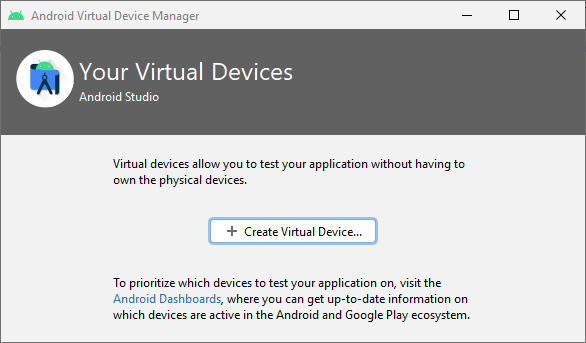
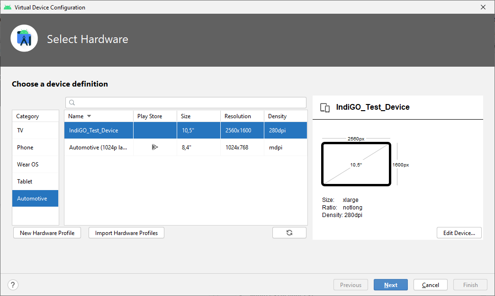
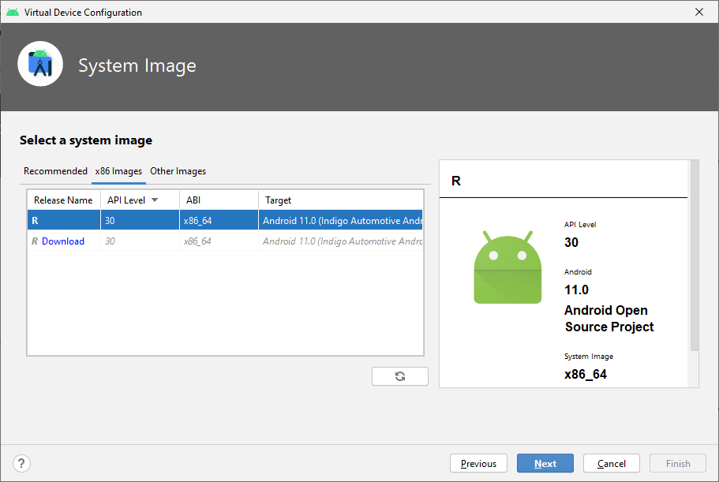
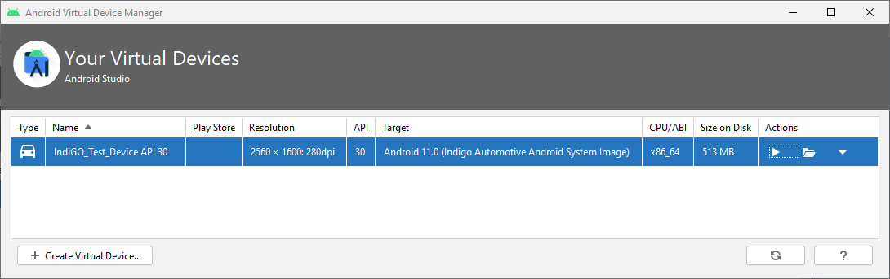
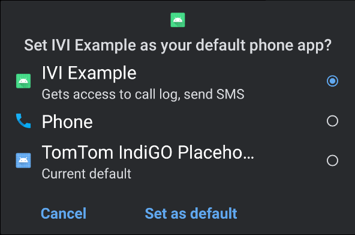
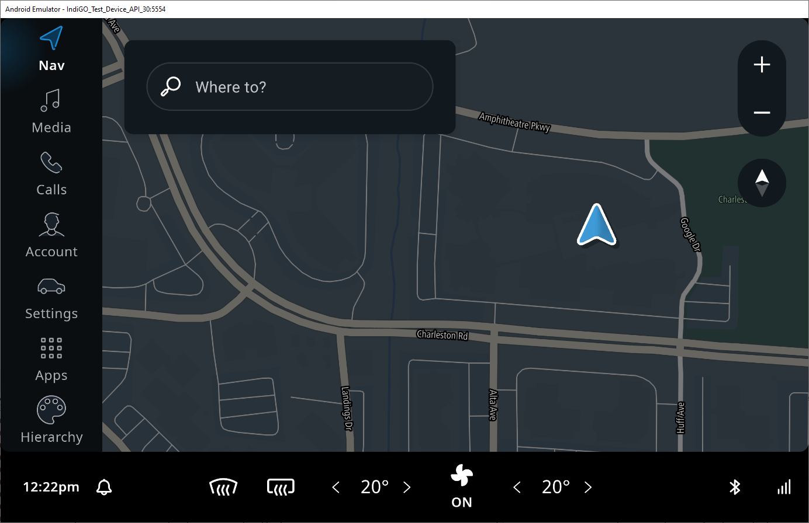

IndiGO can run on Android emulators (Android Virtual Devices, AVDs) in addition to the reference or
demo hardware (Samsung Galaxy Tab S5e). A special Android emulator configuration has been created
for running IndiGO. This configuration contains a number of customizations to the emulator hardware
and the Android platform on which it runs. This emulator can be used for development on top of
IndiGO and runs x86\_64 AOSP with Android 11 Automotive.

__Note:__ The IndiGO platform also runs on a standard Android device, with an IndiGO-supported CPU
architecture. However, some features may not work as IndiGO is implemented for the Android
Automotive variant.

## The IndiGO emulator image

Follow these steps to install the IndiGO emulator image in Android Studio:

- Copy the file `docs/resources/devices.xml` (from the `examples` source), to your `~/.android/`
  folder.

    __Windows:__ Add the file to your `%UserProfile%\.android\` folder.

- If Android Studio is running, restart it, so that the new file is picked up.

- Open the SDK Manager via `Tools` > `SDK Manager`.

- In the SDK Manager, select tab `SDK Update Sites` and add a new entry with the following name and
  URL:
    - Name: `TomTom IndiGO Update Site - Android 11 Emulators`
    - URL: `https://aaos.blob.core.windows.net/indigo-automotive/repo-sys-img.xml`
    - Note the `s` in `https://`, because Android Studio proposes a default URL as `http://`.

- Tick `Use Authentication`, enter your TomTom
  [repository credentials](/indigo/documentation/getting-started#access-the-indigo-sdk)
  and click `OK`.

- Switch to another tab and back to `SDK Update Sites`, then click `Apply` to activate this update
  site.

- Switch to tab `SDK platforms` and tick `Show Package Details` on the bottom right. 

- Expand the `Android 11 (R)` section, enable the `Indigo Automotive Android System Image` and click
  `Apply` to start downloading this image.

- When the download completes, close the SDK Manager.

## The IndiGO emulator device

After having downloaded the [emulator image](#the-indigo-emulator-image), you can create an Android
Virtual Device (AVD) with it:

- Open the AVD Manager via `Tools > AVD Manager`.

- Click `Create Virtual Device`:

- You should now be presented with a list of devices definitions.

- In the `Automotive` category, find item `IndiGO_Test_Device`:

- Select this device `IndiGO_Test_Device` and choose `Next` to continue creating the AVD.

- Select tab `x86 Images` and choose `Android R` (API level 30) as the System Image.
    - __Mac _with_ an M1 processor:__ Select tab `Other Images` and choose `Android S` for
      `arm64-v8a` as the System Image. This is a standard Android image, without IndiGO-specific
      customizations or Android Automotive features.

- Click `Next` then `Finish`.

- You now see a new IndiGO emulator device listed in the AVD Manager:

- Click the triangular `play` icon on the right to start the emulator.
- When the emulator has started, it shows as:

- Enable wifi, to ensure that map data can be downloaded:
    - Click the Home button (circle) in the sidebar next to the emulator screen.
    - Press the Android Applications icon (nine dots in a grid) on the bottom of the screen.
    - Scroll down and open `Settings`.
    - Select `Network & internet`.
    - Enable `Wi-Fi` by pressing the toggle button so it turns blue.

- Set the emulator's OpenGL ES API level to 3.1:
    - Click the three dots at the bottom in the sidebar next to the emulator screen. This opens the
      `Extended Controls` dialog.
    - Select `Settings` at the left.
    - Select the `Advanced` tab at the top.
    - This should say `Desktop native OpenGL` and `Renderer maximum (up to OpenGL ES 3.1)`, see
      picture below.
    - Close the `Extended Controls` dialog.

- Now restart the emulator, for the new settings to take effect:
    - Click the `x` in the upper-right corner of the emulator sidebar.
    - In Android Studio go to: `Tools` > `AVD Manager`.
    - On the right-hand side of each configured AVD there is a down-arrow that launches a context
      menu. Press the down-arrow (instead of pressing the green Play button), and select
      `Cold Boot Now`.

- Build and run the application by clicking on the green `play` icon. Ensure that the device that
  the application will run on is the IndiGO automotive emulator that was created earlier in this
  tutorial.

- When the application starts, you must select `IVI Example` as the default phone app.

- You will now see the IndiGO home screen. Note that the map data is shown only when you have
  [configured a TomTom API key](/indigo/documentation/getting-started/getting-the-tomtom-api-key).

If you encounter any issues, please consult our
[Frequently Asked Questions](/indigo/documentation/getting-started/frequently-asked-questions).
