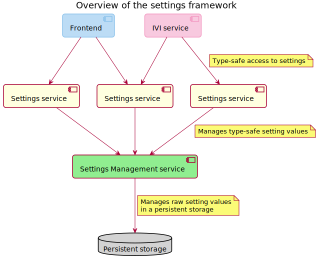

The settings framework allows cross-application settings to be shared between IndiGO services and
frontends in IndiGO. IndiGO components can store them persistently and change their values.

Modules access settings via setting services that offer type-safe and domain-specific interfaces to
the generic settings management service.


## Overview

The settings framework consists of a [settings management service](#settings-management-service),
that provides a `SettingsManagementService` API to store settings values in the persistent key-value
storage, and [settings services](#settings-service), that offer a type-safe and domain-specific
interface to a settings management service.

IVI frontends and IVI services use settings services to manage their settings.



## Settings management service

The settings management service `SettingsManagementService` provides an API to store settings values
in persistent key-value storage in a type-safe manner.

A client of a settings management service should __create__ a setting before use.
A client specifies:

 - An identifier `IviServiceId` of the service that owns the setting. Only the owning service can
   create the same setting multiple times, which may happen if the owning service has been
   restarted.
 - A unique setting key.
 - A default setting value.
 - An update strategy `SettingUpdateStrategy` that specifies what happens to the existing setting
   value.

The type of a setting key is a subtype of the `SettingKey`, and declares the type of a setting
value. Available setting key subtypes are:

- `BooleanSettingKey` for a __boolean__ setting value.
- `IntSettingKey` for an __int__ setting value.
- `FloatSettingKey` for a __float__ setting value.
- `LongSettingKey` for a __long__ setting value.
- `DoubleSettingKey` for a __double__ setting value.
- `StringSettingKey` for a __string__ setting value.
- `BooleanListSettingKey` for a __list of boolean__ setting values.
- `IntListSettingKey` for a __list of int__ setting values.
- `FloatListSettingKey` for a __list of float__ setting values.
- `LongListSettingKey` for a __list of long__ setting values.
- `DoubleListSettingKey` for a __list of double__ setting values.
- `StringListSettingKey` for a __list of string__ setting values.
- `EnumSettingKey` for an __enum__ setting value.

A setting key consists of a setting scope `SettingScope` and a setting identifier.
The setting scope defines whether a setting has a value per user profile, or is relevant to the
entire application, regardless of the active user profile.

__Note__: If the settings management service restarts, then all settings must be created again by
the settings service that owns them. The restart may be detected by observing the availability of
the settings management service.

A client may get the current value of the created setting, or update the value, or reset the setting
to the default value.

A settings management service publishes __a session token___ that identifies the state of settings
visible to clients. It changes when the settings have been modified by a settings management
service, due to user profile switching, factory reset, or other reasons that are not caused by
settings services.
Clients must observe the session token and use it to modify settings.

See the API reference documentation for the `SettingsManagementService` interface.

## Settings service

A settings service offers a type-safe and domain-specific interface to a settings management
service.

A settings service is a special case of the IVI service, that only has properties. Properties can be
either __read-only__ or __writable__. See the `IviSetting` annotation for details.

Properties of a settings service may be of any type supported by the IVI service framework.
Also, they are not mandatorily bound to settings, thus a property may have a value merged from a few
settings or several properties may use the same setting or parts of it.

During initialization, a settings service creates all required settings, and reads stored setting
values. If there is no stored value for a setting, then the default value of a setting is used.

A setting scheme has a version that is defined by a settings service, and is stored persistently.
A setting service reads the stored version before creating the settings. If the stored version
differs from the current version, that is defined by the settings service. Then the settings
service must update the stored settings to the current scheme.


A settings service gets default values and update strategies, required to create or update settings,
from the dynamic configuration provider `dynamicConfigurationProvider` of
the `IviSettingsServiceBase` class.
See also [Configuration framework](/indigo/documentation/development/platform-domains/configuration-framework).

__Note:__ a settings service may also use the static configuration provider
`staticConfigurationProvider`.

### Settings service declaration

__TODO(IVI-4908): Update link to Services section__

Like an IVI service, a settings service implements an IVI service interface,
see [IviService](TTIVI_INDIGO_API).
The difference is that the interface only contains properties annotated with the `IviSetting`
annotation. Clients may access the service using the service API instance, created with
`<interface>.createApi()`.

### Settings service implementation

The `<Interface>Base` class, generated from the settings service interface,
inherits the `IviSettingsServiceBase` class, and contains methods to manage settings, that may be
overridden for specific cases.

For settings of types supported by the settings management API, that is, which can be passed to the
API without transformation, the methods have a default-generated implementation.
For such a setting, the implementation only has to define  the configuration key and the setting key.
These keys are used to load default values and update information from dynamic configurations,
and to perform initialization of a setting.

Settings of other types require the implementation of a few methods.

The base class `IviSettingsServiceBase` calls the `init<Property>()` method,
giving the version of a setting stored in persistent storage. The implementation of the method
must manage the update from the given version to the latest, specified with
the `IviSettingsServiceBase.settingsVersion` property, if versions mismatch.

The default implementation creates a setting, applying value entries of the dynamic configuration
value consecutively.
The value of the current version is written to persistent storage when all settings are initialized.

See the API reference documentation for the `IviSetting` annotation, the `IviSettingsServiceBase`
class, and the generated `<Interface>Base` class.

__Note:__ by default, a setting service waits for a settings management service to become
available to initialize settings. That behavior can be changed by overriding the
`IviSettingsServiceBase.initSettingsService()` method.

#### Example

The declaration of a setting service interface.

```kotlin
@IviService(
    serviceId = "org.example.services.foo"
)
interface FooSettingsService {
    /**
     * The read-only setting of the type supported by the settings management API.
     */
    @IviSetting(accessMode = IviSettingAccessMode.READ_ONLY)
    val foo: Int

    /**
     * The writable setting of the type not supported by the settings management API.
     */
    @IviSetting(accessMode = IviSettingAccessMode.READ_WRITE)
    val bar: SomeParcelableClass
 }
```

From the given interface, the IVI service framework generates an API class for service clients,
and a base class for a service implementation.

```kotlin
class FooSettingsServiceApi {
    val serviceAvailable: LiveData<Boolean>

    val foo: LiveData<Int>
    val bar: LiveData<SomeParcelableClass>

    fun updateBarAsync(newValue: SomeParcelableClass, onResult: ...)
    suspend fun coUpdateBar(newValue: SomeParcelableClass)
}
```

```kotlin
open class FooSettingsServiceBase {
    // Properties for keys are generated because the type of [foo] property is supported by
    // the settings management API.
    protected abstract val fooConfigurationKey: IntDynamicConfigurationKey?
    protected abstract val fooSettingKey: IntSettingKey?

    /**
     * Initializes the [foo] property.
     */
    protected open fun initFoo(storedSettingsVersion: Int) {
        // Implementation is generated by the framework because the type of [foo] property is
        // supported by the settings management API.
    }

    /**
     * Reads the value of the [foo] property from the persistent storage.
     */
    protected open suspend fun readFooFromStorage(): Int {
        // Implementation is generated by the framework because the type of [foo] property is
        // supported by the settings management API.
    }

    /**
     * Writes the value of the [foo] property to the persistent storage.
     */
    protected open suspend fun writeFooToStorage(newValue: Int) {
        // Implementation is generated by the framework because the type of [foo] property is
        // supported by the settings management API.
    }

    /**
     * Initializes the [bar] property.
     */
     // It is an abstract method because the type of the property is not supported by the settings
     // management API.
    protected abstract fun initBar(storedSettingsVersion: Int)

    /**
     * Reads the value of the [bar] property from the persistent storage.
     */
     // It is an abstract method because the type of the property is not supported by the settings
     // management API.
    protected abstract suspend fun readBarFromStorage(): SomeParcelableClass

    /**
     * Writes the value of the [bar] property to the persistent storage.
     */
     // It is an abstract method because the type of the property is not supported by the settings
     // management API.
    protected abstract suspend fun writeBarToStorage(newValue: SomeParcelableClass)

    /**
     * Updates the value of the [bar] property.
     */
    override suspend fun updateBar(newValue: SomeParcelableClass) {
        // The implementation is generated for writable properties of any type.
    }
}
```

### Settings service deployment configuration

A settings service is deployed as a regular IVI service.
It is worth adding a dependency to a settings service interface for a deployment configuration of
an IVI service host that uses the settings service.
To reduce IPC load, a settings service and the IVI service that uses it can be deployed together in
the same process.
See the documentation for IVI service deployment for details.


