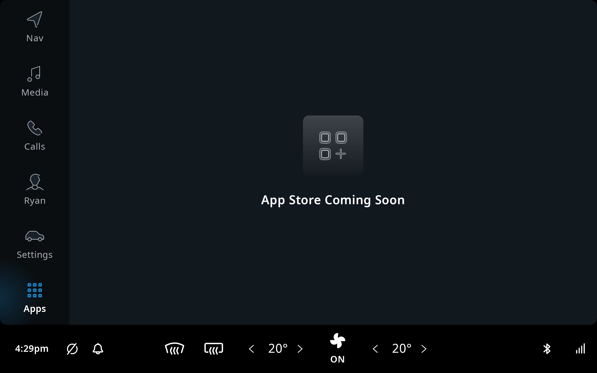

An app store can allow your product to offer end-users of your system the ability to expand their
system by installing additional apps.

IndiGO does not come with a pre-configured app store so, if this is a requirement for your product,
you will need to choose one and configure it yourself.

A number of companies provide Android app stores targeted at automotive applications. Available
Automotive app stores include:
- Faurecia Aptoide
- Harman Ignite
- Access Twine4Car

Contact your TomTom IndiGO sales representative for more information about available app stores.

Once installed and configured, an app store can be accessed via the App Launcher frontend which is
opened by tapping the `Apps` main menu item when using the IndiGO or example application. As there
is no app store included with IndiGO, selecting the `Apps` main menu option currently displays a
"Coming Soon" screen.

   

Any Android apps installed using the app store will appear in the App Launcher. From here they can
be launched into a virtual display within IndiGO.

__Note:__
As well as apps installed from an app store, the App Launcher will also show any Android APKs
installed onto the device using `adb` commands (known as "sideloaded" apps). To avoid confusion, it
is best to remove any existing sideloaded apps before configuring an app store.

The steps below show how to install and configure your choice of app store:

- [Install your app store APK.](#install-your-app-store-apk)
- [Configure IndiGO to launch your app store](#configure-indigo-to-launch-your-app-store)
    - [Overriding app store configuration in Android resources](#overriding-app-store-configuration-in-android-resources).
    - [Overriding app store configuration with a static configuration provider](#overriding-app-store-configuration-with-a-static-configuration-provider).

## Install your app store APK

__Note:__
This section describes installing an app store during the development phase, for example, to try it
out or for proof of concept purposes. For production, the app store APK should be preinstalled as
part of the hardware platform system image.

When you have chosen your app store and downloaded the required APK(s) to a machine with `adb`
installed, you can install the app store using the following command:

```cmd
adb install <your-app-store-APK-filename>
```

## Configure IndiGO to launch your app store

Once you have installed your app store, you need to configure it within IndiGO by overriding the
default app store configuration (that is, no app store) with values relating to your chosen app
store. The configuration values which must be overridden are as follows:

1. App Store Display Name: The name you want to associate with the app store within the UI.
2. App Store Package Name: Get this from your app store documentation or ask your app store
   provider.

The default app store configuration can be overridden
[using Android resource values](#overriding-app-store-configuration-in-android-resources) or by
[implementing a static configuration provider](#overriding-app-store-configuration-with-a-static-configuration-provider).

### Overriding app store configuration in Android resources

If you do not require the app store configuration to be set at runtime, you can override the values
using Android resource strings. To do this, add the following Android resource strings to your
project (substituting with values for your choice of app store):

```xml
    <string name="appStoreDisplayNameConfigKey">My App Store Display Name</string>
    <string name="appStorePackageNameConfigKey">my.app.store.package.name</string>
```

### Overriding app store configuration with a static configuration provider

If you need to configure the app store at runtime, then create a
[static configuration provider](/indigo/documentation/development/platform-domains/configuration-framework#static-configuration-providers)
and configure it in your Application class (for example, `ExampleApplication` if you are using the
[example application](/indigo/documentation/platform-overview/example-app) project).

Add the following dependency to the `build.gradle.kts` file of the module where your new static
configuration provider will reside:

```kotlin
implementation("com.tomtom.ivi.platform:core_config_appstore:${Versions.INDIGO_PLATFORM}")
```

Create the static configuration provider:

```kotlin
class MyAppStoreConfigurationProvider(
        private val appStoreDisplayName: String,
        private val appStorePackageName: String
    ): ComposableStaticConfigurationProvider {
        override fun get(key: OptStringStaticConfigurationKey): String? =
            when(key) {
                appStoreDisplayNameConfigKey -> appStoreDisplayName
                appStorePackageNameConfigKey -> appStorePackageName
                else -> null
            }
    }
```

To configure the example application, the static configuration provider needs to be added to the
existing list of providers returned by `ExampleApplication.createStaticConfigurationProviders()`. In
order for it to override any default values it must be added ahead of the default providers list:

**modules/products/exampleapp/src/main/kotlin/com/tomtom/ivi/example/product/exampleapp/ExampleApplication.kt**

```kotlin
    override fun createStaticConfigurationProviders() =
        listOf(
            MyAppStoreConfigurationProvider(
                getString(R.string.my_app_store_display_name),
                "my.app.store.package.name"
            )
        ) + ...
```

After completing these steps you should see your app store icon above a button with the text
"Download apps" when you open the App Launcher. Tapping this button should open your app store
within a virtual display inside IndiGO.

__Note:__
If you have any sideloaded apps on the device then you will see the sideloaded apps displayed next
to the app store icon and no "Download apps" button. In this case you can launch your app store by
tapping on the app store icon.
