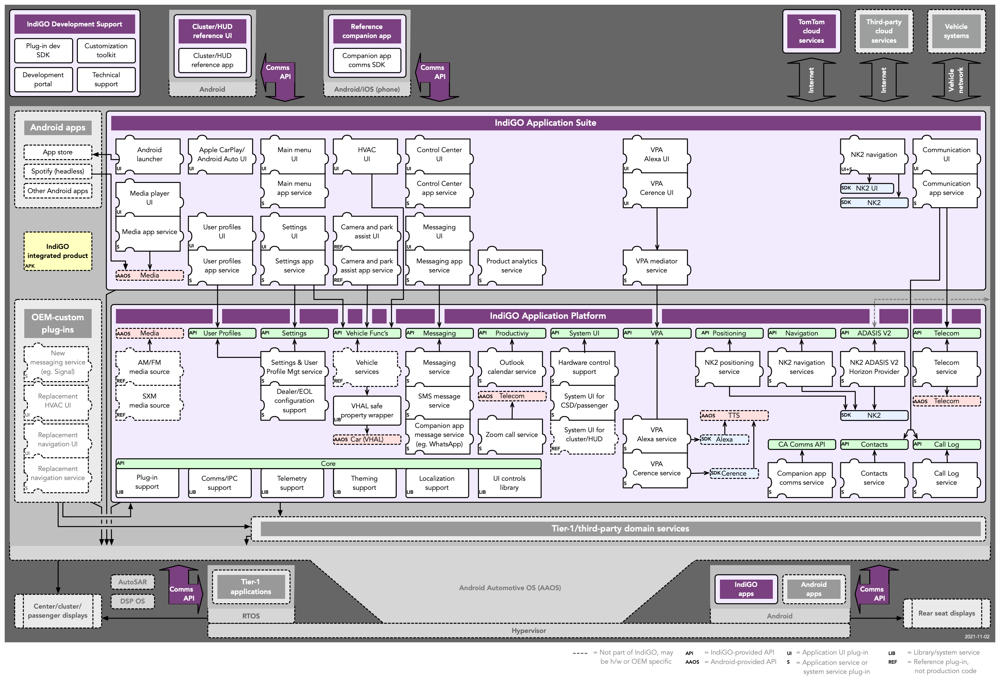

## What is IndIGO?

IndiGO is a framework to deliver Android-based digital cockpits. It includes an application
platform to support the development of highly integrated applications on top of Android Automotive. It
also offers a complete set of industrial strength end-user applications, that can be customized to 
the needs of a car maker.

IndiGO offers a fully customizable system UI, which allows applications to work together in a more
integrated way than the standard Android application-switching system UI does. Individual
applications are not just visually seamlessly integrated, they work together to provide
a single, consistent, cohesive and task-oriented user experience for the end-user, without moving
from one app to another.

## Out-of-the-box included stock components

IndiGO comes out-of-the-box with a comprehensive set of automotive grade services and
applications, ready to be used for commercial purposes. We call these out-of-the-box components 
_stock components_. 

Stock applications can be used “plug-and-play” or they can be customized to the
car maker’s needs. Performing customization is not limited to visual changes, but may also include
modified or added features. And using the extensive set of IndiGO platform APIs, which extend the
standard Android Automotive APIs, new applications can be added with much less effort compared to 
standard Android Automotive development.

The following diagram shows everything that’s included in IndiGO, all stock components
(purple colored) and how these relate to other software in a vehicle.

## Building your first IndiGO product

At the far left of the diagram we see a yellow box called _IndiGO integrated product (APK)_. This is
“the Android application that integrates the IndiGO application platform and its applications”. It
is typically the application that fully controls the center stack and optionally provides
information to the cluster display.

The IndiGO SDK includes an “IVI Example App” that integrates the platform
with all of the stock applications for IndiGO. The example is a fully working IVI system,
including phone calling, contacts handling, messaging, notifications, multimedia, navigation and
much more, all production-level code. All of the applications included in that example
application are shown at the top of the diagram, in the section “IndiGO Application Suite”. The 
[Getting Started Guide](/indigo/documentation/getting-started) explains
step-by-step how to set up your development environment to build that example application.

## Using stock components to assemble your product

When you look at the source code of the IVI Example App, you will notice the Kotlin code for the
product is really just a couple of lines of code. Most of the work is done by a Gradle build file
that pulls in all the stock components that provide the actual functionality of the application. In
the diagram, these stock components are the puzzle pieces in the blocks “IndiGO Application Suite”
and “IndiGO Application Platform”.

Forking and building the IVI Example App is a great way to start development of a new IVI system. It
gets you up and running really fast. From there on, you can easily modify or add any puzzle pieces
you need and you’ll have a working system from day one.

## Customizing stock components to match your needs

Let’s look a bit closer at how to customize a “stock application”. Suppose you wish to make the
Communications application that provides phone calling look or behave differently. As you can see
from the diagram, Communications is split into two puzzle pieces, “Communications UI” and
“Communications app service”. TomTom provides stock versions of these puzzle pieces
in an external binary repository that you would use to pull these puzzle pieces from.

The User Interface (UI) component contains just the user interface: the graphics, the buttons and the connection to
the application service that implements the functionality, such as calling a phone number. The “app service”
contains the application logic. It knows how to do things, but it leaves what that looks like to the
“UI” component. Together these two components make up the Communications application.

Now, if you want to just change what the application looks like, you just have to provide an
alternative UI puzzle piece to your application. You can still pull the “app service” from the
TomTom Nexus repository. This means you can also automatically get the latest version of the “app
service”, even if you modified the UI. That is really useful for staying up-to-date with your
applications.

Should you want to change or add functionality to the application, then you need to customize the
“app service” and provide it yourself. In that case, you can use the source code of the provided
service or application as a starting point. 
All of the other apps would still be pulled from our Nexus and you can still benefit from
the automatic updates for those. That is a powerful way of completely customizing the look and feel
of applications, with limited effort.

## The benefits of using stock components

As you can see from the number of puzzle pieces in the diagram, IndiGO is extremely modular: almost
anything that is provided out-of-the-box can be customized or replaced. But many of the applications
can also be customized without any code changes, by applying a different theme to them, or by
modifying their static configuration files.

Besides the benefit of kick starting your development with our stock puzzle pieces, the modular
architecture provide another great benefit: we, at TomTom, keep updating IndiGO and provide new
versions of applications and services over time. By pulling these components from our Nexus, your
system can easily benefit from software updates that we provide for the IndiGO platform and its
applications. This includes security updates as well as functional improvements.

## Building your own services and applications

Next to the components, or puzzle pieces, there are green boxes in the diagram. These depict the
APIs that IndiGO offers on top of Android Automotive. These APIs are complementary to Android APIs;
they do not try to mimic or reimplement any Android behavior, but rather extend the Android APIs
with a lot of useful APIs for IVI software development. The description of these APIs can be found
in the API reference section of this site.
