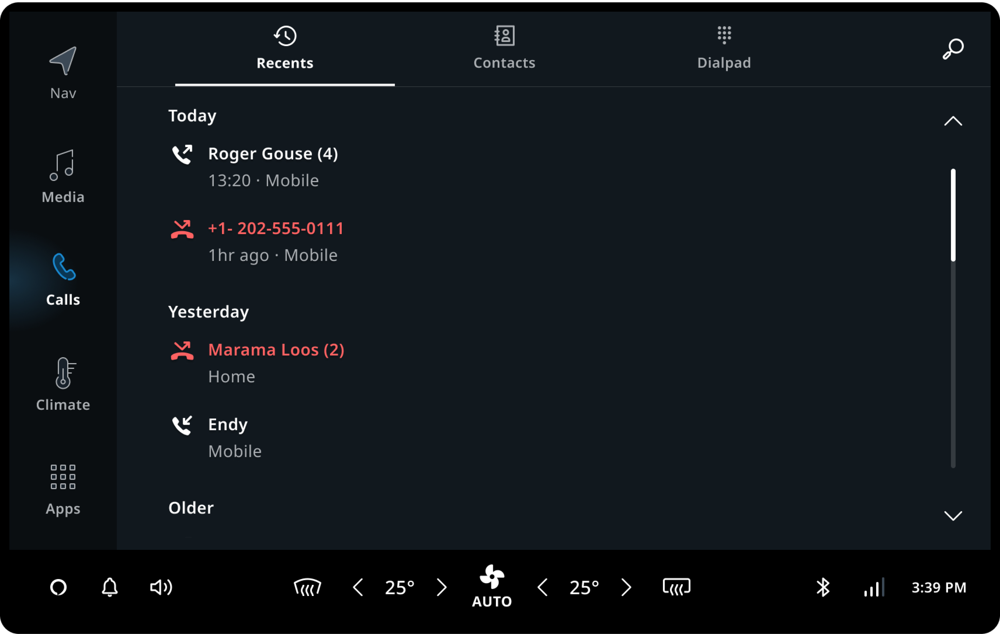
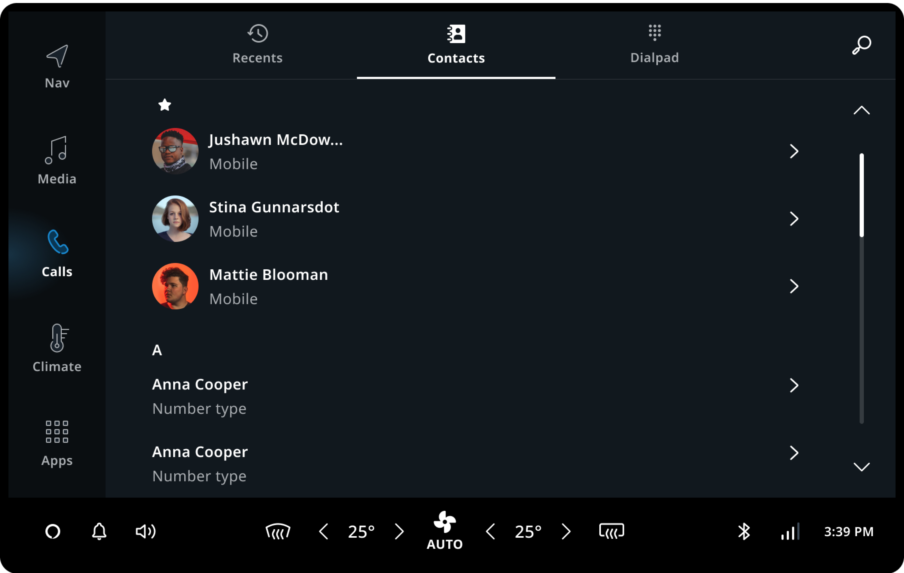
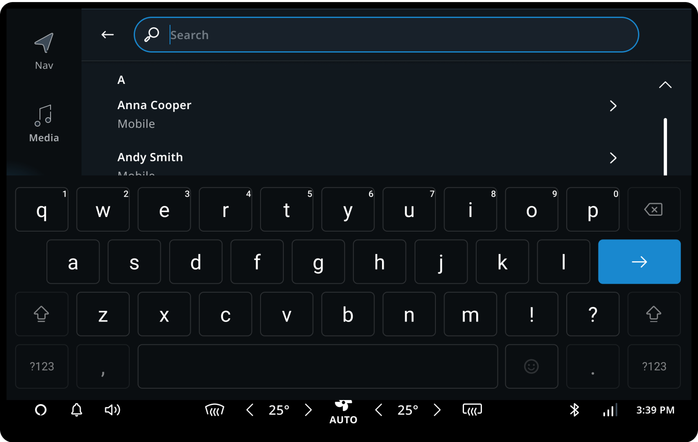
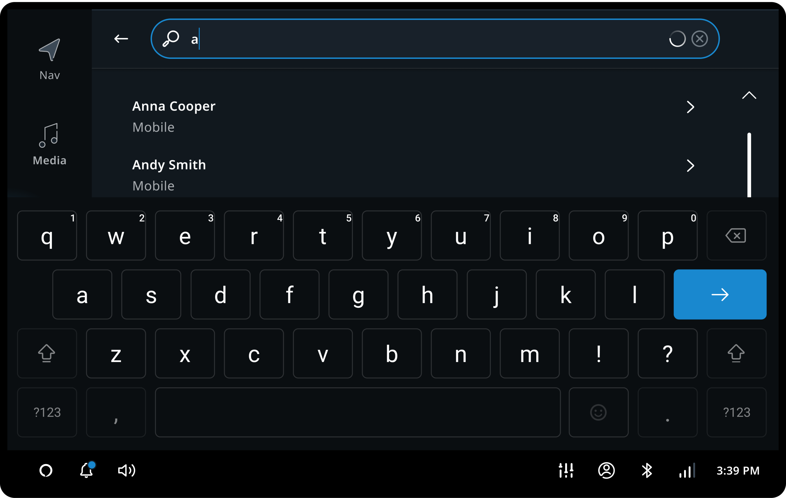
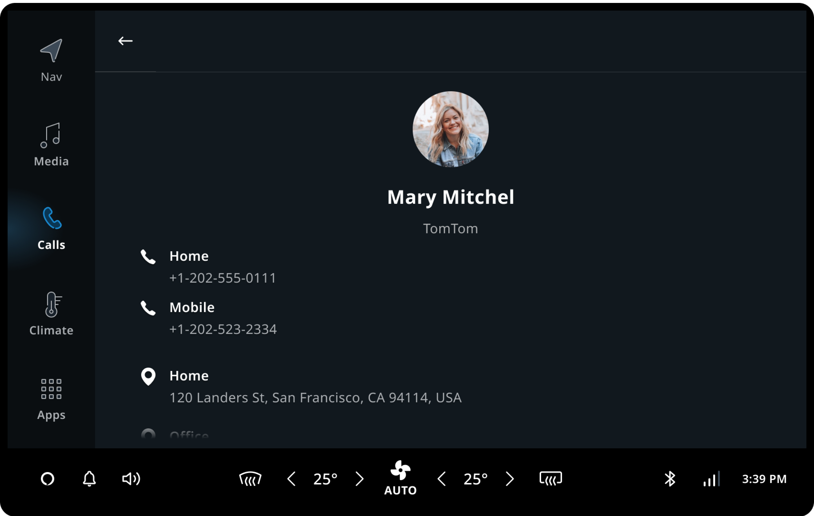
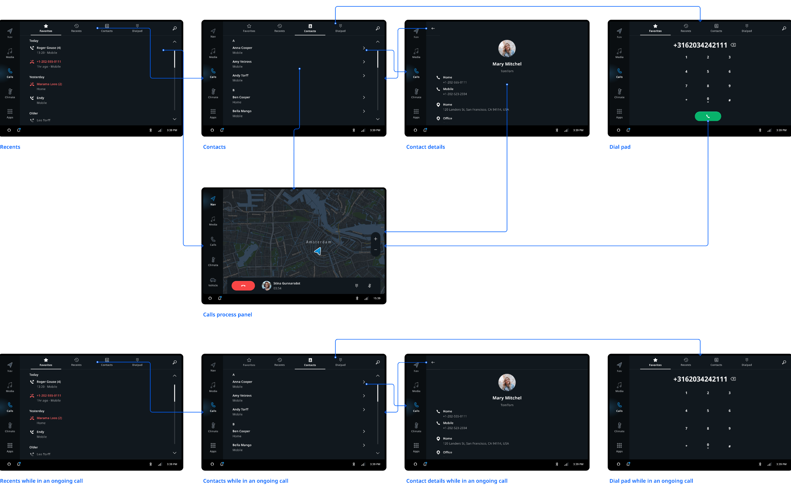

TomTom Digital Cockpit comes with a stock application for an in-vehicle communication experience.
This communication experience is comprised of two parts - phone calls and messaging. Users can
access their entire contact list and call history by using the communication app. They can also
make and receive calls from their synced phonebook via connected mobile phones. Users can also
receive messages through notifications which they can read aloud, call back and reply to with
preset messages.

## Recents

The _Recents_ tab displays phone call history synced from a connected mobile phone. Calls are
categorized into three groups:

- Today: Calls from the current day.
- Yesterday: Calls from the previous day.
- Older: Calls from before yesterday.

The recents list is arranged in chronological order, with the most recent calls at the top of the
list. If there are no recent calls for a group, then the group will not be visible in the list.

## Contacts

The _Contacts_ tab displays the phonebook synchronized from a connected phone. It has two parts:

- Favorite contacts.
- All contacts.

### Favorite contacts

The favorite contacts list is a duplicate of what is on the user's mobile phone(s), synchronized with
the TomTom Digital Cockpit. Editing or adding favorites in TomTom Digital Cockpit is not supported.
If the phone holds no favorite contacts, then the favorites section, including the "star icon"
header, is not displayed.

### All contacts

All contacts, including favorite contacts, are displayed in the "All contacts" part of the screen.
By default, contacts are sorted alphabetically on the first name, and grouped on their first letter.
Contact names starting with non-alphabetic characters are listed in the "#" section.

### Sticky header

The sticky header fixes the alphabet header to the top of the contact list before, during and after
a user scrolls down the list. When a user scrolls the list, the slider on the right side of the
panel moves vertically, indicating the scroll position.

### Scroll bar

The scrollbar indicates how far down the user is in the contacts list if the content is taller than
the viewable area. The scrollbar lets the user navigate to the rest of the contacts by moving the
window viewing area up or down. Tapping anywhere on the scrollbar will move the content by
increments equivalent to the height of the screen, with a pop-up alphabet indicator.

## Contact search

When the user taps on the search icon, the _Contact search_ opens in a new view with a keyboard
(only when Safety Lock is off). The searches will be automatically completed when a user starts
typing.

The content of _Contact search_ starts with a list of _All contacts_ below the search text field.
Users can tap on the back button anytime to cancel the search and leave the _Contact search_ view.

## Contact details

The contact details page consists of three sections:

- Avatar image and contact information.
- All phone numbers and phone number types.
- Addresses displayed without truncation.

## Dial pad

The dial pad can be opened from the tab bar or from the
[_Main Process Panel_](/tomtom-digital-cockpit/designers/system-ui/main-process-panels).

## Initiating or accepting a call

When a user initiates or accepts a call, the call is handled by a
[_Main Process Panel_](/tomtom-digital-cockpit/designers/system-ui/main-process-panels)
which is displayed on the [_Home Panel_](/tomtom-digital-cockpit/designers/system-ui/home-panel).
This ensures that essential call management functions are accessible to the user at all times.

## User flow overview

Users can react to an incoming call without opening the communication app. Once the call is
accepted, the call is handled with a
[_Main Process Panel_](/tomtom-digital-cockpit/designers/system-ui/main-process-panels).

## Customizing communication

Only some components in the communication app are customizable or swappable. If a highly
customized component is needed, replacing the entire communication application frontend is the
best option. However, it will be faster to use the stock communication application and customize
it to your needs.

| Component | Customizable |
| --------- | ------------ |
| Ending a call | The communication app closes automatically after the call is accepted. You can customize it to keep it open. |
| Recents | The look and feel can be customized with theming. The layout and display format is not customizable. |
| Contacts | The look and feel can be customized with theming. The layout is not customizable. |
| Contacts avatar images | Avatar images are only shown for the user’s favorite contacts. |
| Contact search | The search user flow is not customizable. The search icon and the empty state of search results are customizable. |
| Contact details | The look and feel can be customized with theming. The layout is not customizable. |
| Dial pad | The look and feel can be customized with theming. The layout is not customizable. |
| Quick-reply options | 1) Default quick replies: Incoming call notifications have one quick-reply by default, which can be translated into different languages or changed. The user can enable or disable it. 2) Custom quick replies (defined by the user): The user can choose to have no quick replies or add their own quick replies. However, this will require a custom frontend and more development effort. |

