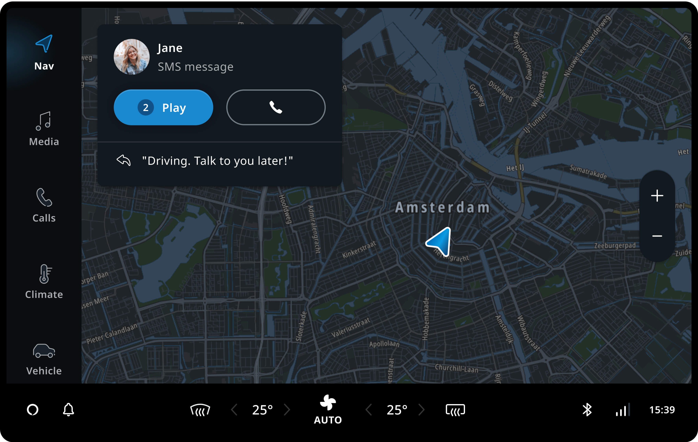
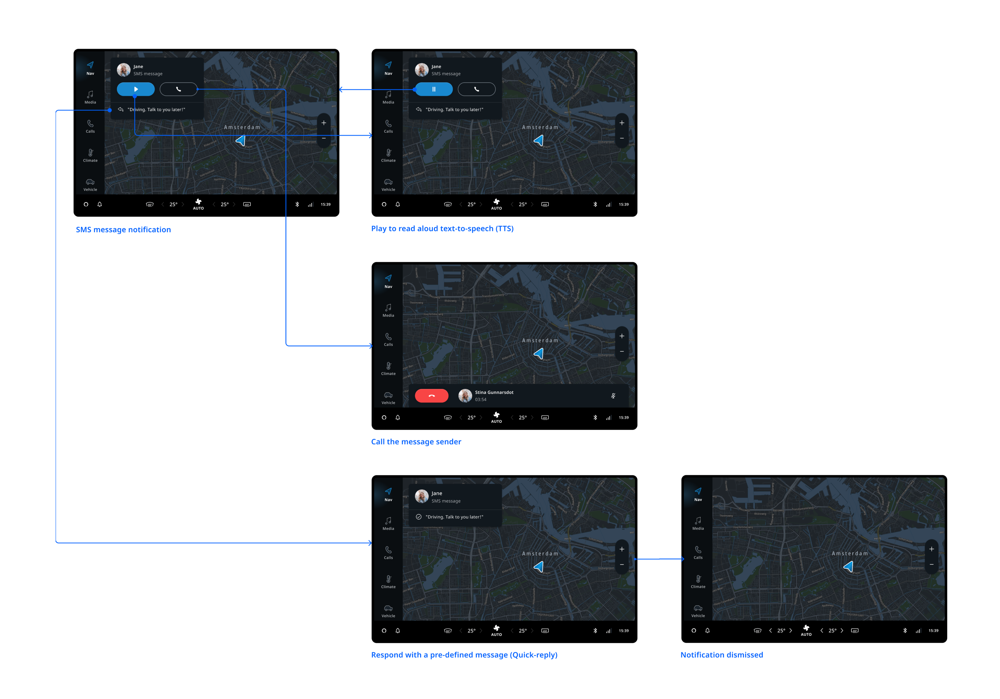

## Overview

TomTom Digital Cockpit uses the system UI notification framework for receiving and responding to text-based messages, 
including SMS messages and third-party messages.

## Receiving SMS message notifications

To receive messages in TomTom Digital Cockpit, a user needs to pair the phone via Bluetooth and grant synchronization 
permissions on both the phone and TomTom Digital Cockpit. Messages received from the phone will appear as heads-up 
notifications on TomTom Digital Cockpit.

An SMS message notification contains:

- Avatar image.
- Name of the sender.
- Label + number of messages.*
- Primary action button - play / pause.
- Secondary action button - call.
- Quick-reply button.

**The number of messages shows only when there is more than one message in the notification stack.*

## Filter based on sender type

SMS messages can often be from unknown senders and contain advertisements or promotions that are distracting 
the user while driving. Message notifications, therefore, are filtered, and the table below lists the sender types that 
are filtered out and when the notifications are shown.

| Phone number type   | SMS message  |
| ------------- | ------------- |
| Unknown number | Not shown. |
| Phonebook contacts | Shown. |

## Filter based on content type

| Content type   | SMS message  |
| ------------- | ------------- |
| Contact, document, GIF, emoji, sticker or photo, location, voice message, incoming, outgoing, missed audio/video call. | Not shown. |
| Voicemail | Shown. |

## User flow overview

This flow shows how users can play sms messages as text-to-speech (TTS), call the message sender, respond with 
pre-defined messages (Quick-reply) and dismiss notifications.

