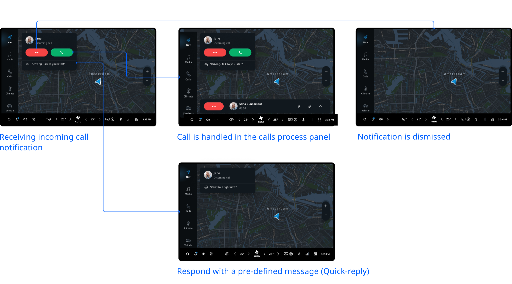

TomTom Digital Cockpit displays incoming calls from connected mobile phones with notifications.
Users can accept or reject a call, or reply with a pre-defined message, by interacting with these
notifications.

## Incoming call notification

An incoming call notification contains:

- Avatar image
- Name of the caller
- Source label
- `Reject` button
- `Accept` button
- Quick-reply options

The incoming call notification can be dismissed by using a swiping gesture to the left or the right.

## Dismiss or reject calls

A call can be rejected by:

- Tapping the `Reject` button.
- Swiping left to reject the call (the direction of swiping to dismiss will depend on the screen
  layout and orientation).
- Voice command using voice personal assistant (VPA).
- Rejecting the call directly on the connected phone.

## User flow overview

Users can respond to an incoming call outside of the communication app. Once the call is accepted,
the call is handled with a
[_Main Process Panel_](/tomtom-digital-cockpit/designers/system-ui/main-process-panels).

