## Overview

TomTom Digital Cockpit comes with a universal media player for audio entertainment. This application
provides access to in-vehicle media sources like radio and Bluetooth audio, and sources from
third-party providers such as Spotify, iHeartRadio and many more. This documentation will cover how
the media player works, its functionality, and how the media player can be customized and
configured.

## Media player panels

The media player is made up of different panels that let the user select media sources, browse media
content, control media playback and login.

- Dashboard: selecting media sources. For example radio, Spotify, or Bluetooth.
- Media browser: browsing content from the selected media source.
- Playlist view: browsing playlists of songs or podcasts inside a media source.
- Task process panel: controls and displays media playback while the user has the media application
  open.
- Expanded process panel: an expanded, more detailed view of the media that is currently playing.
- Main process panel: controls and displays media playback when the user is outside of the media
  player application. For example, using the map.
- Source login: a login screen for third-party media sources that require account login.
- Source settings: a settings modal where the user can change the settings of a media source.

### Dashboard

When opening the media app, the user is presented with the dashboard, which lets them select a media
source. All available media sources are shown in a grid view. Unavailable sources are shown in a
disabled state, such as Bluetooth audio when no device is connected. Tapping a media source opens
it, and shows a login screen if required.

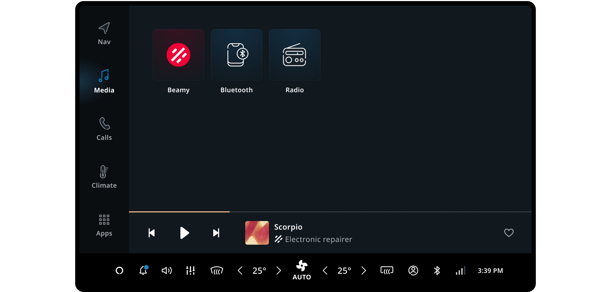

<Blockquote type="announcement">
    All media sources can be customized. However, any customization to media sources provided by
    external companies (not TomTom) will require certification. The default configurations available
    for Spotify and iHeartRadio are already certified for use, provided these are not customized.
</Blockquote>

| Source name | Customization |
| ----------- | ------------- |
| Radio | No certification required. |
| Bluetooth audio | No certification required. |
| Spotify | Requires certification by Spotify. |
| iHeartRadio | Requires certification by iHeartRadio. |

### Media browser

When the user opens a source they are shown the media browser. Content supplied by the media source
is shown in tabs, each containing sections of browsable media (for example, albums/playlists) and/or
playable media (for example, radio channels, songs). Media within a section can be shown as either a
grid or list layout. Tapping browsable media opens the playlist view and tapping playable media
starts media playback.

In the top right, a search button can be tapped to search the media source. A settings button is
next to it, which can show the available settings for the source in a modal. Pressing the back
button returns the user to the dashboard.

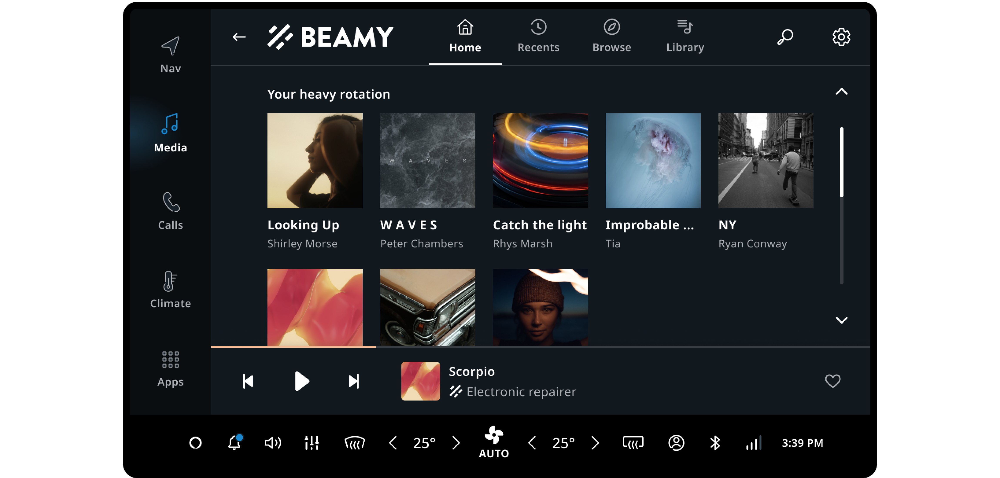

| Section | Use |
| ------- | --- |
| Back button | Return to the previous screen (back to the dashboard in this case). |
| Search | Open the search view of the current source. |
| Settings | Open the setting model of the source. |

### Playlist view

The playlist view contains a list of playable items such as songs or podcast episodes. Next to the
list content is the metadata (cover artwork, title, subtitle, number of the items, and duration). In
nested pages, like the playlist view, a breadcrumb bar is used to take the user to any level in one
tap.

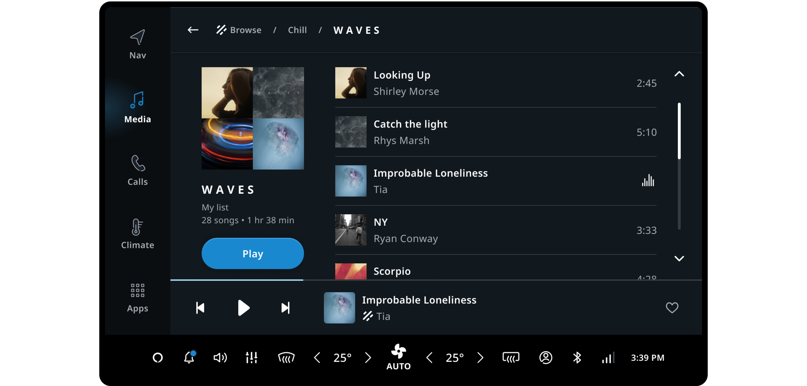

| Section | Use |
| ------- | --- |
| Metadata | Cover artwork, title, subtitle, number of items, and duration. |
| Play/pause button | Play/pause the playback of the playlist. |
| List content | Open the setting model of the source. |
| Breadcumb | Tapping the item leads back to the level of screens. |

### Search view

A source can be searched by using the search view (accessed from the source browser). Search starts
automatically as the user types into the search field. Search results are presented as determined by
the source, which may contain multiple sections. The search results are presented in a list layout,
as this makes it easier to see which items match what the user is looking for.

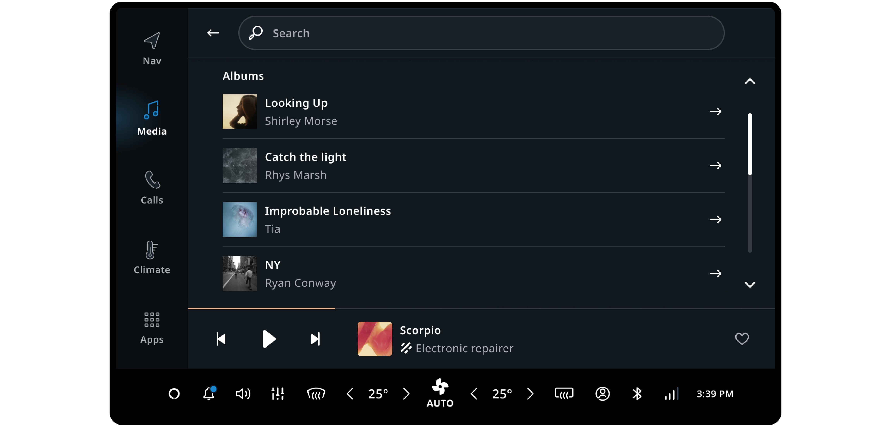

### Media playback - Task Process Panel

In the media application, media playback controls are always available in a
[_Task Process Panel_](/tomtom-digital-cockpit/designers/system-ui/task-panels).
This presents the primary playback controls (1), metadata of the currently playing content (2),
secondary playback controls (3) and progress (4). The primary controls (e.g. play, next) control the
progression of the playback, while the secondary controls (e.g. like, favorite, playback speed,
shuffle) are a limited selection of less frequently used controls and custom source-specific
actions. Tapping the _Expand_ button or the metadata sections opens the
[_Expanded Process Panel_](/tomtom-digital-cockpit/designers/system-ui/expanded-process-panels).

| Section | Use |
| ------- | --- |
| Playback controls | Play/pause, next, previous. |
| Metadata | Title, artist, album name. |
| Secondary playback controls | Favorite, playback speed, shuffle, expand. |
| Progress | Progress of the playback. |

### Media playback - Expanded Process Panel

The [_Expanded Process Panel_](/tomtom-digital-cockpit/designers/system-ui/expanded-process-panels)
presents the currently playing content in a full-size layout, providing access to the full
collection of playback controls and custom actions, and additionally gives access to the playback
queue (by pressing the _Queue_ tab on the top). Pressing the collapse button closes the expanded
process panel, and returns to the previously opened page in the media application.

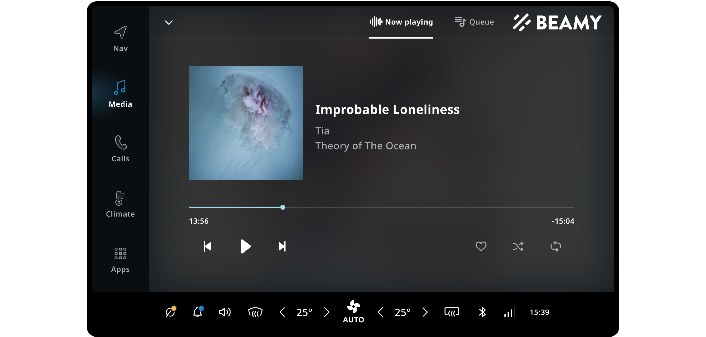

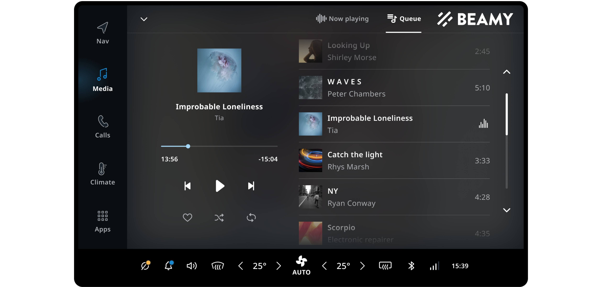

### Media playback - Main Process Panel

The [_Main Process Panel_](/tomtom-digital-cockpit/designers/system-ui/main-process-panels) displays
the media that is currently playing on top of the navigation application. This makes it possible
for users to view and control media playback without leaving the navigation/driving task.

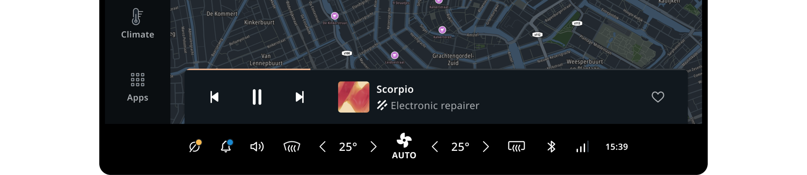

### Source login

When a source requires the user to login before opening it, a login screen is shown inside a modal
window. The login UI is provided by the third-party media source and usually can not be styled or
customized. When login completes, the user is redirected to the media browser. If login fails, the
user is taken back to the dashboard.

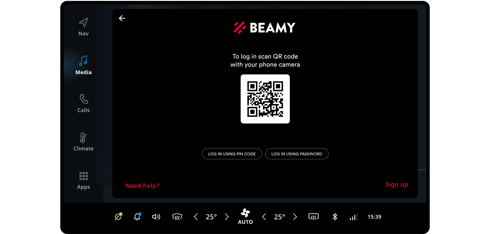

### Source settings

Sources may provide custom user settings, accessible from the settings icon in the top right of the
media browser. Similar to the source login, this UI is provided directly by the media source and
presented (by default) inside a modal. As such, it can not be customized or styled.

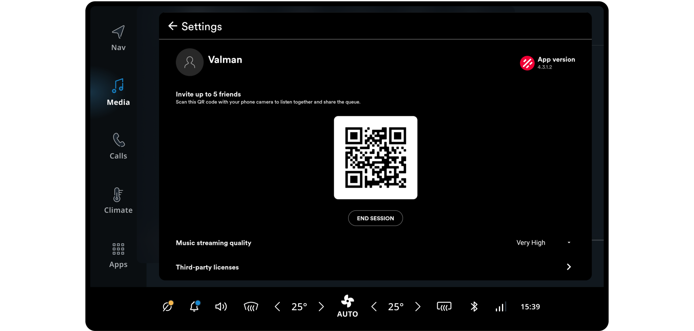

## Flow overview

To change sources, the user always has to navigate back to the dashboard. Playlists and the search
view are displayed in sub-pages. Controlling playback is important, so it is available on every view
and even the TomTom Digital Cockpit home panel.

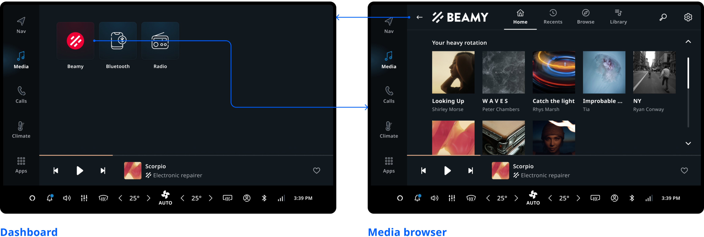
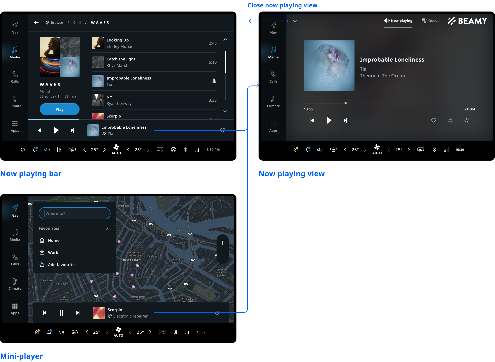
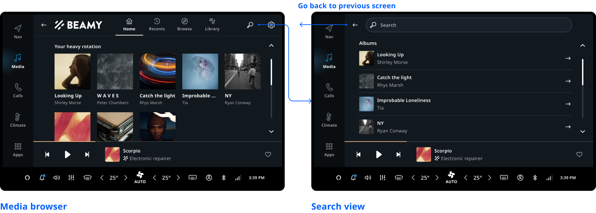
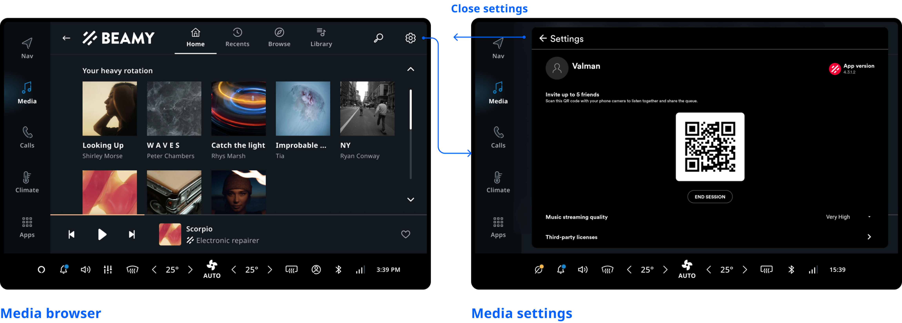

## Customization

TomTom Digital Cockpit as a platform is modular, and applications can be replaced and customized as
a result. That being said, at this point not all aspects of the media application are customizable
or individually swappable. If something highly custom is required, replacing the entire application
frontend is probably the best option. However, it will save a lot of time to stick with the stock
media application and customize it to your needs.

| Component | Customizable |
| --------- | ------------ |
| Theme | The Media App and Mini Player use the TomTom Digital Cockpit platform theming. This means all colors, dimensions, typography, etc. follow the system theme. |
| Source selector | Currently the source selector is not individually replacable or customizable, but given enough demand this can be offered. |
| Expanded Process Panel | Currently the Expanded Process Panel is not individually replacable or customizable, but given enough demand this can be offered. The content (controls, logo use) can be customized through the use of policies. |
| Main Process Panel | The Main Process Panel is displayed outside of the Media app. It can be removed by configuration. The layout itself can’t be changed. The content (controls, logo use) can be customized through the use of policies. The Main Process Panel can be changed by customizing the system UI. |
| Task Process Panel | The Task Process Panel is displayed inside of the Media app.  It can be hidden by configuration. The layout itself can’t be changed. The content (controls, logo use) can be customized through the use of policies. The mini player (outside the media app) uses the Task Process Panel. |
| Source browser | The source browser (including search and playlist view) can be replaced as a whole on a per-source basis. This way a source can live within the media app but still offer a custom UI internally. |
| Errors and system feedback | The text and illustrations of different error toasts and empty states are customizable. When and how they occur however is not. |
| Sources | The data delivered by sources should typically be taken at face value, as writing a lot of source-specific code is hard to maintain. The behavior and appearance of a source can somewhat be customized (logos, custom controls, content, metadata) with the aforementioned policies. For media sources that are not third-party, the behavior and data structure can more freely be customized by changing the standalone application of that media source. |
| Settings and login | The source settings and login screens are not customizable, as they are offered by the source application directly. The way the view is shown (modal, full screen, etc.) is somewhat customizable. |

