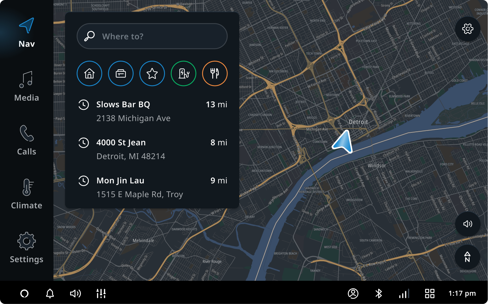
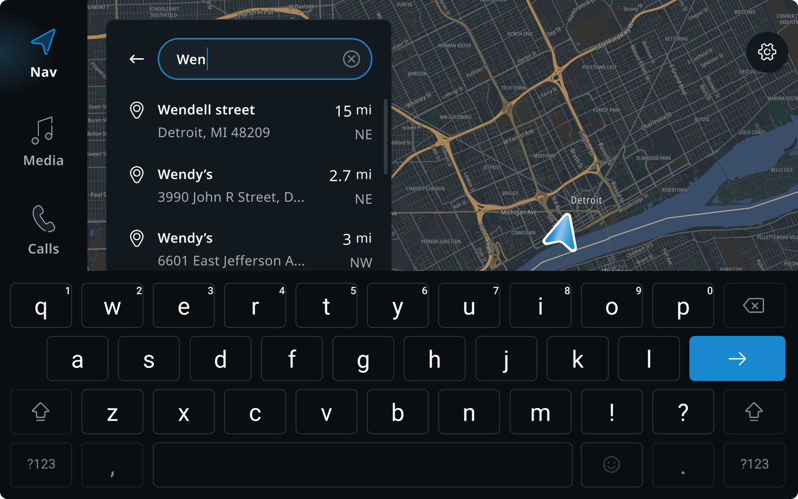
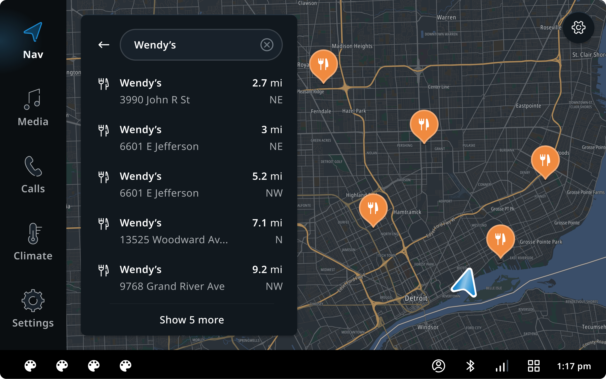
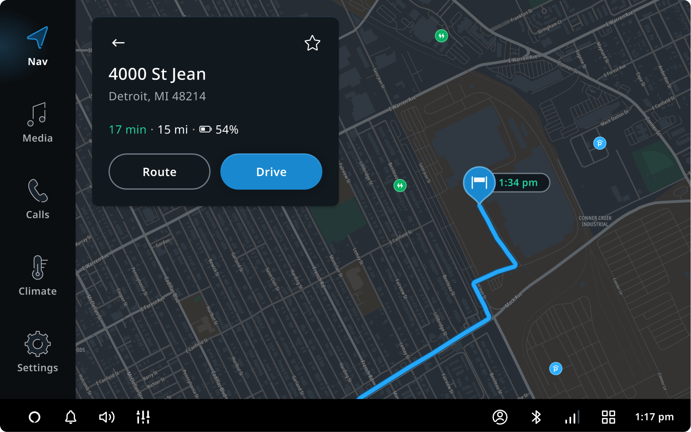
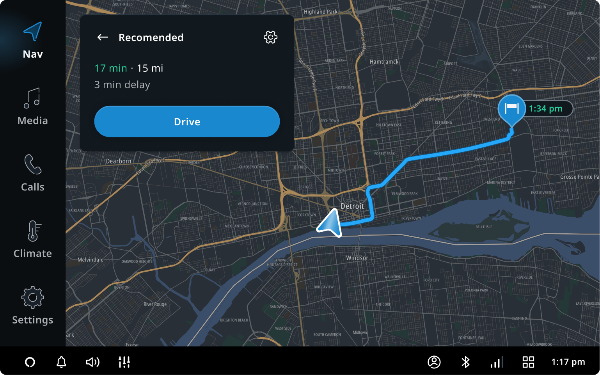
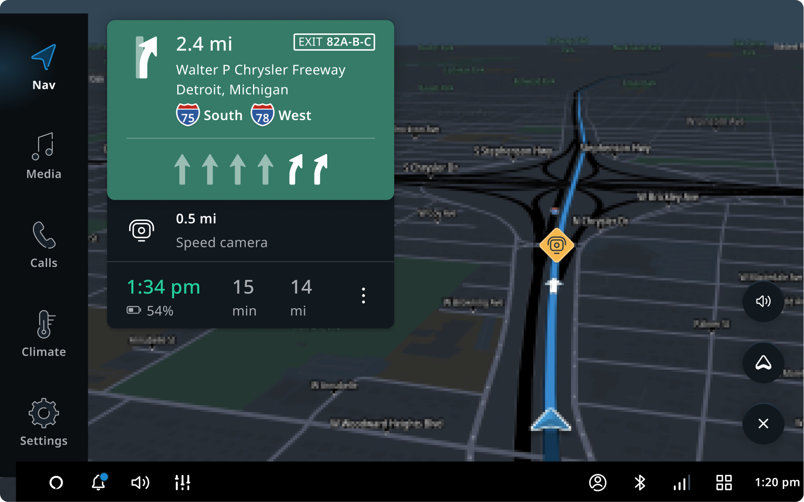
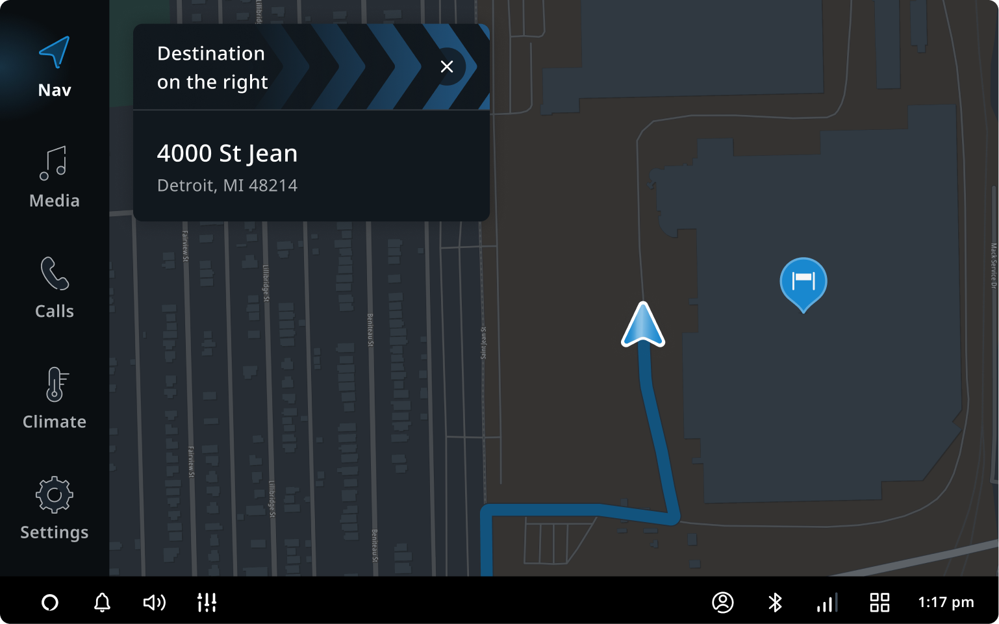
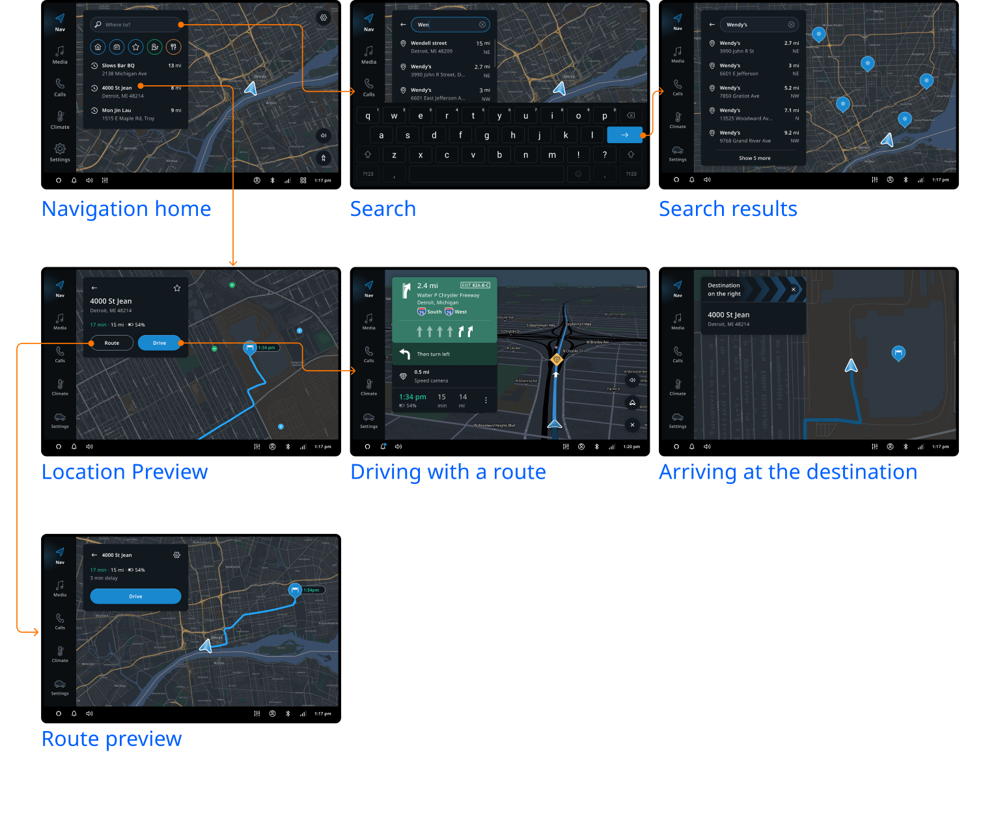

TomTom Digital Cockpit comes with an application for in-vehicle navigation. This application
combines onboard maps, advanced routing and live data services to provide turn-by-turn instructions
to guide a user to their destination. The application’s routing solution offers the optimal way
around traffic (and applicable restrictions) and is updated when needed along the way. Locations can
be selected via free text search or directly from the map, and can also be kept as favorites for
faster access later on.

## Navigation home

The navigation home screen is the starting point for all navigation functionality. It provides
relevant information about a user’s location and their surrounding area. Common destinations can
be quickly accessed for route planning.

From the navigation homepage, a user can:

- Start a free text search.
- Drive to their home or work.
- Go to a list of their favorite locations.
- Drive to a recent destination.
- Search for points of interest nearby.
- In addition, the home screen provides a map view of the area with traffic information.

## Search

When starting a free text search, the keyboard slides up and a user can start typing their free text
search. Underneath the input field we show recent destinations (locations a user recently planned a
route to) as suggestions in a chronological order, as long as no text has been entered. Free text
search allows both address entry and point of interest (POI) search.

## Search results

The results of a _Search_ are presented both in the panel and the map. The map zooms out to
accommodate the search results that are visible in the list. After the user taps "show 5 more" the
map will zoom out to show the additional results on the map as well. The number of results per page
can be configured to match the screensize.

## Location preview

For the selected location, a user will find basic information like address, distance, and a summary
of their route. Location is also indicated on the map with a pin. At this point, a user can decide
to start driving or see more information about their route.

## Route preview

Clicking the `Route` button will show the user the proposed route and the option to select an
alternative to this route. We give more information, and optionally show waypoints in the panel.
On the map, we zoom out to the complete route.

## Driving with a route

The guidance view provides the user with detailed instructions (with visuals and audio) next to the
visualized route path on the map. The map view automatically adjusts to keep the route and the next
maneuver in view. Information about important upcoming events on the route are shown. Speed cameras,
rest places, and fuel/charging points are visualized on the map and in the horizon panel on the
side.

## Arriving at the destination

When a user arrives at their destination, the destination information is shown and the relative
direction of the location is indicated. The map will switch to a 2D north-up street level view of
the area around the destination, keeping the location indicated.

## Flow overview

After setting a destination, users can navigate all the way to their destination without further
need for interaction with the navigation application.

## Customization

TomTom Digital Cockpit offers some built-in customization. Any changes not described in this
section require additional work with TomTom.

| Component | Customizable |
| --------- | ------------ |
| Panel layout | Overall panel layout can be adjusted. For example, a customer could choose to have the panels appear on the right side of the navigation area. |
| Panel width | The panel width will adapt based on the navigation surface size in a manner to make the best use of both map and panel. However, this can be overridden. |
| Theming and visual identity | Navigation can be themed using customization attributes. See separate documentation for theming capabilities. |

