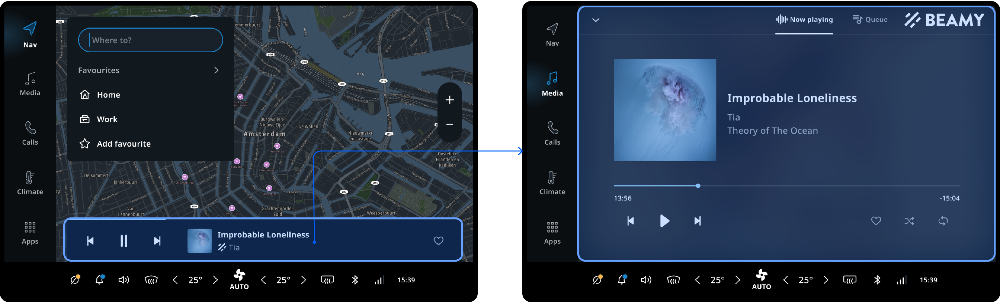
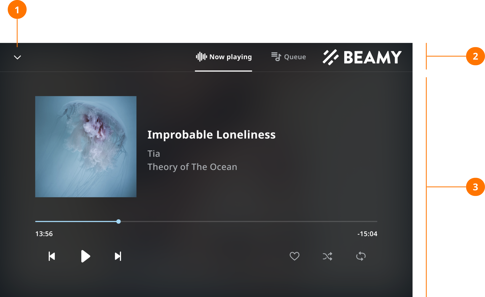
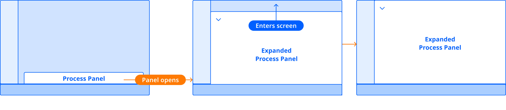
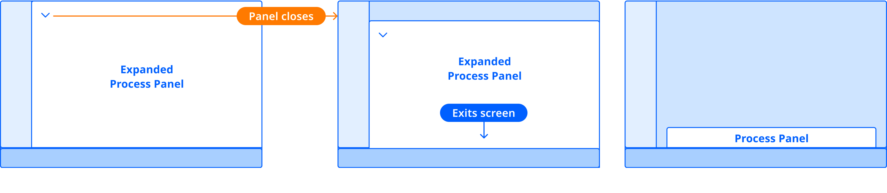

The expanded process panel is used to display additional information or features of the
[main process panel](/tomtom-digital-cockpit/designers/system-ui/main-process-panels)
or
[task process panel](/tomtom-digital-cockpit/designers/system-ui/task-panels).
Using the mini-player (which is placed in the
[main process panel](/tomtom-digital-cockpit/designers/system-ui/main-process-panels))
as an example, tapping on the mini-player will open the _Now playing_ view, where more functions are
provided.

## Anatomy

The expanded process panel is a customizable container with a _Dismiss_ button, a navigation bar, and
a content area.

1. __Dismiss button:__ Tap to close this panel.
2. __Navigation bar:__ Contains navigation of the panel. In this screen, tabs are used to switch
   different contents.
3. __Content area:__ Where the main information is displayed.

## Behavior

The expanded process panel opens when a user action occurs on the
[main process panel](/tomtom-digital-cockpit/designers/system-ui/main-process-panels)
or
[task process panel](/tomtom-digital-cockpit/designers/system-ui/task-panels).
For example, tapping on the metadata area in the _Now playing_ bar will open an expanded process
panel containing the _Now playing_ view.

Tapping the _Dismiss_ button will close the expanded process panel.

## Customization

The styling and other aspects of the expanded process panel can be customized.

| Component | Customizable |
| --------- | ------------ |
| Theme | The style (color, shape, size, etc.) of the expanded process panel follows the attributes defined in the system theme. |
| Content | The expanded process panel can be created with any content within the content area and navigation area. The _Dismiss_ button however is not customizable. |

