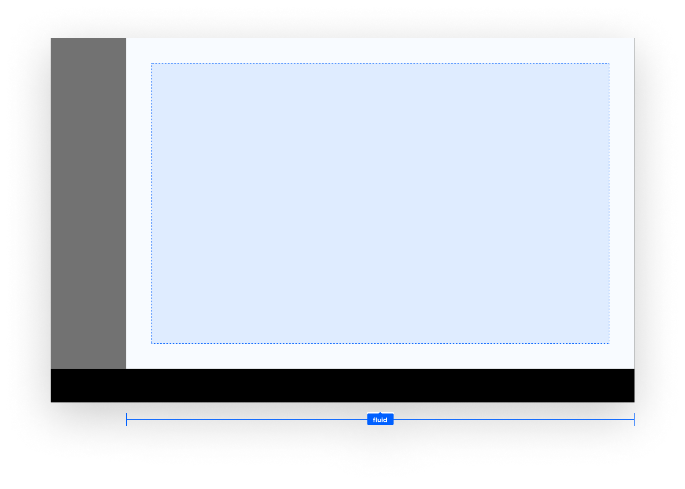

Task panels are the containers of an application's UI. They are in charge of positioning and
animating applications in the system UI. Task panels can be stacked to create a user flow through
various screens. The top-most task panel will be shown to the user, and when that panel is removed,
the next task panel on the stack will be shown. They may be dismissed by the user through system UI
functionality, like swiping it away. Such an action may trigger the system UI to dismiss the whole
task panel stack, rather than just a single one.

## Anatomy

Task panels can display an application UI with all the available screen space, except for the main
menu and control center. The task panel just provides a container with a default background and
animation. Both can be replaced when creating a custom system UI. The panel is not concerned with
the content of the panel.

## Task process panel inside a task panel

A task process panel allows a frontend to visualize an ongoing process in all of its task panels.
Unlike the main process panel, a task process panel is part of the task panel and as such does not
overlap the task panel itself. The task process panel will persist for the whole task panel stack.

The compact process panel UI template can also be used
[outside the process panel](#task-panel-alongside-the-task-process-panel-layout).
For example, the TomTom Digital Cockpit media application uses it to have UI consistency between the
_Mini player_ main process panel and the _Now playing_ task process panel.

### Task panel alongside the task process panel layout

The layout template for the type of task panel can determine which side of the task panel shows a
task process panel (for example, in the media or communication app). The following example
visualizes how a process panel could be moved to the side on certain screen sizes.

<Blockquote>
    This is just an example, as alternative layouts of the task process panel are not yet supported
    but are on the roadmap.
</Blockquote>

## Customization

| Component | Customizable |
| --------- | ------------ |
| Theme | The style of the panels is themable, but the panel containers can also be entirely substituted. |
| Position | The size and positioning of task panels is adjustable per task panel type, by implementing a custom task panel container manager. |
| Animations | The enter and exit animations of task panels can be changed by implementing a custom task panel container manager. The animation used for task panels can depend on the transition source or destination. For example, the climate panel opens from a control center panel, and so animates vertically. |
| Change panel type per app | Stock applications have an internally assigned panel type, which means this type cannot be adjusted. It is possible however, to visualize a task panel type in an alternative way. For example, showing the half panel type as a maximized panel. |
| Panel type | Currently there are only two types of panels (maximized panel and half panel), and no additional types can be added. However, the appearance of these types can be adjusted. (__Note:__ The half panel type is scheduled to be deprecated.) |
| Business rules | Task panels in the system UI have some customizable business rules around them. These include: 1) Closing task panels of a frontend when another frontend opens a task panel. 2) Closing modal panels when task panels open or close. 3) Changing the selecting menu item when a frontend opens or closes a task panel. |

