## Overview

In-vehicle Voice Personal Assistant (VPA) is a digital assistant that uses voice recognition to help
users complete their daily tasks without being distracted while driving. All communication between
the user and any voice assistant is either vocal only or a vocal and visual response.

TomTom Digital Cockpit allows you to integrate various voice assistants currently available on the
market. This documentation describes how voice assistants could work in the system using the example
of a built-in Alexa voice assistant.

<Blockquote type="announcement">
    The default configurations available for Alexa VPA are certification-ready as they have been
    built following the
    [Alexa Auto Design Guidelines](https://developer.amazon.com/en-US/docs/alexa/alexa-auto/about-this-guide.html).
    However, any changes to the Alexa voice assistant in the system will need to adhere to the Alexa
    Auto Design Guidelines for certification.
</Blockquote>

## Commands and wake word

Voice commands usually start with a voice assistant wake word, to initialize the speech dialog with
a further request to the voice assistant from the user. Voice commands and wake words depend on
voice assistants and their possibilities.

The wake word is the word customers can use to invoke a voice assistant. Another way to invoke voice
assistants is by pressing a hardware or on-screen UI button to begin a speech dialogue (if the
button is available in the vehicle).

For example, two primary ways to invoke Alexa in the vehicle are described in the
[Alexa Auto Design Guidelines](https://developer.amazon.com/en-US/docs/alexa/alexa-auto/about-this-guide.html).
Both are required:

- Saying the wake word “Alexa”.
- Pressing the _push-to-talk_ (PTT) button or an on-screen _tap-to-talk_ (TTT) button to directly
  invoke Alexa without the wake word.

### Customization

Customization of the wake word depends on integrated voice assistance possibilities. For example,
Alexa doesn't support wake word customization.

## Voice chrome

Voice chrome is a visual indicator of the voice assistant's active state. The chrome could be
visually different depending on its states, such as status (error, notification, etc.) or other
possible states (listening, speaking, waiting, capturing, etc.). The states of the voice chrome
depend on the voice assistant.

Chrome appears on a top system level in the
[_Overlay panel_](/tomtom-digital-cockpit/designers/system-ui/overlay-panels).

### Customization

Chrome could be customized based on integrated voice assistant guidelines, brand colors, VPA status,
and states. For more information see the
[Alexa chrome guidelines](https://developer.amazon.com/en-US/docs/alexa/alexa-auto/invoking-alexa.html#voice-chrome).

<ImageArticleGrid articles={
 [
  {
     title: 'Out of the box',
     body: 'Stock chrome of Alexa VPA.',
     img: {
       src: 'https://developer.tomtom.com/assets/downloads/tomtom-digital-cockpit/image-components/voice-assistant/out-of-box.png',
       alt: 'navigation',
     }
   },
  {
     title: 'Customized',
     body: 'Customized chrome of Alexa VPA.',
     img: {
       src: 'https://developer.tomtom.com/assets/downloads/tomtom-digital-cockpit/image-components/voice-assistant/customized.png',
       alt: 'communication',
     }
   },
 ]}
/>

## Status control

The status control indicates the voice assistant's activity status. The status control is optional
and has reserved space in the
[_Control center_](/tomtom-digital-cockpit/designers/system-ui/control-center).

For example, Alexa's wake word could be disabled or enabled with status control. Also, the status
control has a yellow indicator badge that shows whether Alexa notifications are available.

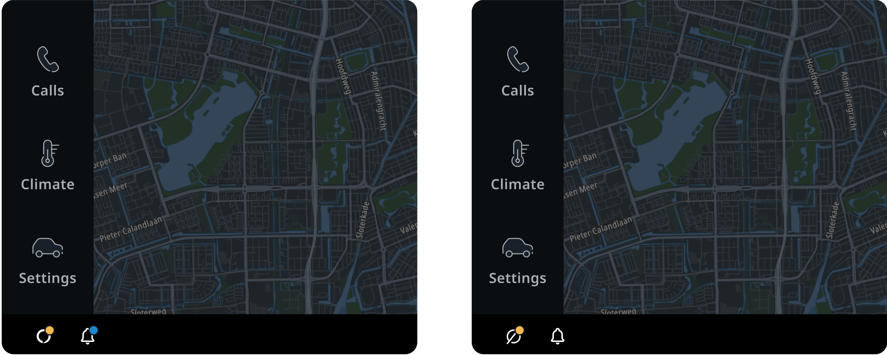

## Voice personal assistant templates

All communication between the user and any voice assistant is either voice commands or voice
commands together with a visual response (template).

Voice assistant templates are a visual way to communicate with the user, that is usually supported
by voice responses from the voice assistant.

All templates are universal and can be used by any voice personal assistant, but the template's
content must follow the format provided. Customers can create a template from scratch, based on
provided generic templates, if additional functionality is required.

There are generic templates supported by TomTom Digital Cockpit:

- Points of interest (POI) list.
- Points of interest (POI) details.
- Traffic.
- Weather.
- Image and text.
- List and buttons.

### Customization

VPA usually provides a visual response, depending on whether the user is driving. Whether or not to
show a visual response is a customizable setting that depends on the customer's decision. However,
we recommend avoiding visual responses while driving if it is possible to solve the user's problem
using only voice response.

For example:

- Full visual response (template): the complete visual template version is recommended to be used
  while parking.
- Short visual response: short version of template.
- Voice only: no visual response except voice chrome is recommended while driving.

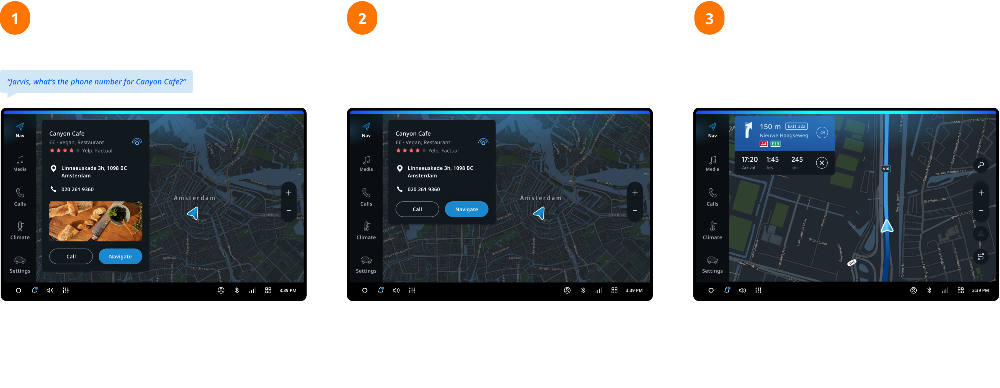

### Navigation

When the user requests the voice assistant about POIs (points of interest), the voice and visual
feedback template from the voice assistant appears on the screen. The template shows the list of
available POIs nearby/along the way or in any other driving context. For example, if the user asks
“Alexa, show me restaurants nearby”, Alexa will show a template with a list of restaurants nearby.
Users can interact with an index by referencing the position of the item in the list. For example,
“Navigate to the first one” or selecting the item with a touch. After selecting one of the provided
options, the user will start navigation to the POI, or the user will open the POI details template.
This option is customizable.

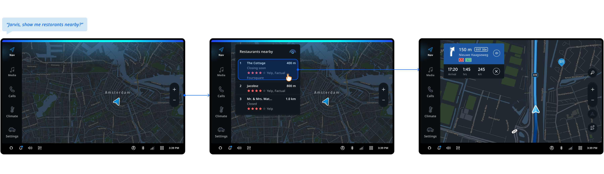

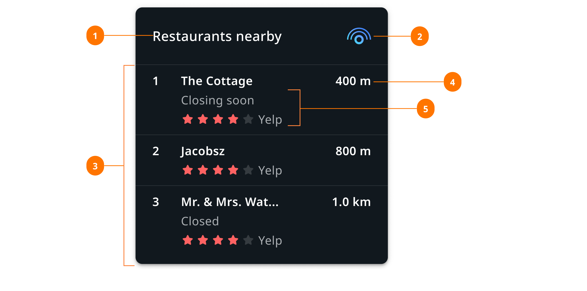

| Section | Use |
| ------- | --- |
| 1. Title | The title usually contains the answer or additional question from the voice assistant. |
| 2. VPS logo | Optional attribute, depends on voice assistant brand guidelines and certification requirements. |
| 3. POI list | Interactive list with short information about each POI, information depends on the provider. |
| 4. Distance to POI | Optional attribute, depends on the data provider. |
| 5. Short POI info | Optional attribute, depends on the data provider. It could be a rating, a list of providers, or the current POI status (closed, open, permanently closed, etc.) |

### POI details

Voice assistants may provide specific POI details supported with visual by users request.

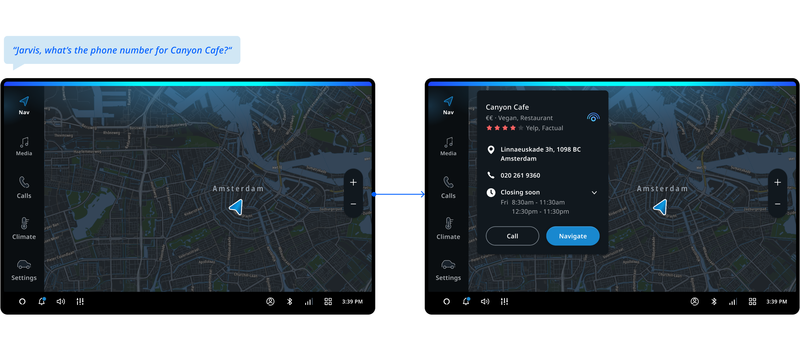

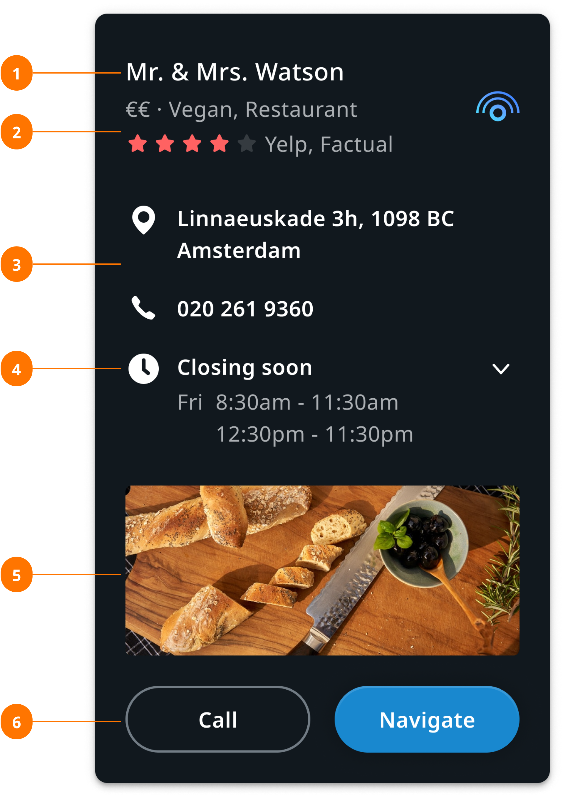

| Section | Use |
| ------- | --- |
| 1. Title | Usually contains the answer or an additional question from the voice assistant. |
| 2. Short POI info | Optional attribute, depends on the data provider. |
| 3. Main POI info | Usually contains phone number and address, depending on the data provider. |
| 4. Expandable list | Optional attribute, depends on the data provider. |
| 5. Image | Optional attribute, depends on the data provider. |
| 6. Buttons | Optional touch actions that could also be performed by voice. |

### Traffic details

Voice assistants may provide specific traffic details during navigation to the POI.

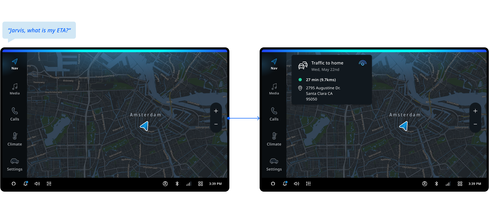

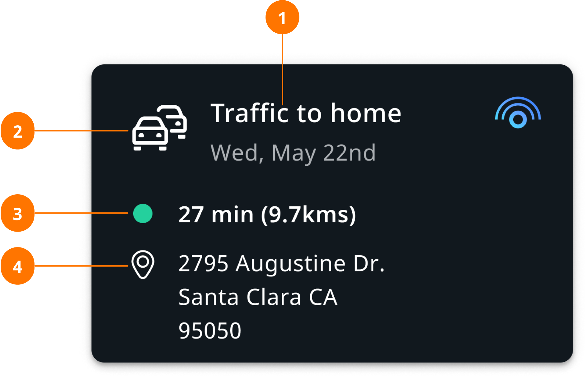

| Section | Use |
| ------- | --- |
| 1. Title | Usually contains the answer or additional question from the voice assistant. |
| 2. Icon/image | Optional attribute, should show the provider logo or any other supportive visual.  |
| 3. Arrival status | Optional attribute to display the traffic, destination/travel time, and distance indicator, if provided by the data source.
| 4. Address | Usually contains location icon/image and full address, depending on the data provider. |

### Weather template

Voice assistants may provide specific weather information with a template by user request. The
information provided depends on the voice assistant.

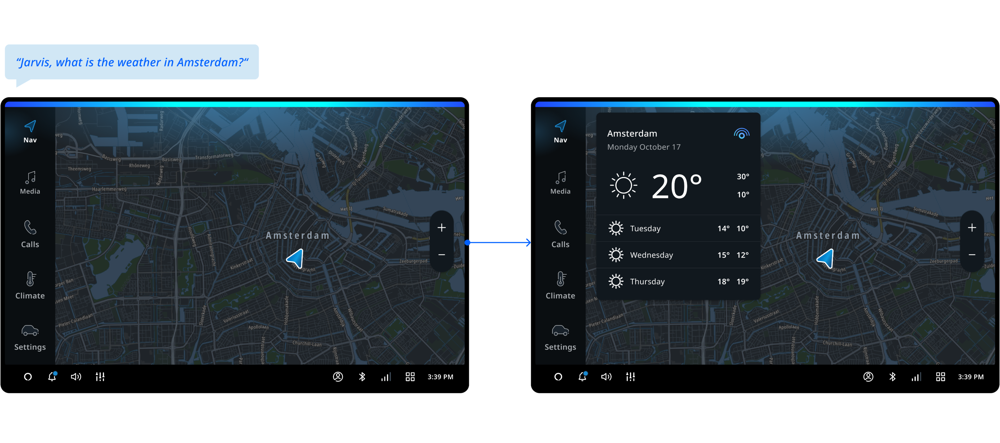

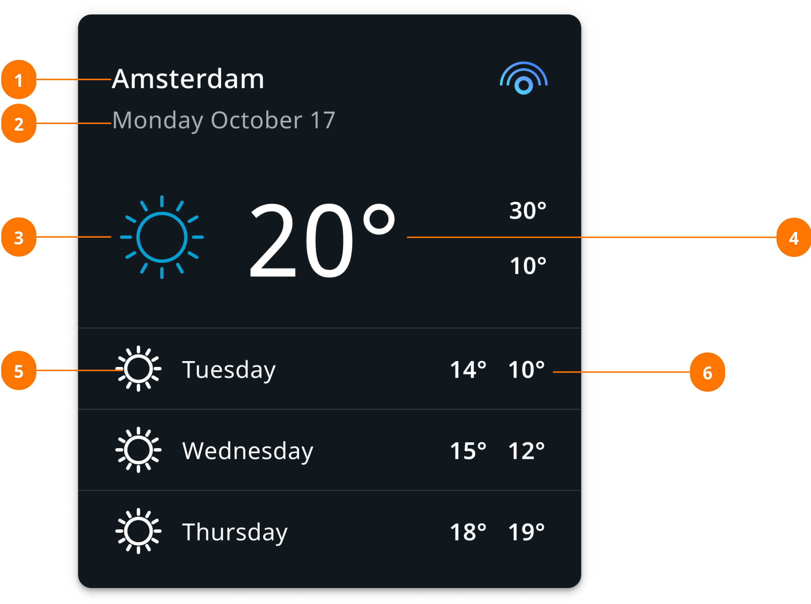

| Section | Use |
| ------- | --- |
| 1. Title | Usually contains the location, city name, country or region, etc. |
| 2. Secondary info | Usually holds the date. |
| 3. Weather status icon | Provides information about the weather status (sunny, rainy, etc.). |
| 4. Average temperature | The average temperature during the day. |
| 5. List item | Optional attribute, usually contains weather information (weather status and maximum/minimum temperatures) on the week. |
| 6. Max/min temperature | The maximum and minimum temperature during the day. |

### Generic content and image

The generic content and image template usually provides information requested by the user, which is
read aloud by the voice assistant. The information depends on the provider.

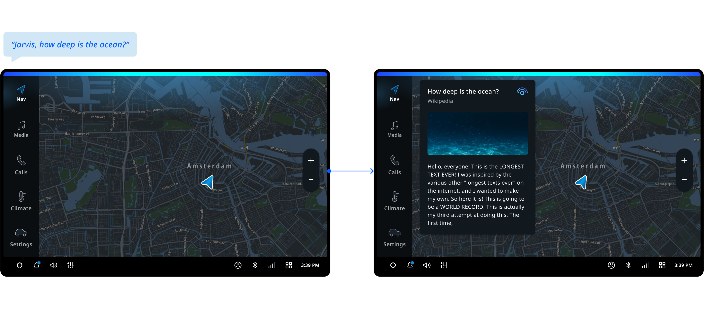

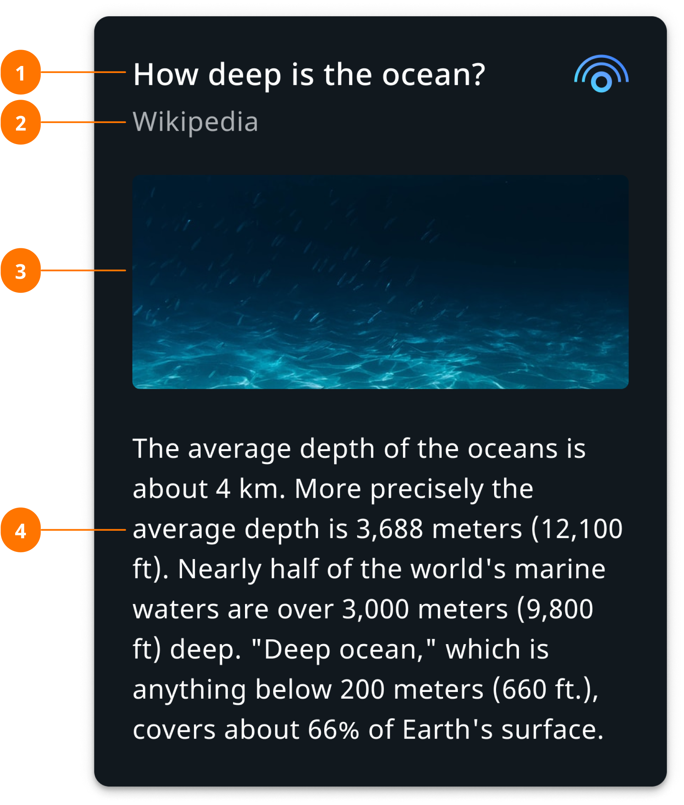

| Section | Use |
| ------- | --- |
| 1. Title | Usually contains the asked question. |
| 2. Secondary info | Usually contains data provider information. |
| 3. Image | Optional attribute, to provide additional visual information. |
| 4. Text | The information provided by the data source. |

### Generic list

The generic list usually provides possible options and depends on the voice assistant. It is only
possible to interact with the list by voice. The amount of options in the list customizable.

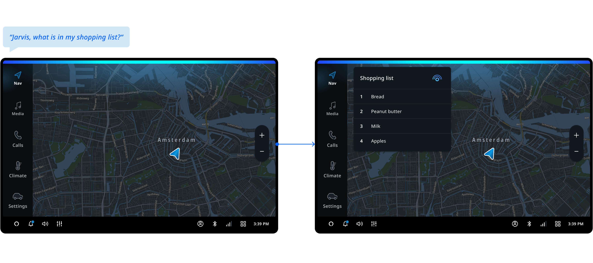

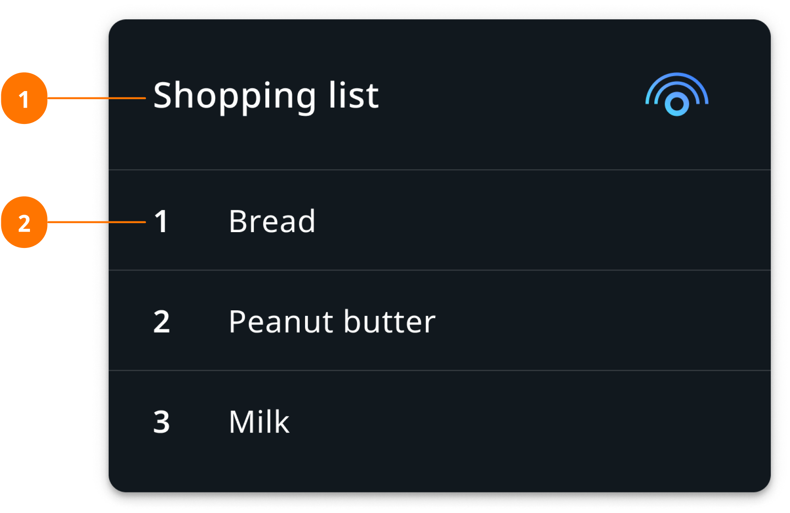

| Section | Use |
| ------- | --- |
| 1. Title | Usually contains the list name. |
| 2. List item | Usually contains a sequence number (optional) and text. |

## Voice assistant login

A login screen is shown inside a modal window when a voice assistant requires the user to log in
before using it. The login flow depends on the voice assistant's guidelines and usually requires
implementation by the customer. When login is complete, the user can interact with the voice
assistant and see the VPA status (if available) in a control centre. The moment when the user needs
to log in depends on the integrated voice assistant. For example, a login modal could be part of the
onboarding flow or appear once the user says a wake word.

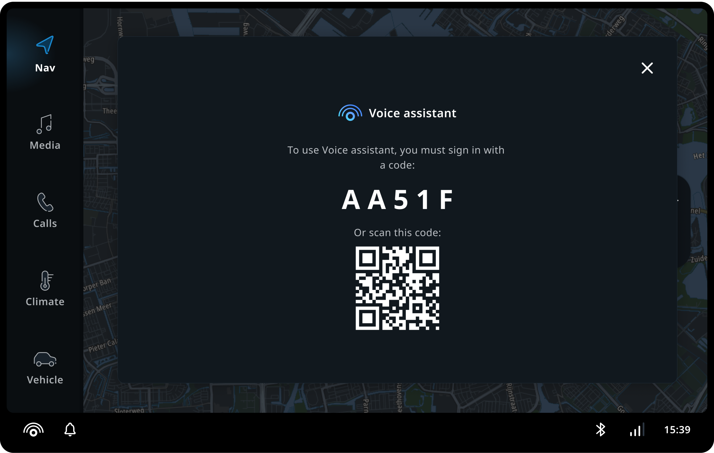

## Customization

Currently, TomTom Digital Cockpit only supports the Alexa voice personal assistant. Any Alexa VPA
customizations require certification from Amazon. Adding a new voice assistant requires integration
work.

