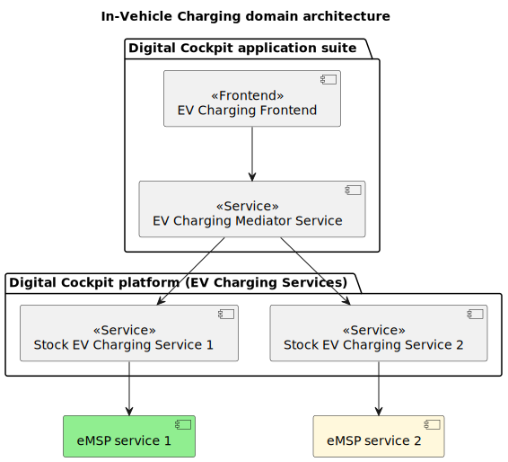

In-Vehicle Charging, specifically EV (electric vehicle) charging plays an important role in the 
future of the Automotive industry, with more and more OEMs introducing electric vehicles to the 
market and countries all over the world investing in EV infrastructure.
This change in the Automotive industry comes with additional complexity for EV drivers when it 
comes to managing route, availability of charging stations and travel time.

TomTom aims to reduce this complexity for EV drivers by offering an integrated solution for planning
an optimal route that takes into account the charging needs of the car, available charging points
(EVSEs) en route and seamless integration with e-mobility service providers (eMSPs). 
An eMSP is a service that provides electric vehicle drivers access to charging points in a 
particular geographical area. Integrating an eMSP with TomTom Digital Cockpit allows the driver
to start and stop the charging process and to pay for that service from within their IVI system.

TomTom Digital Cockpit provides an architecture that allows different eMSPs to be integrated 
allowing the end-user to pay for the charging transaction using different providers. A single 
common and consistent user interface is presented to the user allowing them to charge their vehicle 
using different charging providers in the same way.

## High-level overview

TomTom Digital Cockpit allows multiple eMSPs to be integrated into their product. 

The following diagram shows a high-level overview of the EV Charging architecture:

An eMSP can be integrated into the platform by creating an 
[IVI service](/tomtom-digital-cockpit/developers/tutorials-and-examples/basics/create-an-ivi-service) 
that implements the [`EvChargingService`](TTIVI_PLATFORM_API) interface. This 
interface can only be implemented by discoverable IVI services and hence more than one can exist in the 
system.

A platform service called the [`EvChargingMediatorService`](TTIVI_PLATFORM_API) internally
holds references to all the known eMSP integrations and mediates access to each of them.
This service can also be used by the UI frontend to display the correct charging state to the driver.
For example, it contains APIs that allow the UI to monitor when the user has started 
charging their vehicle and based on this state, it can display a "stop charging" button
for the driver to tap to allow the charging session to be stopped.

TomTom Digital Cockpit contains a number of preintegrated eMSPs. Please speak to your TomTom 
contact person to find out more information on these.

## In-Vehicle Charging Glossary

Many domain-specific terms that relate to in-vehicle charging exist. These are summarized below:

- __Charging Park/Pool__: A grouping of charging stations that share a close location.
- __Charging Station__: A station is a physical grouping of one or more EVSEs, sharing a common user
  identification interface.
- __Connector__: The connector is the physical interface connecting to the car.
- __CPO__: Charge Point Operators install and maintain charge stations. CPOs can either own and
operate Charging Park/station, or operate them for third parties.
- __EV__: Electric Vehicle.
- __EVSE__: Electric Vehicle Supply Equipment is the part of a station that will handle the charging 
process of one EV at a time and may have one meter. An EVSE may have one or several connectors but 
only one can be used at a time.
