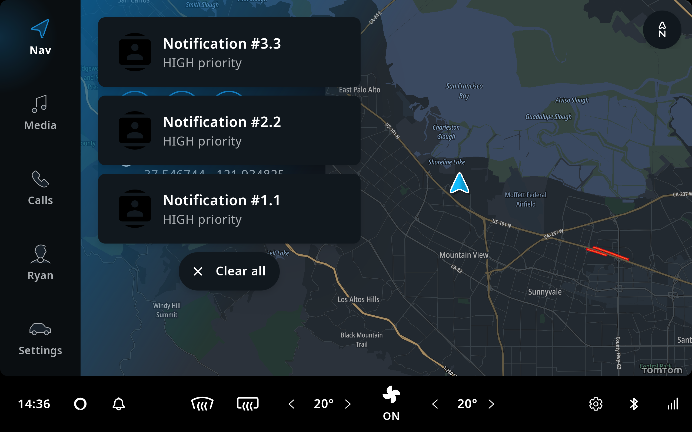

Like everything in TomTom Digital Cockpit, its user interface (UI) also consists of plugins:
[_frontend_ plugins](/tomtom-digital-cockpit/developers/development/frontend-plugins). They expose
[panels](/tomtom-digital-cockpit/developers/development/frontend-plugins#Panel) which contain a visual
user interface for the functionality within the frontend's domain. These panels can be seen as
pieces of the complete user interface. To enable a high degree of flexibility within the TomTom
Digital Cockpit framework, there is no direct coupling between different frontends or their panels, allowing
plugins to be independently added, removed, or replaced.

Even though frontends are not coupled, TomTom Digital Cockpit presents the frontend panels to users in a
cohesive way. The _system UI_ is a plugin that decides when to show which panel and defines the
containers to place the panels in. In common usage, each `Activity` uses a single system UI instance
in its content view; TomTom Digital Cockpit provides [`IviActivity`](TTIVI_PLATFORM_API) that does just that.
Different system UIs can be used per display, hosted in multiple or a single `Activity`.

TomTom Digital Cockpit provides a system UI for the
[_off-the-shelf_ or _stock_](/tomtom-digital-cockpit/developers/development/introduction#off-the-shelf-components-or-stock-components)
implementation. It is built on top of the system UI interface and provides the customer an out of
the box experience. Alternatively, the customer can replace the off-the-shelf frontend and services
with their own implementations.

## The Model-View-ViewModel pattern (MVVM) used in the system UI

Similarly to how [frontends](/tomtom-digital-cockpit/developers/development/frontend-plugins) follow the
[MVVM](https://en.wikipedia.org/wiki/Model%E2%80%93view%E2%80%93viewmodel) pattern, so does the
system UI. In this pattern:

- The model consists of the panels that frontends expose.
- The view model is the system UI's logic to determine which panels to show.
- The view is the container to place the panels in.

### Model

The model contains the information that the system UI presents in the view. It consists of the
complete set of panels exposed by the set of frontends. Each system UI instance can have a different
set of frontends, depending on the _IVI instance_ that it represents; see
[runtime deployment](/tomtom-digital-cockpit/developers/tutorials-and-examples/deployment/configure-the-runtime-deployment-of-the-ivi-system)
for more information on multiple IVI instances. Frontends decide internally when to expose a certain
panel and when to close it. Common situations where a frontend opens a panel include:

- At launch, where a frontend always wants to show a certain panel, like a main menu panel.
- Through a system callback to
  [`Frontend.openTaskPanels`](TTIVI_PLATFORM_API),
  in response to a menu item being clicked.
- Responding to a service update, like opening a notification panel when the telecom service
  indicates there is an incoming call.
- User interaction within the frontend, like showing more details when clicking on a list entry
  within a task panel.

While the frontend is ultimately in control of the panels it contains, the system UI also has
influence over the lifetime of the panels. For example, when the user dismisses a panel by swiping
it away, the system UI requests that the frontend removes it.

### View Model

The model contains the full set of panels that can be shown. However, it may not be suitable to show
all of them at once. There are various situations in which a panel offered by a frontend should not
be displayed to a user. The view model decides when to show which panel. It may, for example, choose
not to show:

- A low priority notification panel, like a text message, when the system UI is already showing a high
  priority notification, like incoming phone call. This is done to not overload the driver with
  information.
- A low priority main process panel, like a media player, when a high priority main process panel,
  like for an ongoing call, is more relevant to the driver.
- The search panel on the home screen when a guidance panel is available for an active route, in
  order to not clutter the home screen.

In addition to the panels to show, the view model provides the view with other information needed to
properly show the system UI. For example, the view model also informs the view of the active theme
or the placement of the main menu based on the product configuration.

### View

The view inflates an Android layout and populates it using the information of the view model. It
exposes an Android [`View`](https://developer.android.com/reference/android/view/View) which can be
integrated in an [`Activity`](https://developer.android.com/reference/android/app/Activity),
[`VirtualDisplay`](https://developer.android.com/reference/android/hardware/display/VirtualDisplay),
or any place where TomTom Digital Cockpit should be presented.

In order to visualize panels, it asks the panel for an Android
[`Fragment`](https://developer.android.com/reference/androidx/fragment/app/Fragment). This fragment is
implemented within the frontend and contains views as a regular Android fragment would. The fragment
is added to the system UI's fragment manager and placed inside a container within the system UI's
layout. The container itself may also be a rich component, including style (background color,
rounded corners, shadows, etc.), animations (like for showing and hiding panels) and logic (like to
swipe away a panel).

__Note:__ Panels should avoid specifying styles, animations, etc. internally, to allow the system UI
to create a consistent look and feel across all panels.

## Separation of concerns

As the system UI is a plugin itself, frontends and their panels should avoid making assumptions
about it. Similarly, the system UI avoids making assumptions about which frontends are available, or
their contents. This low coupling allows both the system UI and the other plugins to be configured
differently per product.

It is important however, that the system UI and the frontends integrate neatly. To achieve this, the
TomTom Digital Cockpit framework provides a set of contracts in the form of interfaces and classes, that
allow a basic level of interaction between the system UI and frontends.

The majority of these contracts are defined in
[`platform_frontend_api_common_frontend`](TTIVI_PLATFORM_API). Apart from the core classes
[`Frontend`](TTIVI_PLATFORM_API) and `Panel`
(see package [`com.tomtom.ivi.platform.frontend.api.common.frontend.panels`](TTIVI_PLATFORM_API)),
the various predefined extensions of `Panel` allow the system UI to recognize how to present that
type of panel. For example, by having a frontend panel extend
[`NotificationPanel`](TTIVI_PLATFORM_API), the system UI knows to treat that panel as a notification,
and can judge whether or not to show it based on the priority specified in the
[`NotificationPanel`](TTIVI_PLATFORM_API) properties.

In addition to the system UI getting information from frontends and panels, the contract also
contains methods that allow the system UI to pass information back. For example, when a panel is
attached to the system UI, `Panel.onAttached` will be called with a
[`PanelAttachment`](TTIVI_PLATFORM_API) instance which contains a
[`PanelContext`](TTIVI_PLATFORM_API) property, that allows the panel to use a limited set of
information from the system UI for its contents. [`PanelContext`](TTIVI_PLATFORM_API) property can
be obtained with `Panel.getPanelContext`. This function requires an
[`IviFragmentId`](TTIVI_PLATFORM_API) as argument. Fragment views can declare an `iviFragmentId`
data-binding variable to obtain the [`IviFragmentId`](TTIVI_PLATFORM_API). The default
implementation of [`IviFragment.onViewCreated`](TTIVI_PLATFORM_API)` binds the `iviFragmentId` 
data-binding variable. You can add the following to the Fragment view XML to declare the 
`iviFragmentId` data-binding variable:

```xml
<data>
    <variable
        name="iviFragmentId"
        type="com.tomtom.ivi.platform.frontend.api.common.frontend.IviFragmentId" />
</data>
```

## System UI Anatomy

A [`SystemUiHost`](TTIVI_PLATFORM_API) hosts a system UI, which is responsible for providing the
system a UI view containing the [`Frontend`](TTIVI_PLATFORM_API)s within it. It has a layout which
is composed of containers for panels. The image below gives an overview of how a stock system UI may
look. In this example, the [`StockSystemUiHost`](TTIVI_PLATFORM_API) defines a layout which contains
the following visible containers:

- A container on the left for the
  [main menu](/tomtom-digital-cockpit/developers/development/frontend-plugins#Main-menu-panel).
- A container on the bottom for the
  [control center](/tomtom-digital-cockpit/developers/development/frontend-plugins#Control-center-panels).
- A container at the top for the [search](/tomtom-digital-cockpit/developers/development/frontend-plugins#Search-panel).
- A container as the background for the [navigation](/tomtom-digital-cockpit/developers/development/frontend-plugins#Home-panel).


[TODO(IVI-7779)]: # (Complete below with ModalPanel, ProcessPanel etc.)

And it also defines containers which are only visible when necessary

- The notification container.
  [Notifications](/tomtom-digital-cockpit/developers/development/frontend-plugins#Notification-panels) are
  triggered when events, like phone calls or messages, occur in the system. This container becomes
  visible when such an event occurs. Notifications will be added to this container and displayed as
  a list. A notification with a higher priority will be displayed above other notifications with
  lower priorities. When notifications have the same priority, the latest notification will be put
  above other notifications with the same priority.



## Safe area

Panels can be overlapped by other panels or system UI elements, and in some cases this could lead
to an unpleasant user experience. For example, when the main process panel opens, it will cover the
bottom part of the home panel. The chevron, the blue arrow that indicates the current location on
the map, may be covered by the main process panel and the user can't see it until the main process
panel is gone.

To provide a better user experience, the system UI needs some information to inform the panels about
them being overlapped. This is achieved through the [`SafeArea`](TTIVI_PLATFORM_API) in
[`PanelContext`](TTIVI_PLATFORM_API). The _safe area_ indicates the amount of space from each side of
a panel that is not safe to display important content due to the panel being overlapped by others.
And each panel can have its own [`SafeArea`](TTIVI_PLATFORM_API).

With _safe area_, in the example above, the map display home panel can use this information to make
sure the chevron isn't shown underneath the main process panel, by moving it upwards. When doing so,
the home panel must still draw the map outside of the safe area because that area might not be
covered in its entirety. For example, the main process panel has space on either side where the map
is still visible.

## System UI services

Apart from [`SystemUiHost`](TTIVI_PLATFORM_API), there are services which are used by the system UI.
The sections below provide an overview of these services.

[TODO(IVI-7779)]: # (Complete this section with services the system UI provides)

### Notification Services

[`NotificationPanel`](TTIVI_PLATFORM_API)s are displayed as a part of the system UI. The container
for notifications defines their width and where the notifications will be presented. Additional
services provide input for the system UI, so it can decide when notifications can be displayed.

#### NotificationDisplayService

The [`NotificationDisplayService`](TTIVI_PLATFORM_API) provides information for clients responsible
for displaying notifications to the user. The client of this service will typically be a system UI,
which uses this information to decide when to display certain notifications to the user.
The [`NotificationDisplayService`](TTIVI_PLATFORM_API) should gather the values of all
[`NotificationSuppressionService`](TTIVI_PLATFORM_API) implementations to determine the final
notification suppression policy.

#### NotificationSuppressionService

A [`NotificationSuppressionService`](TTIVI_PLATFORM_API) indicates whether notifications should be
suppressed. As this is a discoverable service, various domains can have their own implementation of
this interface. For example, the system can suppress notifications when the user is providing input
by using the keyboard. The values of all [`NotificationSuppressionService`](TTIVI_PLATFORM_API)
implementations combined can be used to determine the final notification suppression policy.

#### NotificationCenterService

The [`NotificationCenterService`](TTIVI_PLATFORM_API) is for a notification center, which offers
additional interaction with notifications to the user. A notification center is a UI that allows
users to access notifications in more detail than the system UI offers by default. For example, a
notification center may allow previously suppressed or dismissed notifications to be seen. The image
below shows the notification center (the bell on the control center frontend), and the user can
interact with it to view previously suppressed notifications.


## See also

All of TomTom Digital Cockpit's [UI controls](/tomtom-digital-cockpit/developers/development/ui-controls).
