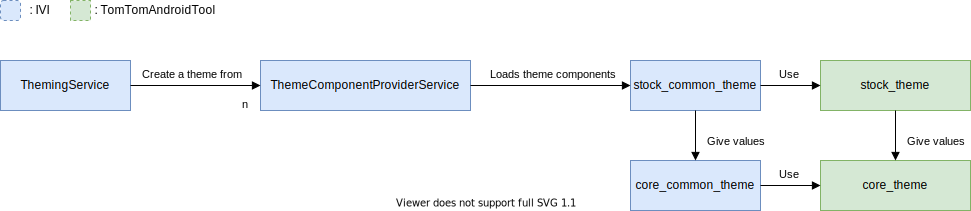
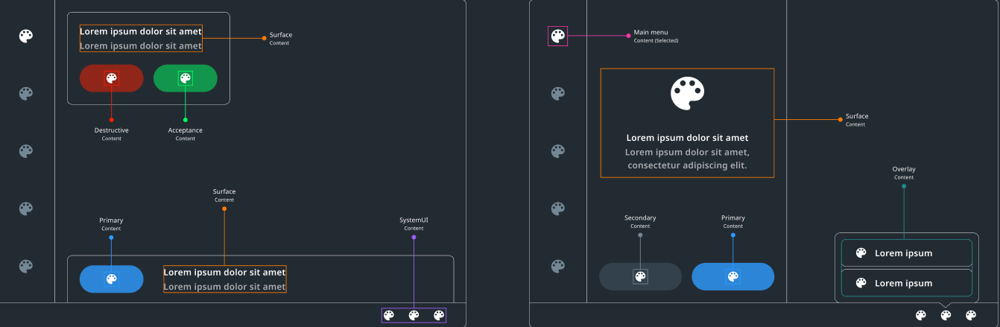
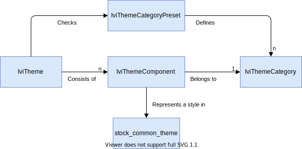

## Introduction

TomTom Digital Cockpit supports theming of the UI. This enables IVI systems built on top of TomTom Digital Cockpit
to have a customized look and feel which is aligned with the branding, make or model of the
vehicle and which is consistent across the entire system. It also allows the system to support
runtime theme switching, enabling the possibility of allowing the end-user to change the look of
their UI while they are using their IVI system.

A theme is composed of styles which are divided into [theme categories](#theme-categories).
Each category focuses on an aspect of the visual user interface such as colors or spacing between
UI components. This page describes how to add themable UI controls and the theming system in
detail.

## How to Implement a Themable UI

TomTom's Digital Cockpit's theming mechanism makes use of
[Android's stylable XML attributes](https://developer.android.com/training/custom-views/create-view#customattr)
and [Android styles](https://developer.android.com/guide/topics/resources/style-resource). The
rest of this guide assumes a basic understanding of these concepts.

A theme is divided into theme categories, each of which consists of a list of Android XML
attributes which can be used to set the styling of a specific aspect of the UI, such as the
color of some text. When implementing the UI, the developer can select attributes from the
appropriate category instead of hardcoding a value into their layout XML.

Examples of the built-in theme categories include:

- __TtThemeCategoryColors__ contains the possible common theme colors. This can be used to
ensure similar parts of the UI such as the backgrounds of all panels of a certain type are the
same color.
- __TtThemeCategoryDimensSpacing__ contains the common spacing values in the theme. This can
be used to ensure that all of the margin and padding values around similar UI controls such
as the padding inside OK buttons is always the same.
- __TtThemeCategoryDimensTextSize__ contains the common text sizes in the theme. This can be
used to ensure that for example, all titles have the same size.

For example, inside `TtThemeCategoryColors`, there is

```xml
...
<!-- Used inside UI elements which require the most attention. -->
<attr name="tt_surface_content_color_emphasis_high" format="color" />
...
<!-- Used to indicate something is wrong. E.g., an error message in a text field. -->
<attr name="tt_surface_content_color_critical" format="color" />
```

As described by its documentation, the `tt_surface_content_color_emphasis_high `
attribute should be used when styling a UI content whose color should indicate to the user
that it is important. This attribute can be used as the value of `android:textColor`
when styling a [`TtTextView`](TTIVI_ANDROID_TOOLS_API). More detailed information on how
colors are organized in the theming system is available in the [Color System](#color-system)
section.

For example, if we were adding an important title to the UI, this attribute could be used to
set the text color:

```xml
<com.tomtom.tools.android.api.uicontrols.textview.TtTextView
    android:id="@+id/importantTitle"
    android:layout_width="wrap_content"
    android:layout_height="wrap_content"
    android:text="Important Title"
    android:textAppearance="?attr/tt_display_text_style_l"
    android:textColor="?attr/tt_surface_content_color_emphasis_high" />
```

Alternatively, to style multiple buttons in the same way, the attribute can be used in
an [Android style](https://developer.android.com/guide/topics/resources/style-resource):

```xml
<style name="ImportantTextViewStyle">
    <item name="android:textColor">?attr/tt_surface_content_color_emphasis_high</item>
</style>

<style name="ImportantButtonStyle">
    <item name="android:textColor">?attr/tt_surface_content_color_emphasis_high</item>
</style>
```

The use of these attributes is core to ensuring that the entire UI of the IVI system
is consistent __and__ changes consistently when the end-user changes the UI theme at runtime.

To change the actual values of these attributes (and hence the look of the UI), see the section
[Customizing the Built-In Themes](#customizing-the-built-in-themes)

TomTom Digital Cockpit also provides a
[UI controls](/tomtom-digital-cockpit/developers/development/ui-controls) library
consisting of a number of UI controls that extend what is available by default in Android. These
also help with producing a themable UI and it is advised to use them where possible.

### Theme Attribute Naming Convention

The built-in Digital Cockpit themes are made up of a large number of styleable XML attributes.
These theme attributes follow a naming convention which help inform the developer of where they
should be used. The naming convention of theme attributes follows the
`prefix_what_where_which_quality_quantity` format. Taking color attributes as an example, the
attribute names consist of:

- `prefix`  for all attributes defined in `core_theme` this is `tt`. The prefix for TomTom Digital Cockpit
  specific component attributes, which are defined in
  [`platform_theming_api_common_attributes`](TTIVI_PLATFORM_API) is `ttivi`.
- `what` determines the _background color_.
- `where` determines the _place_ where it is used. Optional.
- `which` for all color attributes is `color`.
- `quality` represents the _type of emphasis_. Optional.
- `quantity` determines the _level of emphasis_. Optional.

In the [Color System](#color-system) section we'll explain how TomTom Digital Cockpit classifies
_background colors_ and _emphasis_, among other things, to achieve a coherent UI design.

Some examples for color attributes are:

| Prefix | What      | Where    | Which  | Quality    | Quantity |
| ------ | --------- | -------- | ------ | ---------- | -------- |
| tt     | _primary  |          | _color |            |          |
| tt     | _primary  | _content | _color | _emphasis  | _high    |
| tt     | _primary  | _content | _color | _emphasis  | _medium  |
| tt     | _primary  | _content | _color | _emphasis  | _low     |
| tt     | _primary  | _content | _color | _subdued   |          |
| tt     | _primary  | _content | _color | _highlight |          |
| ttivi  | _mainmenu | _content | _color | _emphasis  | _high    |

__Note:__ All attributes defined within the same `prefix_what_where_...` are called a _group_.

#### Global tokens

Most theme attributes refer to a very specific aspect of the UI such as the color of the content
in a panel. However, some of the attributes in a theme have more of a global scope and refer to
a general part of the UI. These attributes are referred to as global tokens or global attributes.

For certain global attributes the naming convention is based on a baseline value. The baseline value
is specified as the suffix of the attribute name, for example, it is the _1 in `tt_size_1`.

The naming convention is composed of the following parts:

- `Prefix` for all attributes defined in `core_theme` is `_tt_`.
- `Category` represents the global category.
- `Scale` indicates the factor that the baseline value should be multiplied by to get to the final
value. When the baseline value for the radius `tt_radius_1` is 4dp, the `tt_radius_23` is
therefore 4 * 23 = 92dp.

The common naming convention is applied for the following categories in the built-in themes:

| Prefix | Category    | Scale | Example           |
| ------ | ----------- | ----- | ----------------- |
| tt     | _size       | _1    | tt\_size\_1       |
| tt     | _spacing    | _0.5  | tt\_spacing\_0.5  |
| tt     | _radius     | _23   | tt\_radius\_23    |
| tt     | _icon\_size | _2    | tt\_icon\_size\_2 |

## Customizing the Built-In Themes

TomTom Digital Cockpit comes with some pre-defined themes including a dark and a light theme. The theme can
be customized by deriving a new theme from the existing one and overriding the existing values
of these attributes in the new theme.

For example, to create new light and dark themes which are based on the build-in TomTom Digital Cockpit
themes, the following XML can be used:

```xml
<resources>
    <style name="MyProductLightTheme" parent="TtiviThemeColorLight">
        <!-- Define a new high emphasis content color for the light theme -->
        <item name="tt_surface_content_color_emphasis_high">@color/product_palette_blue</item>
    </style>

    <style name="MyProductDarkTheme" parent="TtiviThemeColorDark">
        <!-- Define a new high emphasis content color for the dark theme -->
        <item name="tt_surface_content_color_emphasis_high">@color/product_palette_red</item>
    </style>
```

All UI controls which use these attributes will get the defined value when the theme is changed.

## The Theming System

TomTom Digital Cockpit's theming mechanism is heavily based on
[Android's theming approach](https://developer.android.com/guide/topics/ui/look-and-feel/themes),
while additionally providing a means to switch themes at runtime through a service. The Android
styles within the theme are applied to the context of the system UI. All the fragments hosted in the
system UI will get that context with the correct styles applied. Similarly, when a theme changes at
run-time, like when switching between light and dark mode themes, all views are created with a new
context that has the new styles applied.

The theme is provided by the [`ThemingService`](TTIVI_PLATFORM_API). This service is responsible for
deciding which theme should be used by the system UI. It loads the styles that themes can use from
all discoverable [`ThemeComponentProviderService`](TTIVI_PLATFORM_API) instances. (You can read more
on discoverable services in the documentation on
[`IviDiscoverableServiceIdProvider`](TTIVI_PLATFORM_API).) You can add your own instances, or
replace the default one with custom instances that provide alternative styles.

__Note:__ The [`ThemingService`](TTIVI_PLATFORM_API) works with [`IviTheme`](TTIVI_PLATFORM_API)s,
which are explained in detail in the [Customization](#customization) section.

The styles must provide values for _all_ attributes within their respective categories. Failing to
do so will result in unexpected behavior as the views are missing some of their attributes. The
available attributes are defined within the
[`platform_theming_api_common_attributes`](TTIVI_PLATFORM_API) and `core_theme` modules.

The `core_theme` is a _TomTomAndroidTools_ module which defines common theme attributes that can be
used in various projects. The [`platform_theming_api_common_attributes`](TTIVI_PLATFORM_API) module,
which extends `core_theme`, also defines extra theme attributes for TomTom Digital Cockpit. You can customize
the visual appearance of your product by providing the desired values of these attributes.



If you want a look based on the TomTom UX design specification, you can use the
`platform_theming_api_stock_theme`. This theme supports a light and a dark mode. The dark mode is
the default one for TomTom Digital Cockpit.

If you want a customized theme, you must add your own
[`ThemeComponentProviderService`](TTIVI_PLATFORM_API) to provide the extra styles for the
[`ThemingService`](TTIVI_PLATFORM_API) to discover. In that implementation you can override the
values of the `platform_theming_api_stock_theme` to suit your look, or replace the
`platform_theming_api_stock_theme` entirely.

## Theming Design Concepts

### Theme Categories

The appearance of the UI is determined by colors, margins, font types, etc. A theme is divided
into categories for each of these aspects of the UI. To reduce duplication when creating a new theme
and to be able to apply styles independently, these attributes are defined in categories like color,
spacing, and font. Each category represents a set of attributes for the theme.

By having categories of theming attributes, you can create a slightly different theme based on any
other theme. For example, you can create a new look by keeping all categories unchanged, except the
color category. This way you do not need to duplicate _all_ the attributes, but only attributes that
you _want_ to change.

The theme attributes are defined using the standard Android `declare-styleable`. Some examples of
how categories are defined, and which categories attributes belong to, are:

```xml
<!-- attrs_dimens_spacing.xml -->
<resources>
    <declare-styleable name="TtiviThemeCategoryDimensSpacing">
        <attr name="tt_spacing_1" format="dimension" />
        <attr name="tt_spacing_2" format="dimension" />
        <attr name="tt_spacing_3" format="dimension" />
    </declare-styleable>
</resources>

<!-- attrs.xml -->
<resources>
    <declare-styleable name="TtiviThemeCategoryStyles">
        <attr name="ttivi_navigation_search_input_text_appearance_style" format="reference" />
    </declare-styleable>
</resources>

<!-- attrs_colors.xml -->
<resources>
    <declare-styleable name="TtiviThemeCategoryColors">
        <attr name="tt_surface_content_color_emphasis_high" format="color" />
    </declare-styleable>
</resources>
```

### Color System

The color system helps you to apply colors to your UI, including your brand colors. Colors provide a
hierarchy of information, give the correct meaning to UI elements, and meet legibility and contrast
standards.

The TomTom Digital Cockpit color system is designed with a focus on: hierarchy, background colors,
content colors, and emphasis.

#### Hierarchy

UI colors are based on the role they play in the interface. For example, the color of the _surface_
will determine if the UI as a whole is light or dark.

By defining which colors can go on top of each other, you can ensure enough contrast to distinguish
UI elements.

#### Background Colors


The background colors are classified into:

- _Surface colors_ that affect the background of the components. The surface is the background of
  all panels, notifications, the process panel, etc.
- _Primary colors_ that are used for primary actions like primary buttons.
- _Secondary colors_ that are used for secondary actions like secondary buttons, the background of
  segmented controls, etc.
- _Destructive and acceptance colors_ that are used for events that require immediate action or a
  decision of the user.
- _Overlay color_ that is used for components that come on top of the surfaces such as overlays,
  pop-overs, etc.
- _Main menu colors_ that are used for the active app icon, inactive icons, labels, and the
  background of the main menu.
- _Control center colors_ that are used for elements in the control bar, and the background and
  system icons on top of it.

#### Content Colors



Content colors refer to the color of elements that are displayed on top of the background colors.
Whenever UI elements such as texts or icons appear on top of these colors, they will have a
different emphasis to create an order between them.

If there is selected content on the surface like a toggle button, then that selected state is part
of a content color group.

#### Emphasis

 

A UI consists of many components. The fewer components, the easier it will be to understand what is
being communicated. However, sometimes it cannot be avoided to have more components and then
emphasis is used to make some of them stand out and become the focus of the user.

For important information and actions, a high emphasis color should be used. This prevents
distractions from less important components in the UI, like a separation line. Those less important
components could use a low emphasis color instead.

Emphasis is classified into:

- _High emphasis_ which commands the most attention. High emphasis components may be accompanied by
  _medium_ and _low_ emphasis components that perform a less important role.
- _Subdued state_ which is advised for a component that is not interactive, and as such should be
  de-emphasized. For example: dividers.
- _Highlight state_ which communicates when a user has highlighted a component. It is usually
  combined with another, usually primary color. For example: a focused search view.
- _Accent color_ which is used to indicate that some action is needed from the user, usually in
  combination with a highlight color. For example: an active state in a search view.
- _Critical and success states_ which indicate errors and successful actions. For example: an
  invalid text in a text field.
- _Alert, warning and caution_ which are used to raise the user’s attention. For example: a traffic
  warning on the planned route.

## Customization

Here we'll dive deeper into the way you can customize your product using the tools that theming
provides.

An [`IviThemeComponent`](TTIVI_PLATFORM_API) contains the necessary style information and it belongs
to a single [`IviThemeCategory`](TTIVI_PLATFORM_API). The theme component styles are defined as
Android [style](https://developer.android.com/guide/topics/resources/style-resource) resources. For
example, a Noto Sans font style is defined as:

```xml
<resources>
    <style name="TtiviThemeFontNotoSans">
        <item name="tt_font_thin">@font/noto_sans_regular</item>
        <item name="tt_font_medium">@font/noto_sans_semi_bold</item>
        <item name="tt_font_bold">@font/noto_sans_bold</item>
    </style>
</resource>
```

A theme category, like color or font, is represented by an [`IviThemeCategory`](TTIVI_PLATFORM_API).
They may contain multiple [`IviThemeComponent`](TTIVI_PLATFORM_API)s. For example, a font
[`IviThemeCategory`](TTIVI_PLATFORM_API) can have several font
[`IviThemeComponent`](TTIVI_PLATFORM_API)s, each for a different font.

An [`IviTheme`](TTIVI_PLATFORM_API) is a collection of [`IviThemeComponent`](TTIVI_PLATFORM_API)s.

A [`TtiviThemeCategoryPreset`](TTIVI_PLATFORM_API) is a pre-defined set of
[`IviThemeCategory`](TTIVI_PLATFORM_API)s.

An [`IviTheme`](TTIVI_PLATFORM_API) must contain at least one
[`IviThemeComponent`](TTIVI_PLATFORM_API) for each [`IviThemeCategory`](TTIVI_PLATFORM_API) listed
in the [`TtiviThemeCategoryPreset`](TTIVI_PLATFORM_API). The [`ThemingService`](TTIVI_PLATFORM_API)
has the responsibility to check this.



First you need to define styleable attributes for a category. Next you can define a style for it,
which will be used by an [`IviThemeComponent`](TTIVI_PLATFORM_API) later.

Let's use an example to demonstrate the creation of a custom theme. TomTom Digital Cockpit extends color
attributes like `tt_surface_content_color_emphasis_high` which are defined in `stock_theme`. It
is defined like this:

```xml
<resources>
    <declare-styleable name="TtThemeCategoryColors">
        <attr name="tt_surface_content_color_emphasis_high" format="color" />
    </declare-styleable>
</resources>
```

And there is a default value for that color attribute in `stock_theme` as well:

```xml
<resources>
    <style name="TtThemeColorLight">
        <item name="tt_surface_content_color_emphasis_high">#2E3841</item>
    </style>
</resources>
```

The TomTom Digital Cockpit style `TtiviThemeColorStock` inherits from the style `TtThemeColorLight` and
there you can define the value you want for your theme:

```xml
<resources>
    <style name="TtiviThemeColorStock" parent="TtThemeColorLight">
        <item name="tt_surface_content_color_emphasis_high">#A7B290</item>
    </style>
</resources>
```

__Note:__ You can have multiple styles for the same theme category. For example, it is common to
provide light and dark modes as user options. So you can define a light and a dark color theme, and
let the user choose.

You can define a different value for the same attribute in another theme:

```xml
<resources>
    <style name="TtiviThemeColorDark" parent="TtThemeColorDark">
        <item name="tt_surface_content_color_emphasis_high">#FFFFFF</item>
    </style>
</resources>
```

In code, the color category is defined as:

```kotlin
enum class TtiviThemeCategoryPreset(val category: IviThemeCategory) {
    COLOR(IviThemeCategory("COLOR", StaticStringResolver("Color")))
}
```

Then the corresponding [`IviThemeComponent`](TTIVI_PLATFORM_API)s are created and provided by a
[`ThemeComponentProviderService`](TTIVI_PLATFORM_API):

```kotlin
class StockThemeComponentProviderService(
    iviServiceHostContext: IviServiceHostContext,
    serviceIdProvider: IviDiscoverableServiceIdProvider,
) : ThemeComponentProviderServiceBase(iviServiceHostContext, serviceIdProvider) {

    init {
        availableThemeComponents = listOf(
            with(TtiviThemeCategoryPreset.COLOR) {
                IviThemeComponent("Id", category, R.style.TtiviThemeColorStock, "Stock")
            },
            // Adding additional theme category flavors.
            with(TtiviThemeCategoryPreset.COLOR) {
                "Dark".let {
                    IviThemeComponent("Id", category, R.style.TtiviThemeColorDark, it)
                }
            }
        )
    }
}
```

Finally an [`IviTheme`](TTIVI_PLATFORM_API) is created from the
[`ThemeComponentProviderService`](TTIVI_PLATFORM_API):

```kotlin
class StockThemingService(iviServiceHostContext: IviServiceHostContext) :
    ThemingServiceBase(iviServiceHostContext) {
        override fun onCreate() {
            super.onCreate()
            activeTheme = IviTheme(themeComponentProviderService.availableThemeComponents)
        }
}
```

If you want to slightly change the look, then you can change individual attribute values. If
you need to change the look dramatically, then you can create your own theme categories and
attributes and provide your own [ThemeComponentProviderService](TTIVI_PLATFORM_API) to the
`ThemeService`.

