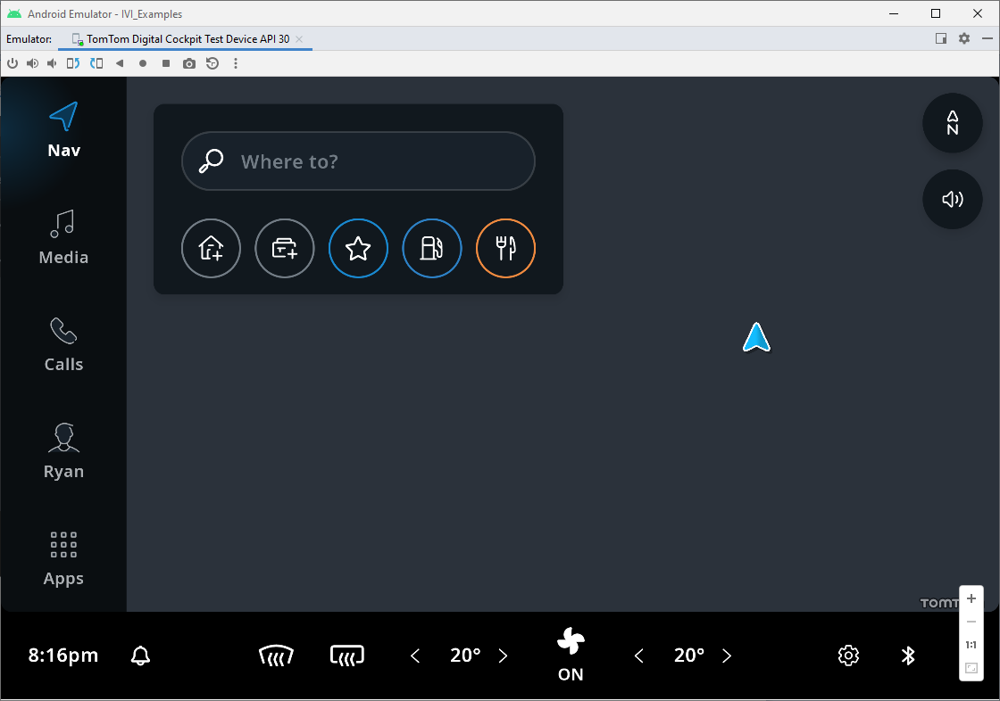
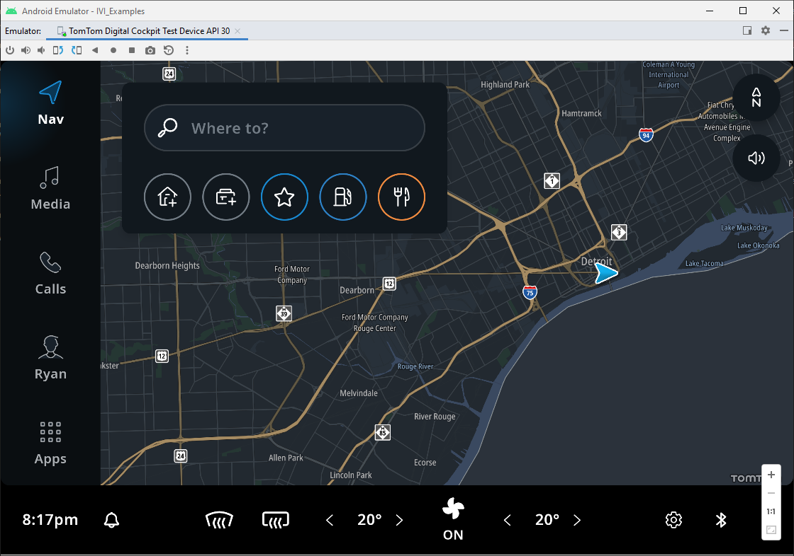

TomTom Digital Cockpit uses an on-board map for its navigation features, but this map is not included in the
SDK package or in the emulator image. You must download and install the map separately.

## Downloading the map

Under the terms of the
[TomTom Digital Cockpit evaluation license](/tomtom-digital-cockpit/developers/getting-started/introduction)
a few demonstration maps are provided in the
[Artifact Repository](/tomtom-digital-cockpit/developers/getting-started/accessing-the-artifact-repository).
Click one of these links and download the map of your choice:

- A map of the USA state of
  [Michigan](https://repo.tomtom.com/#browse/browse:ivi:com%2Ftomtom%2Fdigital-cockpit%2Ftomtom-digital-cockpit-maps%2Fusa-michigan).

Each map consists of a tarball (`.tar`) with the map data and a keystore file (inside a `.zip`).


## Installing the map

Make sure you have built the `IVI Template App` and you are running it in the
[TomTom Digital Cockpit emulator](/tomtom-digital-cockpit/developers/getting-started/the-tomtom-digital-cockpit-emulator#running-the-tomtom-digital-cockpit-emulator),
if you are installing the on-board map on an emulator.

<Blockquote>
  The on-board map and keystore file need to be installed for each application individually. In
  these instructions the target application is the IVI Template App, with the package
  name `com.example.ivi.template.app`. For one of the example apps, use the package name
  from that specific AndroidManifest.xml file.
</Blockquote>

__Windows:__ The `adb` tool comes with the Android SDK, but is not automatically included in the
PATH. You can find it in `%UserProfile%\AppData\Local\Android\Sdk\platform-tools\adb.exe`.

To install a downloaded map on the emulator or on a real device:

- Extract the keystore tarball, then push the keystore file:

```cmd
adb root
adb shell mkdir /data/media/10/Android/data/com.example.ivi.template.app/files/keystore
adb push NK_AUTO_DEV.NKS /data/media/10/Android/data/com.example.ivi.template.app/files/keystore
```

- Extract the downloaded tarball with map data, then push it to the target device:

```cmd
adb push my-directory-with-map-data /data/media/10/Android/data/com.example.ivi.template.app/files/map/
```

- Restart the `IVI Template App`:
  - Swipe up from the bottom of the device's screen.
  - Click on the `All apps` menu icon (grid of nine squares).
  - Swipe up and select `Settings`.
  - Swipe up and select `Apps & notifications`.
  - Select `Show all apps`.
  - Swipe up and select `IVI Template App`.
  - Select `Force stop` on the top right of the screen, then click `OK`.
  - Click on the `All apps` menu icon (grid of nine squares).
  - Swipe up and restart the `IVI Template App`.

If the map and keystore file were succesfully installed, you will now see a blue chevron appear.



## Setting the emulator location

The IVI Template App's navigation features only work if the emulator device's location is within
the on-board map's region.

- Change the device's location:
  - Click the three vertical dots in the top bar of the emulator screen. This opens the `Extended
    Controls` dialog.
  - Select `Location` from the menu.
  - In the `Search` bar, enter a location within the on-board map's region, then click `Set
    Location` and close the `Extended Controls` dialog.

The on-board map is now visible in the emulator, and navigation features operational.




### Using other map regions

If you need a map for an area not included in these demo maps, please ask your TomTom
representative.

## Next steps

Congratulations, you now have an operational TomTom Digital Cockpit environment.

From here on, you have several options:

- Experience the
  [off-the-shelf features](/tomtom-digital-cockpit/developers/platform-overview/example-apps#off-the-shelf-functionality)
  in the template application.

- Build and execute the example applications, as explained in the
  [Tutorials and Examples](/tomtom-digital-cockpit/developers/tutorials-and-examples/overview) section.

- Use the
  [Debug Menu](/tomtom-digital-cockpit/developers/getting-started/the-debug-menu)
  to explore the TomTom Digital Cockpit platform in more detail. For example, by
  [starting a route demo](/tomtom-digital-cockpit/developers/getting-started/frequently-asked-questions-faq#how-do-i-start-a-route-demo).

- As the TomTom Digital Cockpit platform evolves, you can integrate its newest features by following the
  instructions on the
  [Upgrade to a Newer Version of TomTom Digital Cockpit](/tomtom-digital-cockpit/developers/getting-started/upgrade-to-a-newer-version-of-tomtom-digital-cockpit)
  page.

- When you want to learn more about Kotlin or the Android platform, explore the documentation listed
  on the
  [Additional Resources](/tomtom-digital-cockpit/developers/getting-started/additional-resources)
  page.

- If you encounter any issues, please consult our
  [Frequently Asked Questions](/tomtom-digital-cockpit/developers/getting-started/frequently-asked-questions-faq).
