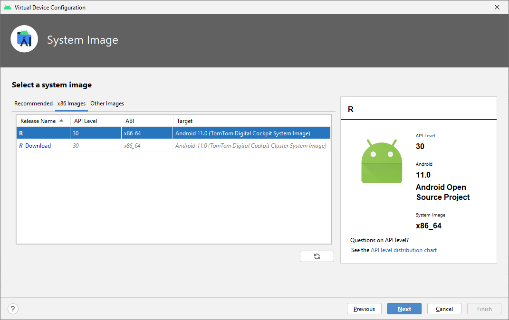

<Blockquote type="warning" hasIcon>
  The TomTom Digital Cockpit Emulator is currently not supported on Apple M-type processors.
</Blockquote>

TomTom Digital Cockpit can run on Android emulators (Android Virtual Devices, AVDs) in addition to
the reference or demo hardware (Samsung Galaxy Tab S5e). A special Android emulator configuration
has been created for running TomTom Digital Cockpit. This configuration contains a number of
customizations to the emulator hardware and the Android platform on which it runs. This emulator can
be used for development on top of TomTom Digital Cockpit and runs x86\_64 AOSP with Android 11
Automotive.

<Blockquote type="announcement">
    The TomTom Digital Cockpit platform also runs on a standard Android device, with a
    TomTom Digital Cockpit-supported CPU architecture. However, some features may not work as TomTom
    Digital Cockpit is implemented for the Android Automotive variant.
</Blockquote>

## The TomTom Digital Cockpit emulator image

Follow these steps to install the TomTom Digital Cockpit emulator image in Android Studio:

- Copy the file
  [`docs/resources/devices.xml`](https://github.com/tomtom-international/tomtom-digital-cockpit-sdk-examples/tree/main/docs/resources)
  to your `~/.android/` directory.
  - __Windows:__ Copy to your `%UserProfile%\.android\` folder.

- If Android Studio is running, restart it, so that the new file is picked up.

- Open the SDK Manager via `Tools` > `SDK Manager`.

- Select tab `SDK Update Sites` and add a new entry:
  - Name: `TomTom Digital Cockpit - Android 11 Emulators`
  - URL: `https://aaos.blob.core.windows.net/tomtom-digital-cockpit/repo-sys-img.xml`
  - Leave `Use Authentication` unchecked, and click `OK`.

- Add another `SDK Update Sites` entry:
  - Name: `TomTom Digital Cockpit - Artifact Repository`
  - URL: `https://repo.tomtom.com/`
  - Tick `Use Authentication`, enter your TomTom
    [repository credentials](/tomtom-digital-cockpit/developers/getting-started/introduction)
    and click `OK`.

- __Note__ the `s` in `https://`, because Android Studio proposes a default URL as `http://`.

- Click `Apply` to activate these update sites.
  - The `TomTom Digital Cockpit - Android 11 Emulators` entry should not show an error.
  - The `TomTom Digital Cockpit - Artifact Repository` entry will show an error, which you can ignore.

- Switch to tab `SDK platforms` and tick `Show Package Details` on the bottom right.

- Expand the `Android 11 (R)` section, enable the `TomTom Digital Cockpit System Image` and click
  `Apply` to start downloading this image.

- When the download completes, click `Finish` and close the SDK Manager.

## The TomTom Digital Cockpit emulator device

After having downloaded the [emulator image](#the-tomtom-digital-cockpit-emulator-image), you can create an
Android Virtual Device (AVD) with it:

- Open the Device Manager via `Tools` > `Device Manager`:

- Select tab `Virtual` and click `Create device`. You should now see a list of device definitions.

- In the `Automotive` category, select item `TomTom_Digital_Cockpit_Test_Device`, then click `Next`:

- In the `System Image` dialog, go to tab `x86 Images` and select the upper entry:
  - `Release Name` : `R`
  - `API level` : `30`
  - `ABI` : `x86_64`
  - `Target` : `Android 11.0 (TomTom Digital Cockpit System Image)`
  - __Note:__ The entries displayed differ only in the last part of their `Target` field.

- Click `Next`. Then, in the `Verify Configuration` dialog, click `Show Advanced Settings` and
  swipe up to the `Memory and Storage` section. Ensure these fields have at least the following
  values:
    - `RAM` : `3072 MB`
    - `VM heap` : `192 MB`
    - `Internal Storage` : `4096 MB`

- Click `Finish`.

- You now see a new TomTom Digital Cockpit emulator device listed in the Device Manager:

## Running the TomTom Digital Cockpit emulator

- Click the triangular `play` icon on the right to start the emulator.
- When the emulator has started, it shows inside a `Device Manager` subwindow:

- To show the emulator in its own window, click the `Settings` icon in the top-right corner of the
  emulator panel and select `View Mode` > `Window`:

- Enable wifi, to allow the emulator network access:
  - Click the Home button (circle) in the top bar of the emulator screen.
  - Press the Android Applications icon (nine dots in a grid) on the bottom of the screen.
  - Swipe up and open `Settings`.
  - Select `Network & internet`.
  - Enable `Wi-Fi` by pressing the toggle button so it turns blue.

- Set the emulator's OpenGL ES API level to 3.1:
  - Click the three vertical dots in the top bar of the emulator screen. This opens the `Extended
    Controls` dialog.
  - Select `Settings` at the left.
  - Select the `Advanced` tab at the top.
  - This should say `Desktop native OpenGL` and `Renderer maximum (up to OpenGL ES 3.1)`, see
    picture below.
  - Close the `Extended Controls` dialog.

- Now restart the emulator, for the new settings to take effect:
  - Close the `TomTom Digital Cockpit Test Device API 30` tab in the emulator
    window to stop the emulator.
  - In Android Studio go to: `Tools` > `Device Manager`.
  - On the right-hand side of each configured AVD there is a down-arrow that opens a context menu.
    Press the down-arrow (instead of pressing the green Play button), and select `Cold Boot Now`.

<Blockquote type="announcement">
    Do **not** close the emulator window without closing the emulator tab inside it. Closing the
    emulator window will **not** stop the emulator, but instead keeps it running in the
    background without access to its user interface.
</Blockquote>

- Go to the emulator window and wait for the emulator to start up.

- In Android Studio:
  - Select the `template_app` project as the application to build.
  - Select the TomTom Digital Cockpit emulator that was created earlier in this tutorial, as the
    device that the application will run on.
  - Build and run the application by clicking the green `play` icon.

- When the application starts, you must allow several permissions to the `IVI Template App` and
  select it as the default phone app.

- You will now see the TomTom Digital Cockpit home screen. Note that map data only shows when you
  have
  [installed an on-board map](/tomtom-digital-cockpit/developers/getting-started/accessing-the-map-data)
  and the current location is inside this map.

__Next step:__
[Accessing the Map Data](/tomtom-digital-cockpit/developers/getting-started/accessing-the-map-data)
