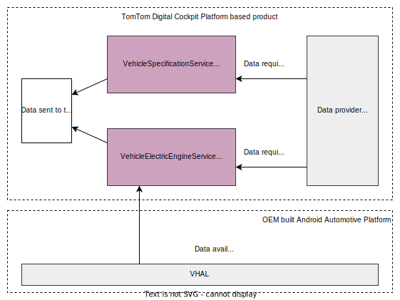

TomTom’s Long-Distance Electrical Vehicle Routing (LDEVR) algorithm uses the vehicle 
characteristics together with map data and live data services, such as TomTom Traffic, to reliably 
calculate the range and to select the most convenient charging stations along the way.

For the algorithm to work as accurately as possible, it needs to access data from the vehicle. Some 
data is more dynamic and can change while driving, per session or over the lifetime of the vehicle. 
Other data is typically static, such as vehicle dimensions. User behavior can also change the data, 
such as controlling HVAC or changing the drive mode from _normal_ to _sport_.

To provide the data necessary for routing, the following two interfaces need to be implemented:

- [`VehicleSpecificationService`](TTIVI_PLATFORM_API)
- [`VehicleElectricEngineService`](TTIVI_PLATFORM_API)

The Stock implementation of these interfaces in the TTDC platform provide static data that are read 
from the vehicle profile set in the 
[The Debug Menu](/tomtom-digital-cockpit/developers/getting-started/the-debug-menu), 
which contains a number of pre-defined vehicle profiles.
Optionally, some of the values can also dynamically be read from the Android Automotive Platform 
[VHAL](https://source.android.com/docs/devices/automotive/vhal) layer, set by the 
[VehiclePropertyIds](https://developer.android.com/reference/android/car/VehiclePropertyIds):

- `batteryChargeLevel` is composed of `INFO_EV_BATTERY_CAPACITY` and `EV_BATTERY_LEVEL`
- `isChargingConnectorConnected` is set by `EV_CHARGE_PORT_CONNECTED`
- `remainingRange` is set by `RANGE_REMAINING`

## Integrating Long Distance EV Routing in the vehicle

As the Stock implementation only provides debug values, it needs to be replaced by a custom one 
that can supply the data needed.

<Blockquote type="announcement">
    For more details on how to create an IVI service, see the
    [Create an IVI Service](/tomtom-digital-cockpit/developers/tutorials-and-examples/basics/create-an-ivi-service)
    page.
</Blockquote>

Depending on the OEM's implementation of the Android Automotive Platform and the hardware supplier, 
some of this data can be available in the 
[VHAL](https://source.android.com/docs/devices/automotive/vhal). For example, battery level, 
battery capacity, and remaining range.
Other data structures are more complex. The charging connectors, for example, are stored in a 
nested `Set<>`, and the charging curve is a data structure in a `Set<>`. Therefore, this data is 
unsuitable to be written/read through the Car API which only supports `List<>` and single values. 
This is better retrieved from other data providers.



In the [`VehicleSpecificationService`](TTIVI_PLATFORM_API) the `engineType` needs to be set to 
`VehicleEngineType.ELECTRIC` to enable the EV features. The `exteriorDimensions` and the `weight` 
need to be set to the vehicle's physical dimensions and weight respectively.

The [`VehicleElectricEngineService`](TTIVI_PLATFORM_API) interface requires the battery level and 
capacity to be set in the `batteryChargeLevel` property.
Notably, most of the data can change while driving, for example the `consumptionModel` will change 
with the driving mode that the car is set to, for example _eco_ drive, or _sport_ drive. Note that 
the charging connectors that the car can utilize are necessary to be able to find suitable charging 
stations along the route. This data also needs to match the connectors available for the country 
map currently in use. The attributes required for this service are further documented in the API 
documentation for the interface: [`VehicleElectricEngineService`](TTIVI_PLATFORM_API).

### Replacing the Stock implementation

When the custom service hosts have been implemented, the stock variants need to be replaced in the 
Gradle files:

__build.gradle.kts:__

```kotlin
import com.tomtom.ivi.platform.gradle.api.defaults.config.vehicleSpecificationServiceHost
import com.tomtom.ivi.platform.gradle.api.defaults.config.vehicleElectricEngineServiceHost

ivi {
    application {
        enabled = true
        services {
            removeHost(vehicleSpecificationServiceHost)
            removeHost(vehicleElectricEngineServiceHost)
            // Add your own service hosts
            // ...

            addHost( /* your own vehicle specification host */ )
            addHost( /* your own vehicle electric engine host */ )

            // etc...


```
