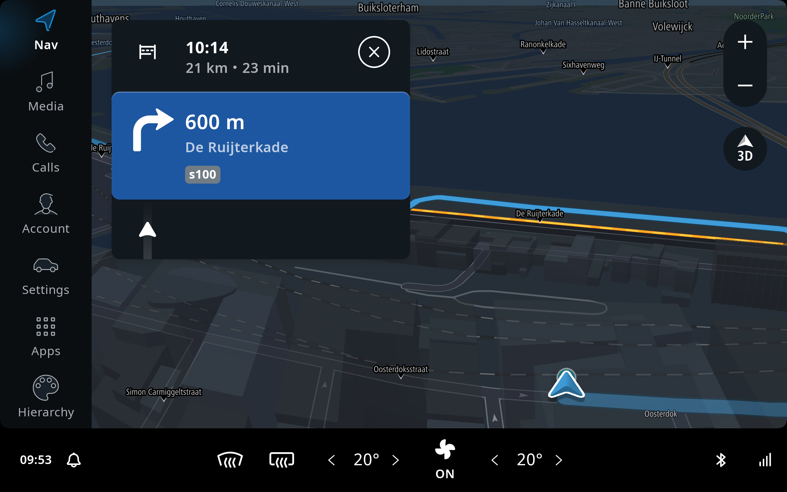
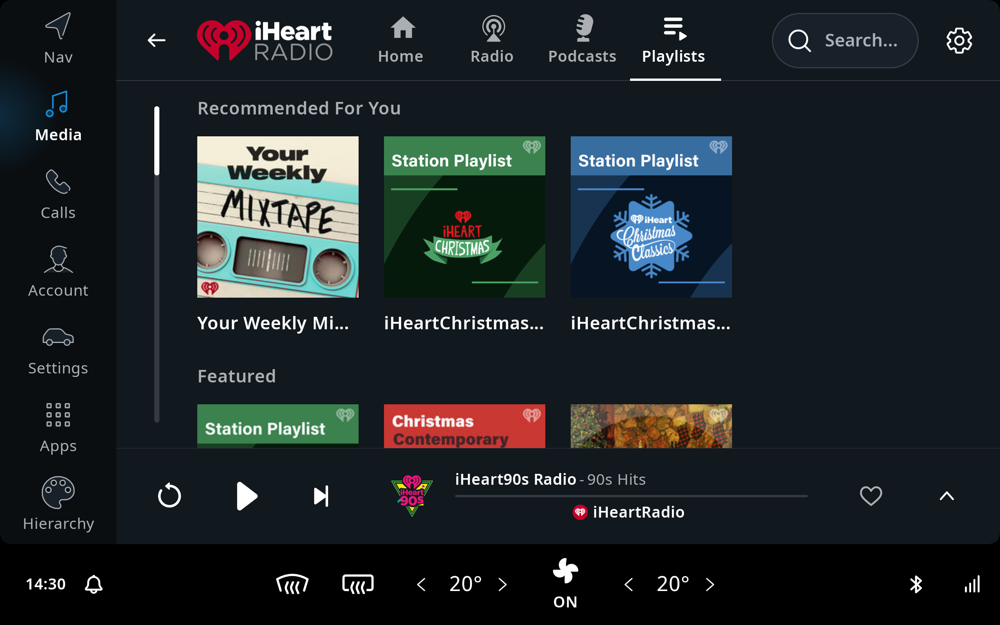
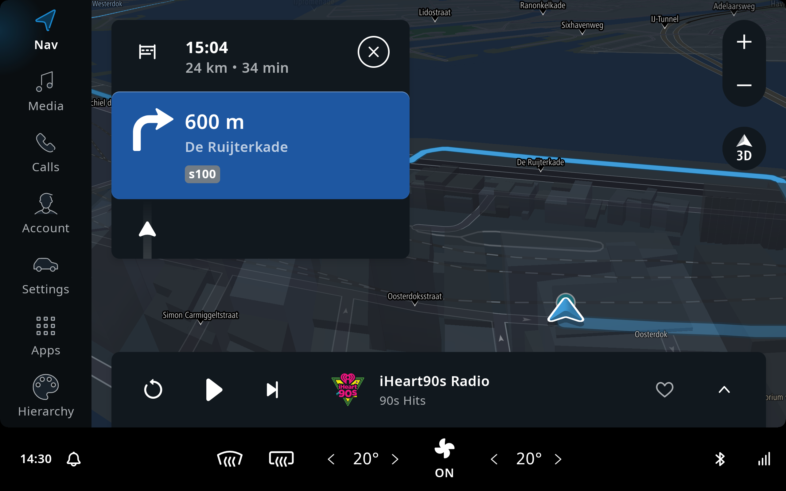
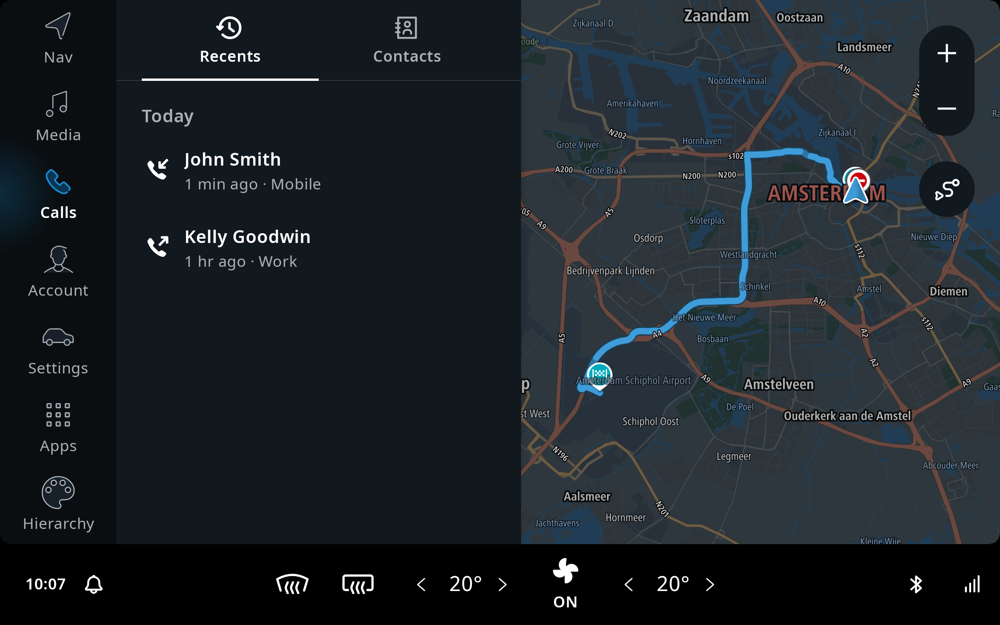

The IndiGO SDK comes with an example application that provides all the stock functionality of the 
IndiGO platform. It also contains the source code that goes with the tutorials, to get you started 
with developing for IndiGO.

## Stock functionality

The IndiGO example application integrates all the stock functionality implemented for the IndiGO 
platform. It is a fully working infotainment system, including navigation, a media center, phone 
calling, messaging and much more. 

The default view, when starting the example application, looks like this. The map view will be 
different depending on your current location. 

The screen of the IndiGO system is divided into a few different areas. The background contains the 
map, which provides navigation functionality, with search, route guidance, traffic information and 
so on. The main menu is on the left-hand side, which allows access to other functionality of the 
platform and ability to always return to navigation. Along the bottom there is a statusbar 
including the Climate Control Center, which contains the Heating, Ventilation, and Air conditioning
(HVAC) controls. 

### Navigation 

The default view in the IndiGO product shows navigation functionality with the current location on 
the background map. The map is interactive and you can pan, zoom and switch between the 2D 
overview mode and the 3D navigation view. To navigation to a location, you can either search for 
it through the search box at the top of the screen, or simply select a location on the map with a 
long press. 

A planned route to Schiphol airport in Amsterdam, with the guidance panel enabled, showing 
guidance instructions for the drive, looks like this: 

And here we have the same route, with the map in 3D mode instead.

### Media 

The media application in IndiGO, provides a framework for browsing and controlling audio content 
provided by third-party sources. The source view in the media application lists all the currently 
available media sources on the device. You can see iHeartRADIO as a 3rd party source on the 
device, and a paired mobile phone for BT audio streaming. 

Each source makes use of the same playback controls, which show the currently playing content at 
the same location of the screen. The user can therefore control what is playing, regardless of 
whether the user is browsing (other) media content, or not. 

When audio is playing and the user is back in the home screen, media controls are visible at the 
bottom of the screen. This is called the Mini Player and allows users to control audio during 
driving, whilst using active guidance. The Mini Player is dismissed automatically, a little while 
after media playing has stopped.

### Climate Control 

Climate control in the car is usually referred to as _HVAC_. Since the HVAC functionality can 
differ a lot between OEMs, the IndiGO platform comes with a reference implementation, providing 
functionality for many common HVAC requirements. This can be used as starting point to implement 
additional functionality for the relevant car model. The reference implementation is wired up to 
the Vehicle Hardware Abstraction Layer (VHAL) in the Android Automotive platform.

The reference application can be launched by touching the climate control area in the status bar 
at the bottom of the screen, called the _Climate Control Center_. The most common HVAC 
functionalities, like changing the temperature, can also be accessed through the Climate Control 
Center directly, without having to launch the application. 

### Calls application 

The calls application in IndiGO, provides functionality to make and receive phonecalls through a 
mobile phone that is paired to IndiGO via Bluetooth. Once a mobile phone is paired, the contact 
list will sync with the IndiGO IVI system. Then the contacts will be accessible under the 
_Contacts_ tab, which allows the user to select a contact and make a phonecall.

The most recent phonecalls will also sync across from the connected mobile phone. If the user 
disconnects the BT connection to the mobile, all synchronized information will be hidden in the UI 
to ensure privacy.

### Apps

IndiGO supports integration of Android application stores. The _Apps_ tab contains a placeholder 
for an app store, which can be configured to display the app store of your choice. This tab also 
contains any other application that is installed outside of the system image.

You can read more about how to configure an app store of your choice in 
[this section](/indigo/documentation/tutorials-and-examples/setup/configure-an-app-store).

Picture showing the placeholder for an app store:

### Example App specific functionality 

The example application also contains code that shows how to implement and integrate specific 
functionality in the IndiGO platform. Each example is explained and documented in the 
[tutorials](/indigo/documentation/tutorials-and-examples) section. 

For example, to get you started making your own IndiGO “application”, there are two examples that 
explain how to 
[create a new frontend](/indigo/documentation/tutorials-and-examples/basics/create-a-frontend-plugin) 
for the UI, along with an 
[IVI service](/indigo/documentation/tutorials-and-examples/basics/create-an-ivi-service) 
to implement the logic. 
These two components together implement an example for displaying account details. The example is 
then replacing the default IndiGO user profile frontend, with the new functionality. 

There is also an example of how to create a hierarchy of panels within a frontend, and the use of 
the [TtNavigationBar](TTIVI_ANDROID_TOOLS_API) at the top to display breadcrumbs to simplify 
navigation between hierarchies. The example source is in `modules/frontends/hierarchy/` in the 
example app.

