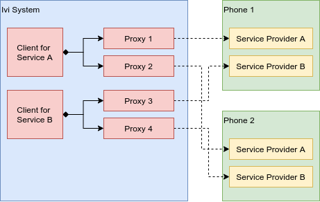

A companion application runs on the user's phone to extend the IndiGO platform experience with 
functionality that is available on that phone; for example, to capture message notifications, 
calendar events, or other data on the phone, and pass them to the IVI system. Or sharing locations 
on the phone, as a navigation destination for the IVI system.

## Overview

The IndiGO platform provides a framework which allows data communication with companion apps via
services which can be extended for different kind of purposes. 

A Bluetooth Low Energy (BLE) connection is used to connect companion apps with the IVI system. On 
top of which we provide a high-level service oriented framework that can be easily extended with 
custom services.

Services are defined using 
[Protobuf](https://developers.google.com/protocol-buffers/docs/overview) service definitions and 
can contain remote procedure calls as well as live data properties that can be observed.

The companion app will _provide_ services and thus can be seen as the server side. The IVI side can
call into those services and can therefore be seen as the client side.

We therefore call the companion app side of a service the _Service Provider_ and the IVI side the 
_Client_.

Multiple companion apps can be connected at the same time, which means that there can be multiple
connections from the IVI system to companion apps for a single service. Each service only has one
client on the IVI side, but that client can spawn multiple service proxies; one to each companion
app. Vice versa, a companion app can only be connected to one IVI system at a time, therefore there
is always a maximum of one client connected to a service provider from the view of the companion
app.

Service interfaces are described using Protobuf files. These are used to generate classes that can
be directly integrated into the IVI system and the companion app.

* _Stub_ classes are generated for the companion side, that can be implemented to provide the
  service functionality.
* _Proxy_ classes are generated for the IVI side, that can be called into directly. All calls into
  the _proxy_ classes will be directly forwarded to the companion app. All observed properties
  will be automatically updated when their data changes on the companion app side.

Because a service definition is used by both the IVI system and the companion app, it is necessary
to put the service definition in a library that can be imported by both.

## More Information

For more information and access to source for our example companion application and SDK, please 
reach out to your TomTom representative.

