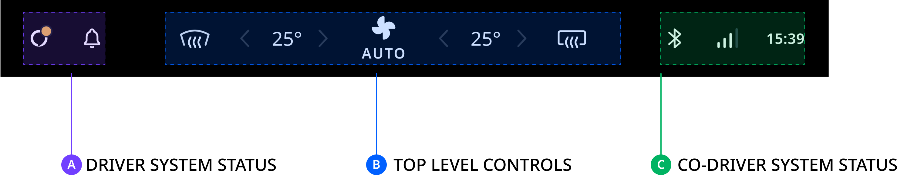

The control center is a collection of controls and indicators that are part of the system UI shell.
By default, they are grouped into three sections, and placed into a single bar at the bottom of the
screen. However, they are easy to replace or reposition. The main use case for these controls and
indicators is having them be available as secondary info from any context. This makes them suitable
for conveying system status or giving quick access to frequently used controls. For instance, the
top level controls section can be used when no hardware controls are available to control HVAC
systems, like the defroster.

## Anatomy

Three sections of controls are provided by default:

- __Driver system status__: Buttons placed on the driver side for actions that may frequently be
  triggered (for example tap-to-talk for VPA).
- __Top level controls__: Vehicle controls as an optional substitute or extension of hardware
  controls, particularly for HVAC systems.
- __Front passenger system status__: Information or status indicators placed on the side of the passenger.
  These controls still often provide (less frequently used) entry points to relevant
  flows. For instance, the Bluetooth indicator is the entry point for the device pop-over and
  pairing flow.

## Customization

The control center can be customized in various ways. In general, the stock control center can be
fully replaced without much difficulty.

| Component     | Customizable  |
| ------------- | ------------- |
| Theming | The content color, background and size of the control center are exposed as attributes in the system theme. |
| Replaceable | The control center container, its layout, and the individual sections are all replaceable. |
| Position & Orientation | The system UI can position and constrain the control center. However, vertical orientation can be used only in combination with a custom control center frontend suited for vertical orientation as well. |
| Layout | The system UI can position and constrain the sections (driver system status, top-level control, front passenger system status) freely within the control center container. New sections can be added, but existing sections cannot be individually modified. |
| Content | The content of the individual sections of the control center is not modifiable, but each section can be replaced with a new (custom) control center section. |
| Split | This can be achieved by modifying the system UI layout. |

## Levels of customization

The positioning, styling and other aspects of the control center layer can be customized.

<ImageArticleGrid articles={
 [
   {
     title: 'Out of the box',
     body: 'The control center from the stock system UI.',
     img: {
       src: 'https://developer.tomtom.com/assets/downloads/tomtom-digital-cockpit/image-components/system-ui/control-center/out-of-box.png',
       alt: 'out of box',
     }
   },
  {
     title: 'Change container',
     body: 'The control center sections are repositioned and themed. The control center container is a custom one, but the content of each section remains unchanged.',
     img: {
       src: 'https://developer.tomtom.com/assets/downloads/tomtom-digital-cockpit/image-components/system-ui/control-center/change-container.png',
       alt: 'change container',
     }
   },
  {
     title: 'Change content',
     body: 'The individual sections are replaced with custom content.',
     img: {
       src: 'https://developer.tomtom.com/assets/downloads/tomtom-digital-cockpit/image-components/system-ui/control-center/change-content.png',
       alt: 'change content',
     }
   },
 ]}
/>
