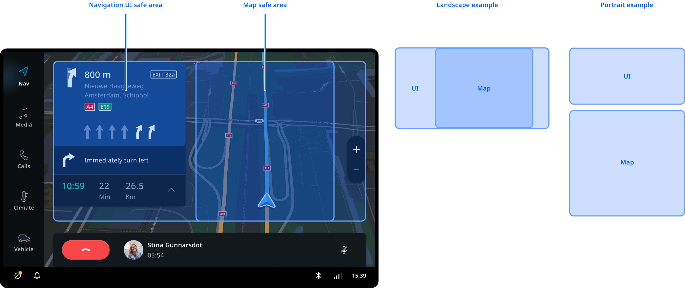
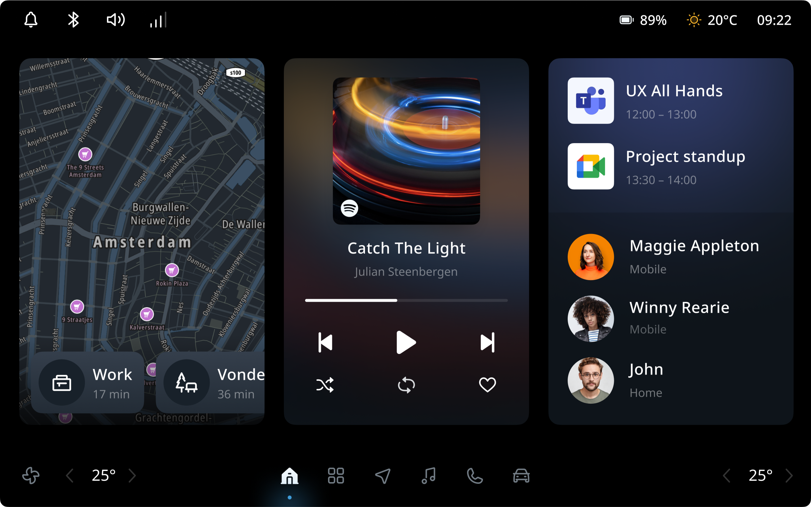

The home panel is, by default, the bottom layer of the system UI in TomTom Digital Cockpit. When the system 
is started, or the user closes an application, this is the screen the user is greeted with. By 
default, TomTom Digital Cockpit serves the navigation experience as the home screen. This choice was made 
because for many drivers navigation guidance is the primary on-screen task while driving, and 
setting up a route is the first thing they do. Even when driving without a route, the TomTom Digital Cockpit 
navigation experience provides contextually relevant information about traffic delays and road 
closures.

## Navigation safe area

The system UI provides the safe area for the home panel. The search/guidance panels are independent 
from the home panel and placed by the system UI; these contribute to the safe area just like the 
main process panel does. When optimizing for a certain screensize it may be useful to reconfigure
their layout. The map safe area (for the route and chevron) is defined by the navigation app and not 
by the system UI.

## Replacing the home screen

As the system UI layout can be replaced, it is also possible to entirely replace the home screen. 
To do this, the map and navigation UI should be moved into a separate navigation application. 
Currently, both map display and navigation are decoupled from the system UI and offered 
through frontend plugins, like all other panels. The following example shows an alternative 
approach to the home screen, where the most relevant information of different applications is 
extracted into widgets. Currently we don't offer widgets, but is it possible to create them using 
the custom panel types that are supported by TomTom Digital Cockpit.

## Customization

The home screen experience can be replaced in its entirety which has the ability to greatly impact 
the overall user experience. The stock navigation experience does follow the system theme, but  
currently most parts of the flows are not customizable.

| Component     | Customizable  |
| ------------- | ------------- |
| Replaceable | The default home screen (navigation app) can be replaced with a custom frontend. |
| Theme | The default home screen (navigation app) can be styled by changing the system theme. |
| Map style | The map style can be customized and linked to the system theme. |
| Safe area | The safe areas of the navigation UI and map can be customized in the system UI. They can be animated or change instantly. |
| Navigation UI | The panels in the navigation UI are moveable and resizable in the system UI. Their animations can also be changed. However, the current content and layout of the panels cannot be changed much. Optimization for different screen sizes is planned. |
