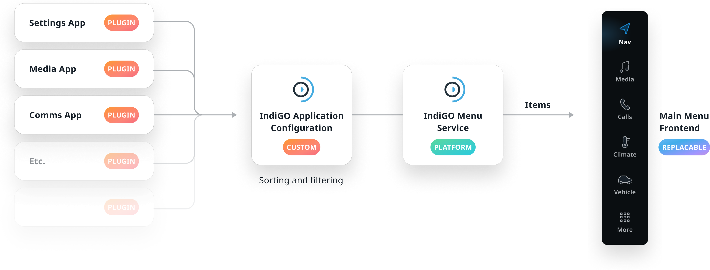

The main menu is a useful entry point to launch the core IVI experience and quickly switch between 
applications. This mechanism is supported on the TomTom IndiGO platform through the 
menu service. An application frontend can be registered with the menu service when configuring a 
TomTom IndiGO based IVI system. The fact that this service is disconnected from the actual main 
menu UI means that this UI can easily be replaced, while still keeping access to the configured 
applications and menu data like the list of menu items, with their icons and optional labels.

## Customization

The stock main menu is themable and flexible in terms of position, layout and content. It is also 
replacable in its entirety.

| Component     | Customizable  |
| ------------- | ------------- |
| Theme | The menu look and feel can be themed by changing attributes like colors, spacing, typography, and/or animations of the menu container and menu items. |
| Replaceable | The entire menu frontend can be replaced with a new one, built from scratch. By making use of the menu service, the menu can populate the same content into a completely different layout. |
| Position | The position of the menu can be changed by replacing the menu frontend. |
| Items and order | The content of the menu is flexible: items can be added, removed, and reordered. The icons of existing menu items can also be replaced. |
| Orientation | The stock menu currently doesn’t support a horizontal layout. A custom menu frontend could be created to add that orientation. |
| Selected indicator | The selected indicator is currently not replacable within the stock menu frontend. If there is a requirement to change this, it's best to entirely replace the menu frontend. The selected indicator can also be disabled with theming. |
| Splitting the menu or creation sections | This is technically possible by replacing the menu frontend, but this mechanism is not accommodated by the TomTom IndiGO menu service. For this to function, additional logic needs to be added to the menu frontend, which may be bad for maintainability. |

## Levels of customization

The main menu can be customized to different degrees, with different degrees of 
engineering and maintenance effort. Configuring the stock menu is a good option to change the look 
and feel of the menu, without writing custom logic or breaking compatibility. If the 
desired result can’t be achieved through configuration, replacing the entire menu frontend is a 
good, albeit more laborious option.

<ImageArticleGrid articles={
 [
   {
     title: 'Out of the box',
     body: 'How the menu looks by default.',
     img: {
       src: 'https://developer.tomtom.com/assets/downloads/tomtom-indigo/image-components/system-ui/main-menu/out-of-box.png',
       alt: 'out of box',
     }
   },
  {
     title: 'Configured',
     body: 'Changed the orientation, content, visualization style, and theming.',
     img: {
       src: 'https://developer.tomtom.com/assets/downloads/tomtom-indigo/image-components/system-ui/main-menu/configured.png',
       alt: 'configured',
     }
   },
  {
     title: 'Replaced',
     body: 'Entirely substituted the stock menu frontend with a custom one with extended functionality (not yet supported).',
     img: {
       src: 'https://developer.tomtom.com/assets/downloads/tomtom-indigo/image-components/system-ui/main-menu/replaced.png',
       alt: 'replaced',
     }
   },
 ]}
/>