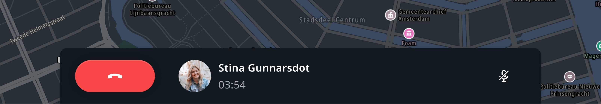
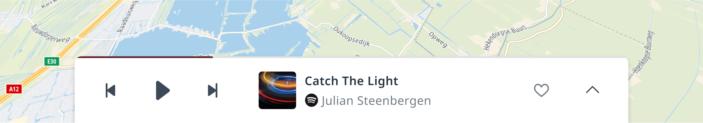
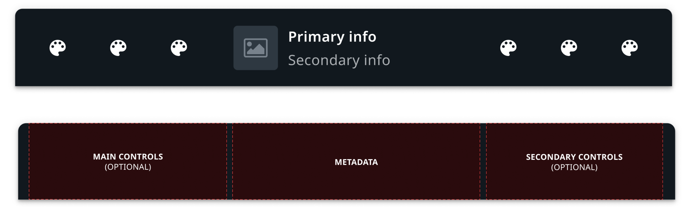

A main process panel is a widget that visualizes the state of an ongoing process. In the default
implementation it is displayed on top of the map / navigation UI. It is used for visualizing and
controlling ongoing calls, and does the same for current media playback. It can be reused for 
different use cases.

### Main process panel selection

Each app must inform the system to visualize the audio process in the main process panel. 
The main process panel's metadata is used by the system UI to determine the priority in which the  
various main process panels are shown. For example, an ongoing phone call has a higher priority than 
streaming media. When both frontends provide a main process panel at the same time, the main process 
panel for phone calls will be shown and not the one for media.

<Blockquote>
    It is also possible to have multiple main process panels visible simultaneously. For example,
    the media and communication main process panels in different positions.
</Blockquote>

### Priority sorting

__Priority per domain:__
- Communication (1st)
- Entertainment (2nd)

__Communication audio processes:__ When multiple communication audio processes are active, these 
will be prioritized in chronological order, and the newest process is visualized on top.

## Anatomy

The main process panel is populated using a UI template that comprises several sections:

| Section     | Use  |
| ------------- | ------------- |
| Main controls | The most important controls for the process (for example, a hang-up button for a phone call), as this section is positioned closer to the driver. This is a list of up to 3 buttons ([TtButton](TTIVI_ANDROID_TOOLS_API)). |
| Metadata | Information about the ongoing process ([TtInformationControl](TTIVI_ANDROID_TOOLS_API)) |
| Secondary controls | An optional secondary list of up to 3 buttons ([TtButton](TTIVI_ANDROID_TOOLS_API)) to perform actions on ongoing process. |
| Progress | An optional progress indicator along the top of the main process panel. (__Note:__ Coming soon.) |

## Customization

The main process panel can be freely styled and positioned in the system UI, but for now replacing 
it requires work for every domain that uses it, such as entertainment and communication. 
Different formfactors / layouts may be supported later on.

| Component     | Customizable  |
| ------------- | ------------- |
| Theme | The color, size, background, and animation of the main process panel can be modified using the system theme. The main process panel template also follows the theme. |
| Position | The position and size of the main process panel can be changed in the system UI. (__Note:__ The main process panel can be removed but this is not recommended as every app has a contract with the main process panel, and frontends may rely on their ongoing processes being accessible. Alternatively, it is possible to 'conditionally hide’ a main process panel.) |
| Animation | The panel enter and exit animation can be changed in the system UI. |
| Orientation | Currently only the default horizontal layout is supported in the main process panel template. However, support for a vertical layout is planned. |
| Layout | The layout template of the main process panel currently cannot be modified without breaking compatibility with the main process panel implementation for the entertainment app and communication app. |
| Content | Main process panels created by various applications can be populated according to the main process panel template. However, existing applications may not offer customization of how they populate the process panel. Currently, the communication app offers no customization, while in the entertainment app the primary and secondary actions can be customized on a per source basis. |
| Priority | It is not possible to customize the main process panel priority selection. |
