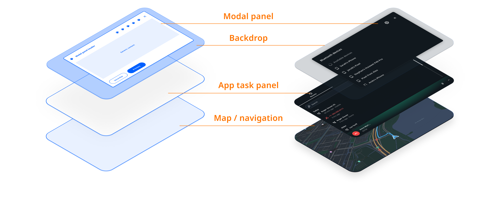
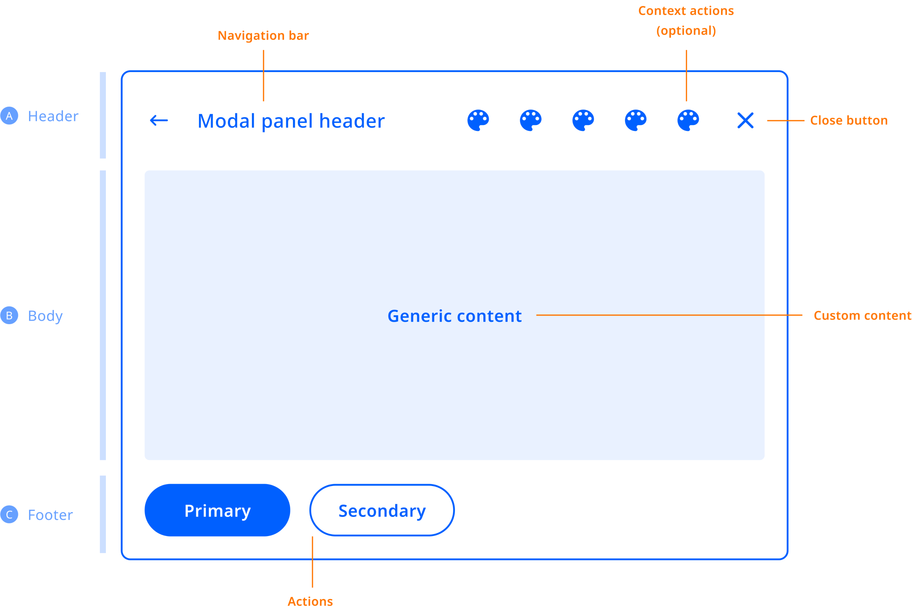

A modal panel is a floating panel that blocks all other user interaction until it has been 
dismissed. They are used to display information that:

- Needs attention from the user, because it presents instructions or critical information.
- Requires information in order to continue with a service or workflow.

Modal panels interrupt a user's workflow by design. When active, a user is blocked from the task 
panel or home panel content. They cannot return to their previous workflow until the modal task is 
completed or the modal panel has been dismissed.

Modal panels are used for short and non-frequent tasks, such as logging into an account, Bluetooth 
device pairing, making small changes, or management tasks. If a user needs to repeatedly perform a 
task, consider letting the user perform it in the original panel. 

Modal panels can be stacked to create a user flow through various screens. The top-most modal panel 
will be shown to the user. When that panel is dismissed, the next modal panel on the stack will be 
shown.

They may be dismissed by the user through system UI functionality, like clicking a close button. 
Such an action may trigger the system UI to dismiss the whole modal panels stack, rather than just 
a single one.

## Anatomy

The modal panel can be used as a standalone container (the backdrop + the panel), but the use of 
the default modal panel template below is recommended. It comprises an optional header section, a 
body section and an optional footer section.

## Customization

| Component     | Customizable  |
| ------------- | ------------- |
| Theme | The style (color, shape, size, etc.) of the modal panel and backdrop follows attributes defined in the system theme. |
| Content | Modals can be created with any content within the modal panel. The content of modals created by existing applications can typically not be modified without replacing the entire application frontend. |
| Replacing | The modal backdrop can be replaced by modifying the system UI. (__Note:__ Currently is not possible to replace the panel template, it is on the roadmap to be supported.) |
| Position | The position of modals and the modal backdrop can be modified in the system UI. |
| Animation | The enter and exit animations of the modal panel and modal backdrop can individually be changed. |
| Dismissal behaviour | It is also possible to change the dismissal behaviour in a custom system UI. For example, to replace current dismiss actions (close button, tapping on the backdrop or the menu) with another mechanism. |

## Levels of customization

The positioning, styling and other aspects of the modal layer can be customized. However, since the 
content of modals from existing applications already exists, it cannot be customized. The content of 
modals created by new applications is fully customizable though, as any UI can be created within 
its boundaries.

<ImageArticleGrid articles={
 [
   {
     title: 'Out of the box',
     body: 'How modals looks in the stock system UI.',
     img: {
       src: 'https://developer.tomtom.com/assets/downloads/tomtom-indigo/image-components/system-ui/modal-panels/out-of-box.png',
       alt: 'out of box',
     }
   },
  {
     title: 'Themed',
     body: 'Global and modal-specific theme attributes can be used to change the styling.',
     img: {
       src: 'https://developer.tomtom.com/assets/downloads/tomtom-indigo/image-components/system-ui/modal-panels/themed.png',
       alt: 'themed',
     }
   },
  {
     title: 'Custom panel',
     body: 'The system UI is tweaked to reposition the modal panel, and the modal template and backdrop are replaced.',
     img: {
       src: 'https://developer.tomtom.com/assets/downloads/tomtom-indigo/image-components/system-ui/modal-panels/custom.png',
       alt: 'custom panel',
     }
   },
 ]}
/>