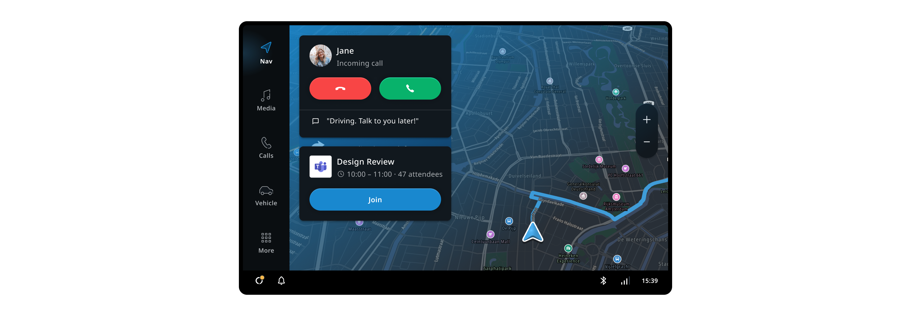
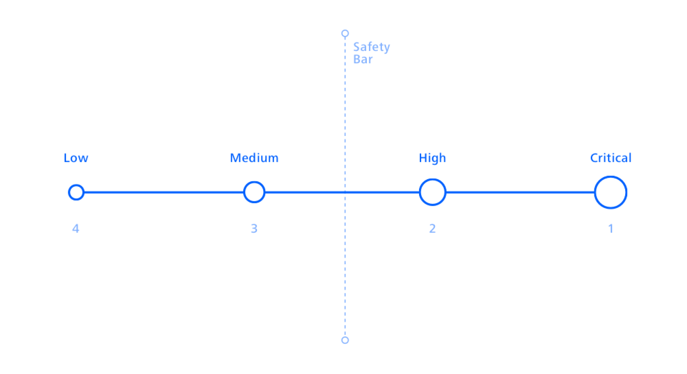
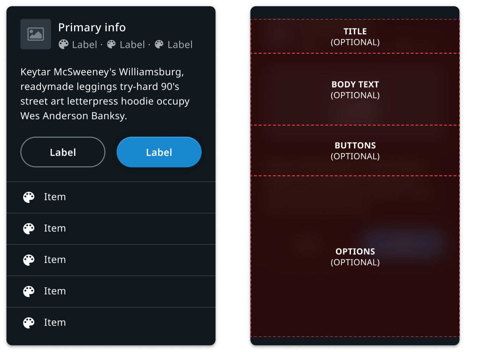
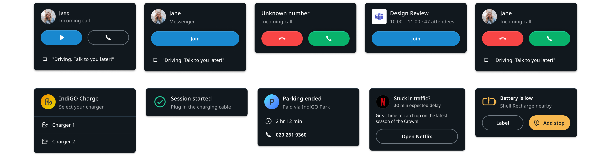

Notifications are pieces of information that are relevant to the user, but typically are not a 
direct result of user input. They may be presented on the top layer of the system UI as Heads-Up 
Notifications (HUNs) and / or in a centralized notification history of non-dismissed notifications 
(Notification Center). Most notifications (except for the voice assistant display cards) are 
configured using a UI template and a set of properties. A set of rules determines which 
notifications to show in which context. Through this interface, metadata such as the priority, can 
be passed to the system UI. The system UI uses this metadata to determine when and how to show the 
notification. For example, it may choose to suppress a low priority notification while a higher 
priority notification is active, to avoid distracting the driver. Notifications may be dismissed by 
the user through system UI functionality, like swiping it away.

## Notification list

The notification list manages the positioning, sorting and animation of notifications as they come 
in and go out of view. By default, it positions the notifications at the top on the driver’s side. 
Multiple notifications can be shown simultaneously, but there are several mechanisms (notification 
priority, notification suppression / do not disturb) at work to prevent overwhelming the user with 
notifications.

### Priority

Notification sorting is determined by priority and chronology. Important notifications 
with HIGH or CRITICAL priority are always shown, even when interacting with the system or while Do 
Not Disturb is active. When notifications have the same priority, the newest one is shown first 
(until dismissed). However, when a higher priority notification comes in, it takes precedence.

### Notification suppression

The notification suppression is a platform mechanism that, when enabled, suppresses notifications 
with medium and low priority. The notification lock may be linked to a global toggle (for example “Do not 
disturb”) or automated contextually. By default, the notification suppression is enabled when the 
user has interacted with the screen in the last 5 seconds.

## Anatomy

Most notifications follow the same template and can be built with a single configurable UI 
component. We strongly recommend to use the template for creating new notifications. It comprises a 
set of optional fields that can be combined to cover almost all use cases. To adjust the 
template to suit a custom system UI, an opportunity to inject a custom UI may be part of this 
template in the future. The following image is an example of a possible structure where every field 
is optional.

## Examples

Here are some examples of notifications that can be created using the notification template.

## Customization

The notification stack can be customized in terms of styling, positioning, and general appearance. 
However, the layout and content template of notifications are currently fixed, and the 
notifications created by stock experiences (media, communication app) cannot currently be changed.

| Component     | Customizable  |
| ------------- | ------------- |
| Backdrop | The position, style and animation of the notification backdrop can be changed in the system UI. |
| Position | The position of the notification stack can be changed in the system UI. |
| Animation | The animations of the backdrop and invidual notifications are customizable. The animation used for Notifications panels can depend on the transition source or destination. For example, notification panels can dismiss towards the bottom when transitioning to a process panel. |
| Theming | The styling of the notification content, container, and backdrop can be modified by changing the system theme. |
| Notification layout | The stock notification layout currently cannot be replaced, though support for creating alternative layouts for the notification data template is planned. It is also possible to create a notification panel with a completely custom UI. |
| Notification content | Notifications can be populated by applications/plugins in any way. However, the notifications created by existing applications (e.g. the communication app) can currently not be modified. |
| Notification template | The notification data template can not be modified or extended at the moment because existing applications rely on the current template being available. |
| Notification filtering and sorting | The system can implement a custom filtering and sorting mechanism to determine which notifications should be visible. However, the main way to know the urgency of a notification is limited to its priority (low, medium, high, critical). |
| Communication notifications | Limited customization options exist for communication notifications. It is possible to add more than one quick reply option (OEM), and for the user to change the text of the quick reply message. |
| Dismissal behaviour | It is also possible to change the dismissal behaviour in a custom System UI. For example, replace the swipe-to-dismiss gesture with another mechanism.|

