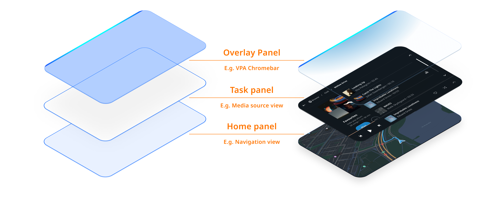

Frontends can overlay the system UI using overlay panels. Overlay panels are used to show a 
temporary visual effect over the system UI's main content area. This can be used, for example, to 
visualize the state of a currently active VPA or provide large and noticeable navigation 
instructions.

