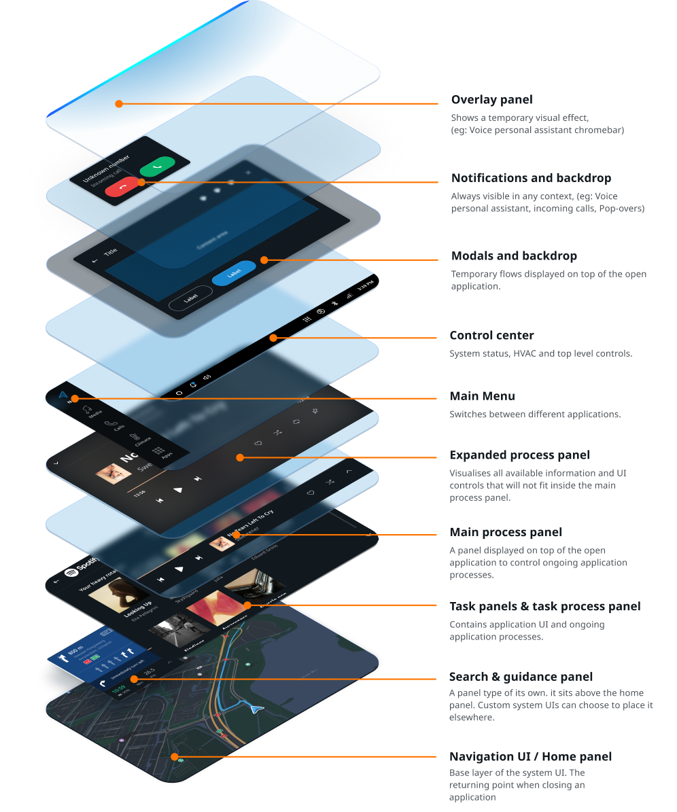
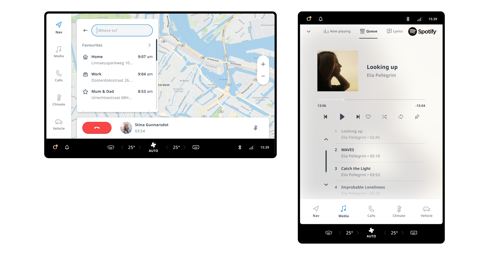

## Overview

The system UI defines the layout of the system on a displayed level in TomTom IndiGO, along with its
rules and behaviors. The system UI decides when to show which panel and defines the container 
to place these panels in. Frontends expose panels, which the system UI processes and presents when 
appropriate. Panels have many use-cases. This is not limited to opening panels when pressing a menu 
item, but also notifications, main process panels, and even the menu itself. 

As the system UI itself is a plugin, it and its components can be replaced in their entirety.

## Anatomy

The system UI comprises a layered set of building blocks, which by default is structured as 
visualized below. However, this order, as well as the layout of individual layers, can be easily 
changed by replacing the system UI layout. This can be done without breaking compatibility with the 
individual building blocks, like the menu or notifications. This is an easy way of dramatically 
customizing the look and feel of the system, without losing the functionality offered by the system. 
This guide covers how each individual layer functions, how it can be configured, and what different 
approaches to customizing it are available.

<Blockquote>
    It is also possible to create Custom panel types. A custom panel is currently not shown in 
    the layering, but it is supported by TomTom IndiGO.
</Blockquote>

## Configuration examples

The positioning and constraints of the content of the different system UI layers can be customized. 
The following examples show the stock configuration for landscape screens and a possible 
configuration for portrait screens. Customizing the layout of the layers in the system UI is, next 
to theming, a highly effective way to create a distinct and optimized experience for a vehicle and 
its specific hardware setup.

