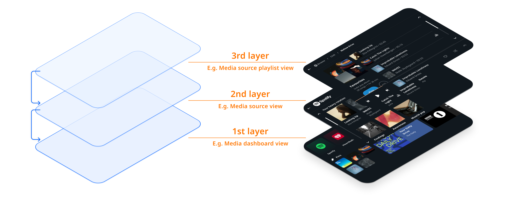
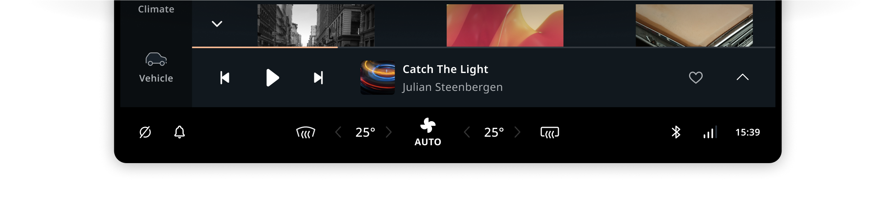
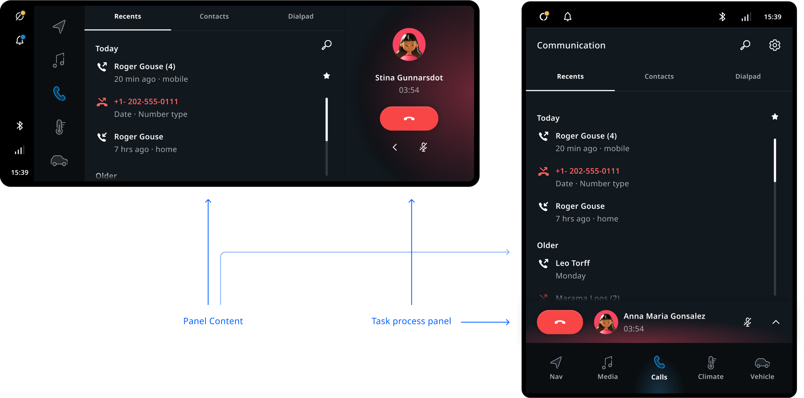

Task panels are the containers of an application's UI. They are in charge of 
positioning and animating applications in the system UI. Task panels can be stacked to create a 
user flow through various screens. The top-most task panel will be shown to the user, and when that 
panel is removed, the next task panel on the stack will be shown. They may be dismissed by the user 
through system UI functionality, like swiping it away. Such an action may trigger the system UI to 
dismiss the whole task panel stack, rather than just a single one.

## Anatomy

TomTom IndiGO currently includes two types of task panels:

<ImageArticleGrid articles={
 [
   {
     title: 'Maximized Panel',
     body: 'Full panels can display an application UI with all available screen space, with the exception of the main menu and control center. The task panel just provides a container with a default background and animation. Both can be replaced when creating a custom system UI. The panel is not concerned with what is the content of the panel.',
     img: {
       src: 'https://developer.tomtom.com/assets/downloads/tomtom-indigo/image-components/system-ui/task-panels/max-panel.png',
       alt: 'maximized panel',
     }
   },
  {
     title: 'Half Panel (deprecated)',
     body: 'Half panels were used to position an application UI next to the navigation / home UI of the base layer of the system UI. This may be used to accomodate performing simple on screen tasks without losing the visibility of the map. However, this pattern is being deprecated on a platform level in favor of having the simpler full panel used in all situations. If something else than full panels is required for an application UI, a custom implementation will be required.',
     img: {
       src: 'https://developer.tomtom.com/assets/downloads/tomtom-indigo/image-components/system-ui//task-panels/half-panel.png',
       alt: 'half panel',
     }
   },
 ]}
/>

## Process panel inside a Task panel

A task process bar panel allows a frontend to visualize an ongoing process in all of its task 
panels. Unlike the process bar, a task process bar panel is part of the task panel and as such does 
not overlap the task panel itself. The task process bar panel will persist for the whole task panel stack. 

The process panel UI template can also be used 
[outside the process panel](#task-panel-alongside-the-task-process-panel-layout). For instance, the 
TomTom IndiGO media application uses it to have UI consistency between the process panel Mini 
Player and Now Playing Bar. 

### Task panel alongside the Task process panel layout

The layout template for the type of task panel can determine at which side of the task panel to show a process 
panel (for example, in the media or communication app). The example below visualizes how the 
process panel could be moved to the side on certain screen sizes.

<Blockquote>
    This is just an example, as alternative layouts of the task process panel are not supported yet 
    but are on the roadmap.
</Blockquote>

## Customization

| Component     | Customizable  |
| ------------- | ------------- |
| Theme | The style of the panels is themable, but the panel containers can also be substituted entirely. |
| Position | The size and positioning of task panels is adjustable per task panel type, by implementing a custom task panel container manager. |
| Animations | The enter and exit animations of task panels can be changed by implementing a custom task panel container manager. The animation used for task panels can depend on the transition source or destination. For example, the climate panel opens from a control center panel, and so animates vertically. |
| Change panel type per app | Stock applications have a internally assigned panel type, which means this type cannot be adjusted. It is possible however, to visualize a task panel type in an alternative way. For example, showing the half panel type as a maximized panel. |
| Panel type | Currently there are only two panel types (maximized panel and half panel), and no additional types can be added. The appearance of these types can be adjusted freely however. (__Note:__ The half panel type is scheduled to be deprecated.) |
| Business rules | Task panels in the system UI have some customizable business rules around them. These include: 1) Closing task panels of a frontend when another frontend opens a task panel. 2) Closing modal panels when task panels open or close. 3) Changing the selecting menu item when a frontend opens or closes a task panel. |