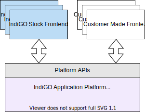
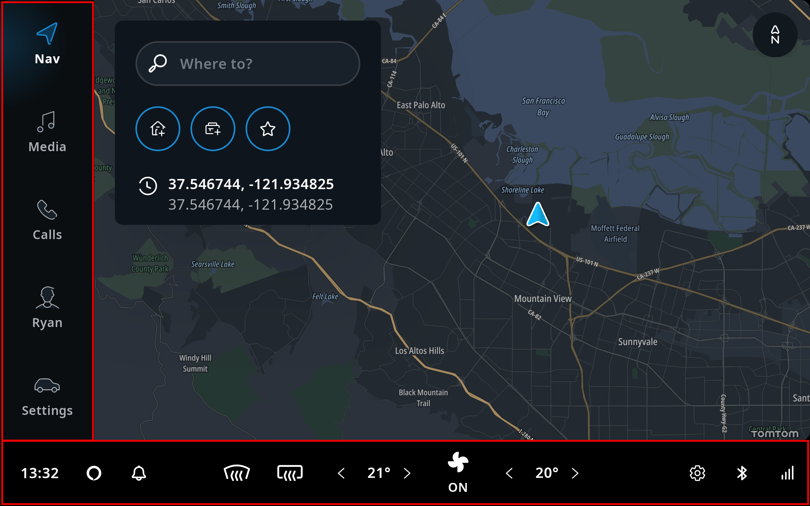
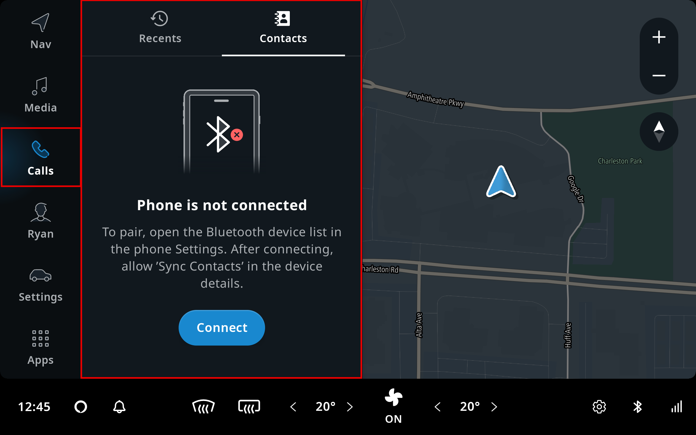
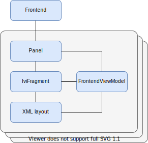
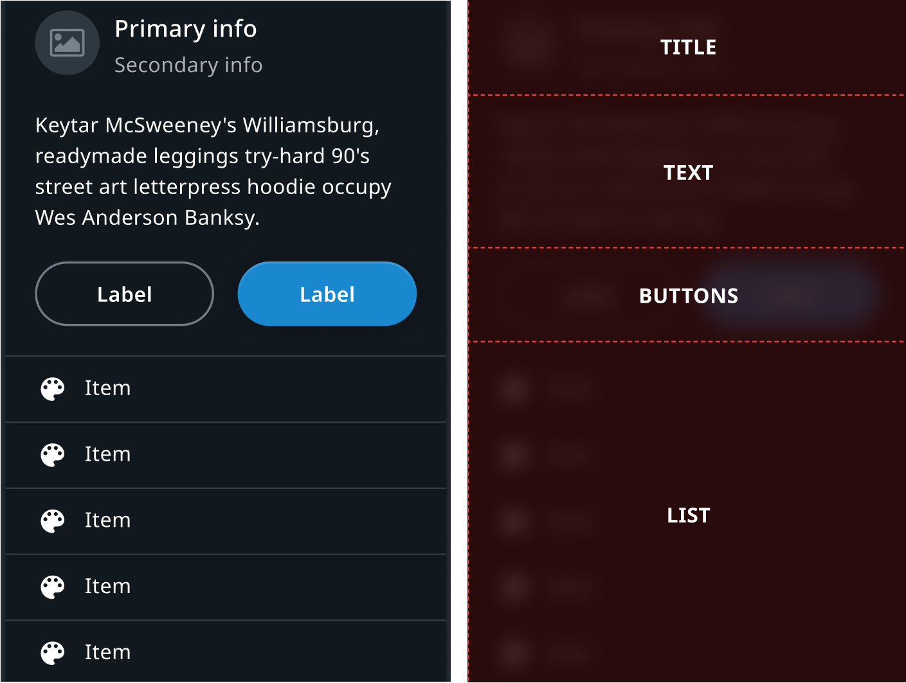

Frontend plugins are the user interface (UI) modules of the TomTom IndiGO platform. Each frontend
is an independent module encapsulating the UI of some distinct functionality in the platform. The
TomTom IndiGO platform provides a number of default, or
[_off-the-shelf_](/tomtom-indigo/documentation/development/introduction#off-the-shelf-components-or-stock-components),
frontend plugins, like the media player, or the phone, etc.

Each frontend is developed against a common set of stable platform APIs. These APIs can be used to
create new frontends for the platform, or replace an off-the-shelf plugin with your own customized
version.

The configuration and inclusion of the frontend plugins in the TomTom IndiGO product are done at
build time, thus only the applicable frontend plugins are included in the deployed product.

The TomTom IndiGO product is built and deployed as one Android
[APK](https://developer.android.com/guide/components/fundamentals).
Therefore, the plugins cannot be replaced, or updated individually after the product has been
installed on a device. This requires a new build to be re-installed.

This page provides an overview of frontend related components. If you want to start building a
frontend plug-in, see
[Create a frontend plugin](/tomtom-indigo/documentation/tutorials-and-examples/basics/create-a-frontend-plugin).

## Off-the-shelf (stock) frontend plugins

There are a number of _off-the-shelf plugins_ in the TomTom IndiGO platform. In the source
repository these are usually referred to as _stock plugins_. The following picture shows the default
view when you launch the example application that comes with TomTom IndiGO. Highlighted in red it
shows the HVAC frontend along the bottom and the main menu frontend on the left side with menu items
that launch other frontends.

Here is an example of one of the stock launched frontends, containing the UI for the contacts
functionality. The Frontend and the associated menu item are highlighted in red.

## Frontends and panels

Frontends insert parts of their UI into [panel](#panel)s, which the
[System UI](/tomtom-indigo/documentation/development/system-ui) processes and displays when needed.
Panels can be considered to be common sections of the overall UI that get reused by different
applications. The arrangement of these panels is orchestrated by the System UI which ensures that
the correct parts are displayed and dismissed appropriately.

Panels are used for a wide range of functionalities. This is not limited to opening panels when
pressing a menu item, but also notification panels, main process panels, and even the main menu itself.

A menu item can be associated with a frontend. This menu item is added to the main menu to open
the frontend's main task panel and can also be used to create the frontend on demand.

TomTom IndiGO frontends are designed around using the
[MVVM pattern](https://en.wikipedia.org/wiki/Model%E2%80%93view%E2%80%93viewmodel)
and [Android's Data Binding Library](https://developer.android.com/topic/libraries/data-binding).
TomTom IndiGO has many convenience classes to simplify using these. The
[`platform_frontend_api_common_frontend`](TTIVI_INDIGO_API) module contains the classes needed to
create your own frontend, panel, and fragment using a `ViewModel` for the data-binding.

### Frontend

A [`Frontend`](TTIVI_INDIGO_API) exposes pieces of the overall user interface. For example, there
could be a frontend for the main menu and one for the map view. Each frontend can have one or more
panels associated with it, like a main panel and a notification panel. A frontend can also be
headless, like a phone frontend that might not show a panel until a phone call starts.

To create your own frontend, derive the [`Frontend`](TTIVI_INDIGO_API) class. Also, a
[`Frontend`](TTIVI_INDIGO_API) can be created by its own [`FrontendBuilder`](TTIVI_INDIGO_API).

### Panel

A `Panel`(see package
 [`com.tomtom.ivi.platform.frontend.api.common.frontend.panels`](TTIVI_INDIGO_API)) visually
represents a frontend through an [`IviFragment`](TTIVI_INDIGO_API), which may be shown in the system
UI. A `Panel` also is not bound to a specific Android context. And it may be able to be dismissed.
Panels that can be dismissed, such as [notification panels](#notification-panels),
[modal panels](#modal-panels), [task panels](#task-panels) etc., are extended from
`DismissablePanel`. `DismissablePanel`s can be dismissed by the user, through system UI
functionality, like swiping it away.

TomTom IndiGO offers a base set of panel types that can be used. Customers can also define their own
panel types. To create your own panel for a frontend, you can derive from any of the panel classes
in the package [`com.tomtom.ivi.platform.frontend.api.common.frontend.panels`](TTIVI_INDIGO_API).
Which panel to derive from depends on how the panel should be presented. For example, deriving from
[`TaskPanel`](TTIVI_INDIGO_API) allows you to implement a panel that can be opened through a menu
item.

#### Panel Types

##### Home panel

The home panel is the main element shown on the screen when starting TomTom IndiGO. The default home
panel contains a map that allows the user to plan a trip somewhere and navigate to it.  A frontend
can provide a home panel by adding a panel that extends [`HomePanel`](TTIVI_INDIGO_API) to its
panels.

##### Main menu panel

The main menu panel provides a way of accessing the other system frontends. Main menu panels
commonly depend on the [`MenuService`](TTIVI_INDIGO_API), which provides the menu items and handles
user selections. This allows the menu frontend itself to not have any dependencies on other
frontends directly. A frontend can provide a menu by adding a panel that extends
[`MainMenuPanel`](TTIVI_INDIGO_API) to its panels.

##### Task panels

Tapping on a menu item in TomTom IndiGO's main menu commonly leads to a panel sliding open. This
panel is called a _task panel_, and it can be created by adding a panel that extends
[`TaskPanel`](TTIVI_INDIGO_API) to the frontend's panels. It allows the user to perform a certain
task, after which the panel typically is closed again. Task panels can be thought of as an "app"
within TomTom IndiGO.

Task panels can be stacked to create a user flow through various screens. The top-most task panel
will be shown to the user, and when that panel is removed, the next task panel on the stack will be
shown.

A header with a consistent look and feel across other task panels can be added by placing the
[`TtNavigationBar`](TTIVI_ANDROID_TOOLS_API) control in the panel's layout. This is typically placed
in the top-left of the panel, but may be placed anywhere.

[TODO(IVI-7834)]: # (Provide the tutorial for navigating task panels and remove below.)

System UI provides task panels with data to populate the navigation bar. System UI calls the task
panel's `Panel.onAttached` method with [`NavigatablePanelContext`](TTIVI_INDIGO_API) data. When a
task panel's view model implements the [`NavigatablePanelViewModel`](TTIVI_INDIGO_API) interface,
a fully populated [`NavigationBarViewModel`](TTIVI_INDIGO_API) is available in the task panel's view
model in [`NavigatablePanelViewModel`](TTIVI_INDIGO_API)`.navigationBarViewModel` based on this
data. When your task panel's view model extends from [`FrontendViewModel`](TTIVI_INDIGO_API),
implementing [`NavigatablePanelViewModel`](TTIVI_INDIGO_API) is as easy as inheriting from it; no
implementation is needed. The [`TtNavigationBar`](TTIVI_ANDROID_TOOLS_API) can be populated in the
task panel's layout by assigning
[`NavigatablePanelViewModel`](TTIVI_INDIGO_API)`.navigationBarViewModel` to the
[`TtNavigationBar`](TTIVI_ANDROID_TOOLS_API)'s `ttViewModel` XML attribute. Then you have a fully
functioning [`TtNavigationBar`](TTIVI_ANDROID_TOOLS_API). For example, the system UI may hide the
back button in the navigation bar, if there's only one task panel in the stack. It may also fill in
the breadcrumbs for quick access to other task panels in the stack. The metadata in the task panel
interface, such as the label, can be used to provide the information shown in the navigation bar.

When the user dismisses the panel, like swiping it away, it can trigger the system UI to dismiss the
whole task panel stack, rather than just a single one.

##### Main process panels

Frontends can visualize ongoing processes in the UI, by using main process panels. These can be 
created by adding a panel that extends [`MainProcessPanel`](TTIVI_INDIGO_API) to the frontend's 
panels. This can be used, for example, to show an ongoing audio streaming process or during a phone 
call. The main process panel's metadata is used by the system UI to determine the priority of when 
to show them. For example, an ongoing phone call has a higher priority than streaming media. When 
both these frontends provide a main process panel at the same time, the main process panel for phone
calls will be shown instead of the one for media.

More information about the [`MainProcessPanel`](TTIVI_INDIGO_API) can be found in
[Main process panel](/tomtom-indigo/documentation/design/system-ui/main-process-panels). Or, if you
want to start building a [`MainProcessPanel`](TTIVI_INDIGO_API), see
[Create a main process panel](/tomtom-indigo/documentation/tutorials-and-examples/main-process-panel/create-a-main-process-panel).

##### Task process panels

A task process panel allows a frontend to visualize an ongoing process in all of its task panels.
Unlike the main process panel, a task process panel is part of the task panel and as such does not
overlap the task panel itself.

[TODO(IVI-7779)]: # (Some content below is better be described in the system UI doc.)

TomTom IndiGO's system UI may hide the main process panel when a task panel is opened. However, if 
the process is relevant to that task panel, it likely wants to continue presenting that process to 
the user; for example, to show a mini player for the currently playing music. In these cases, the
frontend can add a panel extending [`TaskProcessPanel`](TTIVI_INDIGO_API), which the system UI will
show next to the task panel itself, within the task panel's container. The task process panel will
persist for the whole task panel stack. When task panels get added and removed from the stack, the
same task process panel will continue to be visible. A frontend's task process panel will only be
shown if it also has an active task panel, and will not be shown for task panels of other
frontends.

[TODO(IVI-8484)]: # (Add a section that describes in more detail the Expanded Process Panel.)

##### Notification panels

A notification is a panel that TomTom IndiGO uses to present information to the user.

Each [`NotificationPanel`](TTIVI_INDIGO_API) has its own
[`NotificationPanel`](TTIVI_INDIGO_API)`.Priority`. The system UI uses it to determine when and how
to show the notification. For example, it may choose to suppress a low priority notification, while
a higher priority notification is active, to avoid distracting the driver.

TomTom IndiGO provides a pre-defined UI [template](#notification-panel-template), that clients can
use to present information. The user can also tap on the notification to trigger an action.
Notification panels that choose to use[`NotificationFragment`](TTIVI_INDIGO_API) get this UI
template, but it is not mandatory to use a template. If your panel uses a different layout, then
extending the regular [`IviFragment`](TTIVI_INDIGO_API), instead of the template's fragment gives
you full control over the contents.

More information about how the system UI handles the notifications can be found in
[System UI](/tomtom-indigo/documentation/development/system-ui). Or, if you want to start building a
notification, see
[Create a notification panel](/tomtom-indigo/documentation/tutorials-and-examples/notifications/create-a-notification-panel).

##### Modal panels

A modal panel is a _floating_ panel that blocks all other user interaction until it has been
dismissed. Modal panels are used to display information that:

- Needs attention from the user, like instructions or critical information.
- Requires information in order to continue with a service or workflow.

Modal panels interrupt a user's workflow by design. When active, a user is blocked from the task
panel or home panel content. They cannot return to their previous workflow until the modal task is
completed or the modal panel has been dismissed.

Modal panels are used for short and non-frequent tasks, such as logging into an account, Bluetooth
device pairing, making small changes, or management tasks. If a user needs to repeatedly perform a
task, consider letting the user handle it in the original panel. Modal panels can be created by
adding a panel that extends [`ModalPanel`](TTIVI_INDIGO_API) to the frontend's panels.

Modal panels can be stacked to create a user flow through various screens. The top-most modal panel
will be shown to the user. When that panel is dismissed, the next modal panel on the stack will be
shown.

A header with a consistent look and feel across other modal panels can be added by placing the
[`TtNavigationBar`](TTIVI_ANDROID_TOOLS_API) control in the panel's layout. This is typically placed
in the top-left of the panel, but may be placed anywhere.

[TODO(IVI-7834)]: # (Provide the tutorial for navigating modal panels and remove below.)

System UI provides modal panels with data to populate the navigation bar. System UI calls the modal
panel's `Panel.onAttached` method with [`NavigatablePanelContext`](TTIVI_INDIGO_API) data. When a
modal panel's view model implements the [`NavigatablePanelViewModel`](TTIVI_INDIGO_API) interface,
a fully populated [`NavigationBarViewModel`](TTIVI_INDIGO_API) is available in the modal panel's
 [`NavigatablePanelViewModel`](TTIVI_INDIGO_API)`.navigationBarViewModel` based on this data. When
your modal panel's view model extends from [`FrontendViewModel`](TTIVI_INDIGO_API), implementing
[`NavigatablePanelViewModel`](TTIVI_INDIGO_API) is as easy as inheriting from it; no implementation
is needed. The [`TtNavigationBar`](TTIVI_ANDROID_TOOLS_API) can be populated in the modal panel's
layout by assigning [`NavigatablePanelViewModel`](TTIVI_INDIGO_API)`.navigationBarViewModel` to
[`TtNavigationBar`](TTIVI_ANDROID_TOOLS_API)'s `ttViewModel` XML attribute.

Then you have a fully functioning [`TtNavigationBar`](TTIVI_ANDROID_TOOLS_API).
For example, the system UI may hide the back button in the navigation bar if there's only one modal
panel in the stack. It may also fill in the breadcrumbs for quick access to other modal panels in
the stack. The metadata in the modal panel interface, such as the label, can be used to provide the
information shown in the navigation bar.

When the user dismisses the panel, like clicking a close button, it can trigger the system UI to
dismiss the whole modal panels stack, rather than just a single one.

##### Control center panels

TomTom IndiGO's control center is an isolated area of the system UI that provides persistent
indicators and controls, that are accessible to the user _at all times_; for example, clock or
temperature controls. It is populated with various panels extending
[`ControlCenterPanel`](TTIVI_INDIGO_API). The metadata, which is set in the panel's interface, lets
the system UI determine where to show the panel. For example, a panel with its `type` property set
to `SYSTEM_STATUS_DRIVER` will be shown somewhere easily accessible by the driver and may be
positioned differently depending on the location of the steering wheel.

##### Search panel

The search panel offers quick access to search functionality. This panel is meant to provide a
visual context for location based search, such as searching for a driving destination, parking spots
or charging stations. A frontend can add this search functionality by adding a panel that extends
[`SearchPanel`](TTIVI_INDIGO_API) to its panels.

__Note:__ The search panel is explicitly _not_ meant for searching content within a task panel, like
songs within a media frontend.

##### Guidance panel

The guidance panel displays guidance information for the active trip. A frontend can provide that
guidance information by adding a panel that extends [`GuidancePanel`](TTIVI_INDIGO_API) to its
panels.

##### Overlay panels

Frontends can overlay the system UI using overlay panels, which can be created by adding a panel
that extends [`OverlayPanel`](TTIVI_INDIGO_API) to the frontend's panels. Overlay panels are used to
show a temporary visual effect over the system UI's main content area. This can be used, for
example, to visualize the state of a currently active VPA, or to provide large and noticeable
navigation instructions.

#### Panel templates

Panels in several frontend plugins may have a very similar layout. For example, most notifications
have an icon, text and buttons arranged in the same way. These panel-specific layouts are offered by
TomTom IndiGO in the shape of _templates_, that request a view model and put the information that
it contains in the right place.

These templates are implemented in the form of a base fragment class. In order to use a template,
your panel's fragment should extend one of these base template fragments. The view model referred to
by your fragment must then also extend the `ViewModel` type used by that template fragment. The
properties in that template `ViewModel` can be set by your own view model to populate the template.

__Note:__ It is not mandatory to use a template. If your panel uses a different layout, then
extending the regular [`IviFragment`](TTIVI_INDIGO_API) instead of the template's fragment gives
you full control over the contents.

TomTom IndiGO offers templates for:

- [Notification panels](#notification-panel-template)
- [Main process panels](#main-process-panel-template)
- [Task process panels](#task-process-panel-template)
- [Modal panels](#modal-panel-template)

##### Notification panel template

The design of a notification is determined by the template. You can use it by extending
[`NotificationFragment`](TTIVI_INDIGO_API) and specify the content for
each element of the template through [`NotificationViewModel`](TTIVI_INDIGO_API).

[TODO(IVI-5615)]: # (Add link to UX design of notification template and remove the image)

The template consists of several sections:

- The __title__ section gives the user a context for the notifications appearing, like an incoming
  calling, car warning, etc.
- The __text__ section is used to provide the description for a notification.
- The __button__ section, if applicable, provides the user with the ability to act upon the
  notification. A maximum of two buttons can be present in the notification. Their type can be
  configured by the developer, depending on how they want the end-user to be able to interact with
  the notification.
- The __list__ section provides the user a set of extra options to choose from, like send quick
  replies, multiple options given by VPA, etc.

##### Main process panel template

The default template for [`MainProcessPanel`](TTIVI_INDIGO_API)s can be used by extending
[`MainCompactProcessFragment`](TTIVI_INDIGO_API) and 
[`MainCompactProcessViewModel`](TTIVI_INDIGO_API) from
[`platform_frontend_api_template_compactprocesspanel`](TTIVI_INDIGO_API).

For More information about the process panel template. please check the
[Anatomy](/tomtom-indigo/documentation/design/system-ui/main-process-panels#Anatomy) section in the 
_main process panels_ page.

##### Task process panel template

The default template for [`TaskProcessPanel`](TTIVI_INDIGO_API)s can be used by extending
[`TaskCompactProcessFragment`](TTIVI_INDIGO_API) and 
[`TaskCompactProcessViewModel`](TTIVI_INDIGO_API) from
[`platform_frontend_api_template_compactprocesspanel`](TTIVI_INDIGO_API).

##### Modal panel template

The default template for [`ModalPanel`](TTIVI_INDIGO_API)s can be used by extending
[`ModalFragment`](TTIVI_INDIGO_API) and [`ModalViewModel`](TTIVI_INDIGO_API) from
[`platform_frontend_api_template_modalpanel`](TTIVI_INDIGO_API).

[TODO(IVI-5617)]: # (Add UX design of model template)

### Fragment

Instead of Android's [`Fragment`](https://developer.android.com/guide/fragments),
[`IviFragment`](TTIVI_INDIGO_API) is the base class for all fragments used by
[`Frontend`](TTIVI_INDIGO_API)s in TomTom IndiGO. Typically, [`IviFragment`](TTIVI_INDIGO_API)s are
responsible for creating a layout and linking it to a [`FrontendViewModel`](TTIVI_INDIGO_API). It
provides a helper class [`IviFragment`](TTIVI_INDIGO_API)`.ViewFactory` that takes care of common
tasks for creating a view, such as inflation, binding a lifecycle owner and `ViewModel` and
extracting a root view.

### `ViewModel`

A [`FrontendViewModel`](TTIVI_INDIGO_API) is a
[`ViewModel`](https://developer.android.com/topic/libraries/architecture/viewmodel) used by a
[`Frontend`](TTIVI_INDIGO_API) and an [`IviFragment`](TTIVI_INDIGO_API). It also references a
corresponding panel. This panel reference can be used for different purposes, like dismissing the
panel.

## Registration

Each frontend is registered by supplying a set of metadata at build-time
which describes the frontend characteristics. Each metadata contains details such as:

- A factory class which can be used by the framework to create the instance.
- Whether the frontend should start at start-up (the default) or start on demand.
- Optionally, a menu item can be added to the main menu to open the frontend's main task panel.

The configuration in the Gradle build files can also specify whether or not this frontend should
be replacing an existing stock frontend.
