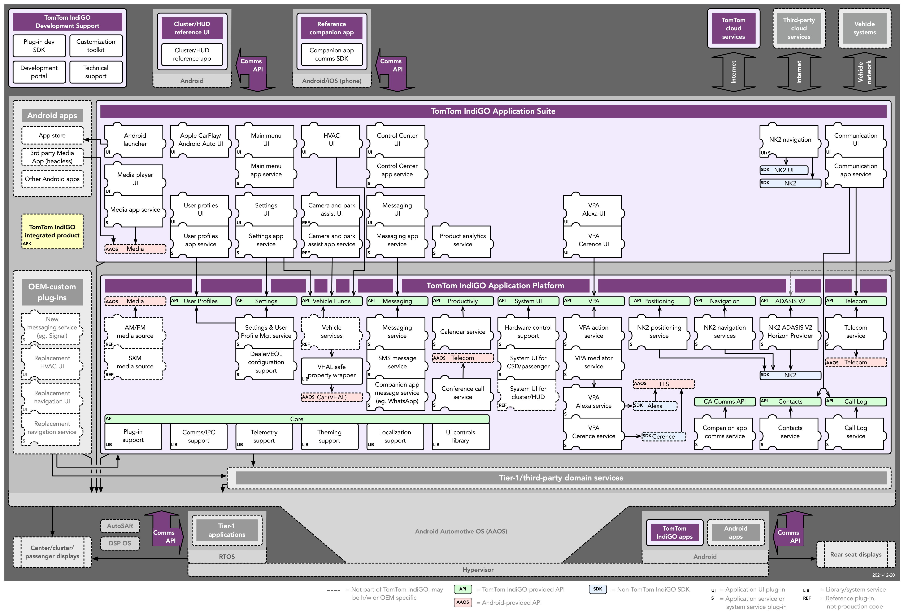

In this TomTom IndiGO development guide, you can find a set of documents that describe the
fundamentals of the TomTom IndiGO platform, and the building blocks that are used to build and
create new functionality.

The TomTom IndiGO platform is a framework built on top of
[Android Automotive](https://source.android.com/devices/automotive) OS, that allows you to create
functionality needed for digital cockpits. It comes with a set of ready-made applications, and a set
of platform APIs that extend the functionality of the standard Android Automotive platform.

The TomTom IndiGO product is deployed as one single Android APK, which means that each
_application_ for TomTom IndiGO is built as a set of plugins to the TomTom IndiGO framework. What is
deployed as part of the end product, is configured at build time. You can, for example, select which
off-the-shelf (or _stock_) TomTom IndiGO applications should be part of your product, and which ones
should be replaced with your own _applications_, or merely add new functionality.

The following diagram shows everything that’s included in TomTom IndiGO, all off-the-shelf
components (purple colored) and how these relate to other software in a vehicle.

## Off-the-shelf components (or _stock_ components)

The TomTom IndiGO platform comes with a collection of standard components. These can be used as the
off-the-shelf implementation for front-ends, servers and other components when your project has no
special requirements on them. In the source repository, _off-the-shelf components_ are referred to
as _stock components_.

In the IndiGO source code these stock components are usually created in the namespace
`com.tomtom.ivi.stock.xx`, their class names often are `StockXx` and their source code can be found
in a directory named `stock`. You may consider these as delivered directly from stock, without
further treatment or customization.

## The benefits of using off-the-shelf components

As you can see from the number of puzzle pieces in the diagram, TomTom IndiGO is extremely modular:
almost anything that is provided out-of-the-box can be customized or replaced. But many of the
applications can also be customized without any code changes, by applying a different theme to them,
or by modifying their static configuration files.

Besides the benefit of kick-starting your development with our off-the-shelf puzzle pieces, the
modular architecture provide another great benefit: we, at TomTom, keep updating TomTom IndiGO and
provide new versions of applications and services over time. By pulling these components from our
artifact repository, your system can easily benefit from software updates that we provide for the
TomTom IndiGO platform and its applications. This includes security updates as well as functional
improvements.

## Building your own services and applications

Next to the components, or puzzle pieces, there are green boxes in the diagram. These depict the
APIs that TomTom IndiGO offers on top of Android Automotive. These APIs are complementary to Android
APIs; they do not try to mimic or reimplement any Android behavior, but rather extend the Android
APIs with a lot of useful APIs for IVI software development. The description of these APIs can be
found in the API reference section of this site.

## TomTom IndiGO Fundamentals

The User Interface (UI) part of an TomTom IndiGO _application_ is built using
[frontend plugins](/tomtom-indigo/documentation/development/frontend-plugins). These are created
using standard Android layouts and fragments, together with _panels_, which are Android views made
to fit in with the TomTom IndiGO UI framework, each with its own specialized functionality. TomTom
IndiGO also comes with a set of UI controls, that are based on the standard Android controls, but
tailored for the TomTom IndiGO platform and its look and feel. You can read more about this in the
[UI controls](/tomtom-indigo/documentation/development/ui-controls) section.

The [System UI](/tomtom-indigo/documentation/development/system-ui) section explains how _panels_
are arranged, managed and presented to the user on the screen.

Non UI related logic can be wrapped in an
[IVI service](/tomtom-indigo/documentation/development/ivi-services), which provides a mechanism to
encapsulate longer-running tasks and business logic for some distinct functionality in the platform.
These are based on Android
[services](https://developer.android.com/guide/components/services), and use the same mechanisms,
but hide some of the details of the Android service implementation.

The look and feel of the TomTom IndiGO product can be changed through
[Theming and Customization](/tomtom-indigo/documentation/development/theming-and-customization),
which is based on Android's
[styles and themes](https://developer.android.com/guide/topics/ui/look-and-feel/themes), with
additional functionality to support different themes and swapping them at runtime.

The TomTom IndiGO platform is divided into different functional
[platform domains](/tomtom-indigo/documentation/development/platform-domains/overview), which are
described separately. Next to to the various domains plugins can connect with, TomTom IndiGO offers
a number of
[platform features](/tomtom-indigo/documentation/development/platform-features/overview) to further
integrate plugins with the rest of the system.
