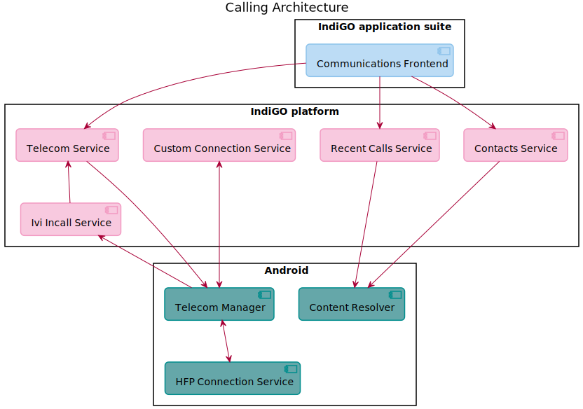
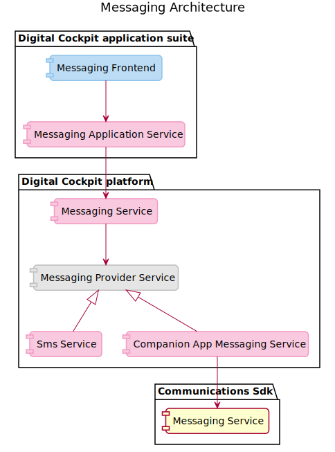

The communications domain spans the following sub-domains:

- [Making a phone call](#making-a-phone-call)
- [Send and receive messages](#send-and-receive-messages)

## Making a phone call

The TomTom IndiGO platform provides flexible architecture components that allow the integration of 
a wide range of voice calling services. The TomTom IndiGO application suite provides the end-user 
with a consistent user interface through which they can make and receive calls, as well as view 
contacts and recent calls.

The TomTom IndiGO platform comes with support for making phone calls using a Bluetooth-connected 
phone. TomTom IndiGO can also be extended to support other communications services. For example 
Voice Over Internet Protocol (VOIP) calling. This can be done by integrating an SDK of an online 
conference calling service by implementing a
[`ConnectionService`](https://developer.android.com/reference/android/telecom/ConnectionService) for
it.

How to do this is described in:
[How to create a custom connection service](/indigo/documentation/tutorials-and-examples/communications/create-a-custom-connection-service)

### High level overview

The following diagram shows a high-level overview of the architecture of calling in TomTom IndiGO.

It shows the following components:

- __Communications frontend__: This implements the user interface for incoming call notifications,
    the ongoing call process bar, as well as the recent calls and contacts list.
- __Telecom service__: This service provides support for initiating calls and getting the status
    of all current calls, both incoming and outgoing.
- __Custom connection service__: An example of a custom connection service, which can be used to
  extend TomTom IndiGO with new calling services.
- __Recent calls service__: This service provides the recent calls list.
- __Contacts service__: This service provides the contacts list.
- __IVI in-call service__: This service receives call state information from Android and passes
    this to the telecom service.
- __Telecom manager__: This is an Android service that provides calling functionality.
- __Content resolver__: This is the Android content database which, among other things provides
  the contacts and recent calls lists.
- __HFP Connection Service__: This is the Android Bluetooth hands free profile connection service,
  that implements hands free calling using a Bluetooth connected phone.

## Send and receive messages

The TomTom IndiGO platform provides flexible architecture components to allow a wide range of
messaging services to be integrated. The TomTom IndiGO application suite provides the end-user with 
a consistent user interface through which messages can be read and responded to. For some messaging
systems (like SMS) it is  also possible to directly send messages, instead of only responding to
an existing conversation.

Currently the suite comes with support for SMS, using devices connected through Bluetooth, and
WhatsApp using the example companion app.

In TomTom IndiGO, messages are subdivided in
[`Conversation`](TTIVI_INDIGO_API)s.
A conversation contains all messages sent between the user and a specific list of peers, using the
same messaging provider, like SMS, WhatsApp, Facebook Messenger, etc.

TomTom IndiGO can be extended with support for a new messaging service as follows:

- [Extending TomTom IndiGO directly](#extending-tomtom-indigo-with-a-new-messaging-service).
- [Extending the Companion App](#extending-messaging-using-a-companion-app).

### High level overview

The following diagram shows a high-level overview of the architecture of messaging in TomTom IndiGO.

It shows the following components:

- __Messaging frontend__: This implements the user interface for message notifications.
- __Messaging application service__: This provides state and business logic for the frontend.
- __Messaging service__: This service implements all messaging functionality, including providing
  a list of all current conversations.
- __Messaging provider service api__: This is a discoverable service API for transparently
  supporting multiple types of messaging.
- __SMS service__: Messaging provider implementation that adds SMS messaging support to the
  platform.
- __Companion app messaging service__: Messaging provider that adds messaging support through the
  companion app.
- __Communications messaging service__: This is the messaging service definition used for
  communications between TomTom IndiGO and the companion app.

### Extending TomTom IndiGO with a new messaging service

TomTom IndiGO can be directly extended with support for a new messaging service by implementing a
new discoverable
[`MessagingProviderService`](TTIVI_INDIGO_API).

### Extending messaging using a companion app

TomTom IndiGO comes together with a framework that supports running remote services on a companion app.
This framework also contains the communications
[`MessagingService`](TTIVI_INDIGO_API),
which can directly be used to extend TomTom IndiGO messaging.
