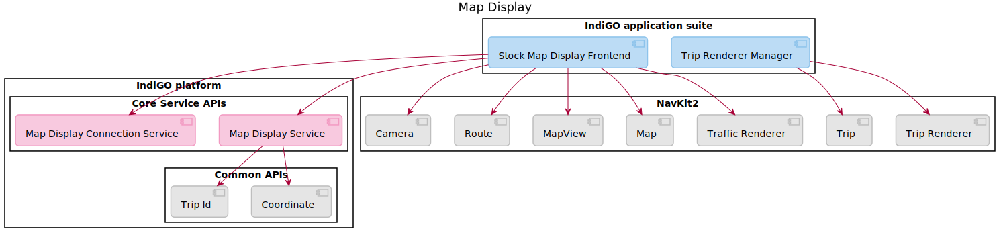
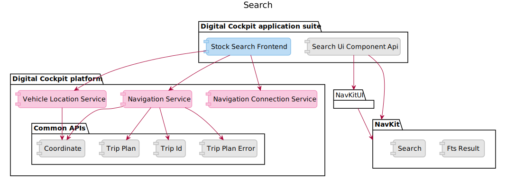
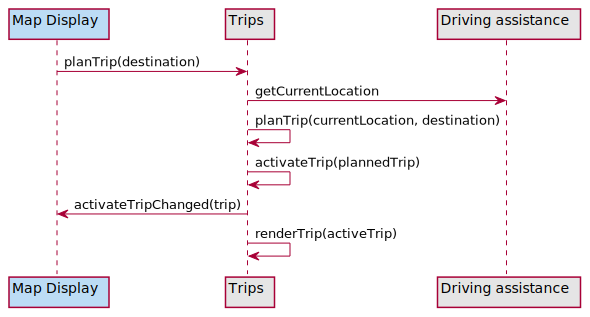
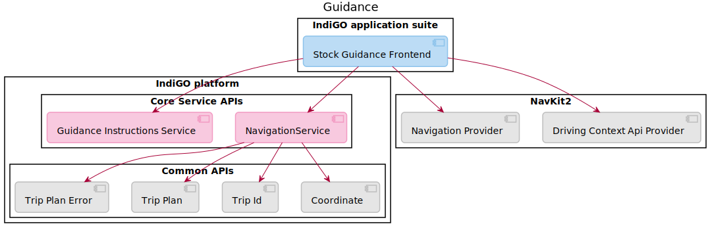

<Blockquote>
    When using TomTom IndiGO version 1.0.3880-1630 or earlier, please skip this page and instead go
    to&nbsp;
    <a href="/tomtom-indigo/documentation/development/platform-domains/navigation-navkit2">
        Navigation (NavKit2)
    </a>
    .
</Blockquote>

Navigation is central to the TomTom IndiGO experience. Online navigation enables fresh and always
up-to-date map content. It is built on top of TomTom's navigation SDK:
NavKit and makes use of common UI controls, made available through the NavKitUI SDK.

TomTom IndiGO provides a set of generic core services as well as
[_off-the-shelf_ or _stock_](/tomtom-indigo/documentation/development/introduction#off-the-shelf-components-or-stock-components)
implementations. They are built on top of NavKit and NavKitUI SDK and provide the customer with
an out of the box navigation experience. Alternatively the customer can replace the off-the-shelf
frontend and services with their own implementations.

The navigation domain includes the following sub-domains:

- [Display a map](#display-a-map)
- [Search](#search)
- [Guidance](#guidance)

## Display a map
Displaying the map using NavKit SDK requires two components: the _NavKit Map Visualisation_
library and the _NavKit Map Visualisation onboard service_ library. Additionally a suite of small
UI controls are provided by the NavKitUI SDK, such as a Zoom Control, a Map Mode Toggle, Location
Preview, etc. The _NavKit Map Visualisation_ library includes a map renderer (the component has to
be integrated with app UI) and provides access to the map surface.
The _NavKit 2 Map Visualisation_ library requires map tiles which are provided by the _NavKit 2 Map
Visualisation onboard service_. Communication between the two mentioned components is done using
inter-process communication. The _NavKit 2 Map Visualisation onboard service_ library will be
deployed in separate process to reduce impact of potential malfunction.

The following diagram shows a high-level overview of the architecture of map rendering in TomTom
IndiGO:

It shows the following components:
- __Map display frontend__: This implements the user interface for the map display.
- __Trip render manager__: Implements NavKit `Trip Renderer` and `Trip` to provide trip rendering
  functionality.
- __Map display connection service__: Provides a way to configure the map data source
  (online or onboard).
- __Map display service__: This service provides support for trip, destination, camera mode,
  collision warning zones, traffic mode and map interaction type.

## Search

The following diagram shows a high-level overview of the architecture of search in TomTom IndiGO:

It shows the following components: 
- __Search frontend__: This implements the user interface for the search functionality.
- __Search ui component api__: Provides the NavKit and NavKitUI components.
- __Vehicle location service__: This service exposes information related to the current driving
  situation and to the current location, regardless of whether a trip is planned.
- __Navigation service__: This service implements all navigation related functionality, including
  planning a trip to a user provided location.
- __Navigation connection service__: Starts and manages the background NavKit worker service.

## Guidance

Planning a trip, trip activation and visualization require the following components to interact with
each other:
- __Map display__: responsible for map interaction and visualising active trips. This component is
  described in [Display a map](#display-a-map).
- __Trips__: responsible for planning trips and managing the active trip.
- __Driving assistance__: responsible for the current location. This component also lays the
  foundation for future functionality such as route demos.

An example of the interactions between these domains is show below:

The following diagram shows a high-level overview of the architecture of guidance in TomTom IndiGO:

It shows the following components:
- __Guidance frontend__: This implements the user interface for the guidance functionality.
- __Guidance instructions service__: This service contains the data of the next guidance instruction.
- __Navigation service__: This service implements all navigation related functionality, including
  updating the active trip and monitoring for the trip for completion.
- __Navigation provider__: This manages the lifecycle of NavKit navigation instances.
- __Driving context api provider__: This manages the lifecycle of NavKit driving context API instances.
