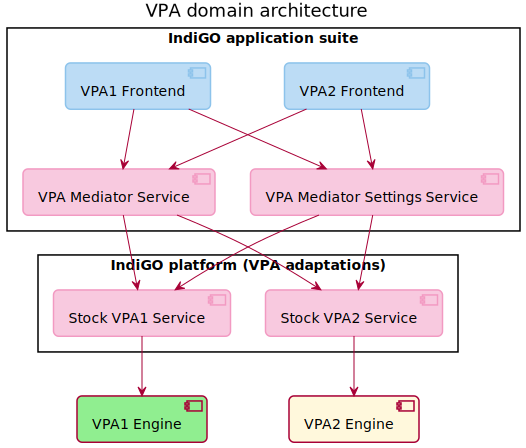

TomTom IndiGO allows the integration of one or more 3rd-party voice engines in one product, to support
Voice Personal Assistants (VPAs) in the vehicle.
A generalized interface enables the customer to speak commands and reply to system queries by voice.
For example, the user can ask the system to make a phone call or find a nearby hospital by talking
to it.

In this document we will use some terms that are specific to the voice domain (such as "wake word"
or "earcon"). A good glossary providing definitions for most of these terms is the
[Alexa Auto Glossary](https://developer.amazon.com/en-US/docs/alexa/alexa-auto/glossary.html).

## High-level overview

As explained in the introduction above, TomTom IndiGO can support one or more VPAs in one product.
Below is the high-level design of the Multi-VPA Architecture in TomTom IndiGO.

The diagram shows the most relevant components in this architecture:
- _TomTom IndiGO platform (VPA adaptations)_: Specific VPA implementations typically provide their
  engine in the form of a library in an SDK. To abstract the VPA-specific APIs away, each VPA has an
  associated Adaptation Service whose job is to interface directly with the VPA engine.
  All other components in TomTom IndiGO communicate with the VPA engine via the Adaptation Service.

  Currently, TomTom IndiGO offers an off-the-shelf implementation of a VPA Adaptation service for
  the Alexa Auto VPA, provided by the off-the-shelf Alexa service, and plans to offer a second
  implementation that will provide an abstraction for the Cerence Assistant VPA.

  __Note:__ Alexa Auto is available as part of TomTom IndiGO upon approval by TomTom and
  Amazon. To request TomTom IndiGO's implementation for Alexa Auto please contact your local sales
  representative.

- _[`VpaMediatorService`](TTIVI_INDIGO_API)_: this is a platform service whose role is to ensure
  that multiple VPAs do not interfere with each other and that commands to and from a VPA go to the
  right UI / VPA adaptation. For example:
  - It informs the UI when Alexa is speaking, so that the
    [voice chrome](https://developer.amazon.com/en-US/docs/alexa/alexa-auto/glossary.html#v) can be
    shown to the user.
  - It indicates that one VPA would like to show the user a disambiguation list and what is in that
    list.

  This service can also send requests to VPA adaptations, for example, to inform them that the
  user would like to login to their service, if that is needed.

  VPA frontends must communicate through this service to interact with a VPA.

- _[`VpaMediatorSettingsService`](TTIVI_INDIGO_API)_: this is a platform service providing access to
  all the VPA-related settings. It can be used to update settings like the language used by a VPA or
  whether the VPA can be invoked with a wake word.

- _VPA frontends_: the application frontends for the VPAs. More information on the typical features
  provided by a VPA frontend can be found in section
  [Implementing a custom VPA frontend](#implementing-a-custom-vpa-frontend).

  Currently, TomTom IndiGO offers an off-the-shelf implementation of a frontend, the _Alexa
  frontend_, designed to be used with the Alexa Auto VPA. This frontend has multiple
  responsibilities:
  - Showing the current state of the dialogue with the Alexa Auto VPA using the Alexa-branded
    [voice chrome](https://developer.amazon.com/en-US/docs/alexa/alexa-auto/glossary.html#v).
  - Playing the Alexa [earcon](https://developer.amazon.com/en-US/docs/alexa/alexa-auto/glossary.html#e)
    sounds.
  - Rendering the UI that presents visual information from Alexa that complements the voice
    output. Examples include the weather forecast, POI search results, or the user's shopping list.

## Implementing a custom VPA frontend

The TomTom IndiGO application suite provides an off-the-shelf Alexa frontend as well as a simple
generic VPA frontend that shows how to build a frontend for a second VPA.

As explained in the previous section, the most important service that should be used by a VPA
frontend is the VPA mediator service.

This service provides a number of properties that should be observed to build the UI for a VPA,
such as:
- The VPA properties, like the current locale(s) or whether the
  [wake word](https://developer.amazon.com/en-US/docs/alexa/alexa-auto/glossary.html#w) is enabled.
- The VPA authentication state.
- The VPA conversation state: whether the VPA is idle, listening, thinking, speaking or
  expecting an answer from the user.
- The VPA UI visibility state: whether the VPA UI should be visible or hidden.
- The visual metadata that should be shown by the UI to complement a voice interaction.

Additionally, if the request was initiated from the UI rather than by voice, the VPA frontend can
also send a number of requests to a VPA by calling VPA mediator service methods.
This may be needed to allow the end-user to be able to perform a function with a mixture of voice
and touch, to ensure that the VPA still has the right context.
For example:
- To log in or log out of a VPA.
- To request a VPA to start listening (for example, if a
  [Tap-to-talk](https://developer.amazon.com/en-US/docs/alexa/alexa-auto/glossary.html#t) button
  was pressed).
- To stop an ongoing voice interaction (for example, if the UI showing the visual metadata for an
  interaction was dismissed by the user).
- To perform some other action that was triggered from the VPA UI (for example, placing a phone call
  or starting a navigation to one of the POI (Point Of Interest) search results shown by the
  frontend).

Typically, a VPA frontend would render 2 main UI components:
- A "chrome" component that is only activated when a voice interaction is ongoing, showing the VPA's
  dialogue state (for example, whether the VPA is idle, listening, thinking, speaking, or
  expecting an answer from the user).

  In the off-the-shelf Alexa frontend, this is implemented as an [`OverlayPanel`](TTIVI_INDIGO_API)
  that temporarily overlays the system UI's main content area.
- A "template" component that is displayed when the VPA provides additional visual metadata that
  complements the current voice interaction. Typically, VPAs provide this visual information for
  many user requests, such as:
  - The weather forecast.
  - POI (Point Of Interest) searches (for example, the closest bars and restaurants).
  - Shopping lists or calendars that are associated with the VPA user account.
  - Information about subjects that are available on Wikipedia.

  In the off-the-shelf Alexa frontend, the "templates" are rendered inside a
  [`VpaNotificationPanel`](TTIVI_INDIGO_API), which behaves like a
  [`NotificationPanel`](TTIVI_INDIGO_API), but also stops the current voice interaction when
  dismissed.

