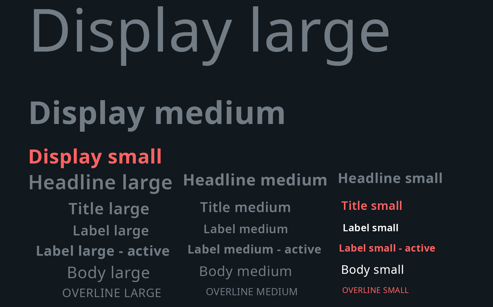

In TomTom IndiGO, the
[System UI](/tomtom-indigo/documentation/development/system-ui)
is made up of a number of panels, such as the main menu, notifications, etc.
Each panel visually represents a frontend through a fragment made up of different UI elements like
text, images, buttons, etc. To ensure a consistent UI style and to minimize implementation effort,
these elements are implemented as reusable UI controls in the
[TomTom Android Tools](/tomtom-indigo/api-reference/api-reference) library. They support various 
forms of user interaction and their appearance can be easily customized.

The `com.tomtom.tools.android.core.theme` module declares the view element attributes that these
controls need, to define their appearance. When using these controls, it is mandatory to define
these attribute values. For further information, check the
[Theming](/tomtom-indigo/documentation/development/theming-and-customization)
documentation.

For more details of these controls, see the [`api_uicontrols`](TTIVI_ANDROID_TOOLS_API) module.

The most commonly used custom controls are:

- [TextView](#textview)
- [Button](#button)
- [TextInputField](#textinputfield)
- [ImageView](#imageview)
    - [TtRemoteImageView](#ttremoteimageview)
    - [TtRoundedImageCardView](#ttroundedimagecardview)
- [List](#list)
    - [TtListLinearLayout](#ttlistlinearlayout)
    - [TtListTableLayout](#ttlisttablelayout)
    - [TtListRecyclerView](#ttlistrecyclerview)
- [ScrollBar](#scrollbar)
- [ScrollView](#scrollview)
- [ProgressBar](#progressbar)

Other controls that are available in TomTom IndiGO are:

- [InformationControl](#informationcontrol)
- [NavigationBar](#navigationbar)
- [SearchView](#searchview)
- [SeekBar](#seekbar)
- [TabBar](#tabbar)

## Common controls

### TextView

The [`TtTextView`](TTIVI_ANDROID_TOOLS_API) class is a user interface element that represents a label
control that displays text to the end-user. It acts in a similar way to Android's
[`TextView`](https://developer.android.com/reference/android/widget/TextView)
but should be used instead of it (or similar) classes so that the UI of the frontend being developed
is consistent with the rest of the UI of the IVI system.

In contrast to the Android class
[`AppCompatTextView`](https://developer.android.com/reference/androidx/appcompat/widget/AppCompatTextView),
this control also provides predefined option for; Vertical alignment.

Examples of [`TtTextView`](TTIVI_ANDROID_TOOLS_API)s configured in various ways:

### Button

The [`TtButton`](TTIVI_ANDROID_TOOLS_API) class provides a basic form of interaction. It can be tapped
on to trigger an action.

The [`TtButton`](TTIVI_ANDROID_TOOLS_API) adds to the Android class
[`AppCompatButton`](https://developer.android.com/reference/androidx/appcompat/widget/AppCompatButton)
the following features:

- You can provide a drawable, a text label or both, that will be shown on the button.
- Showing a badge on top of the drawable is also possible. A typical use case could be to inform the
  user when something changes, like new messages become available.
- Several types of buttons are defined. They all have a different appearance and should be used for
  different use cases:
    - __Primary__ is used for actions with the most emphasis.
    - __Secondary__ is used for actions with less emphasis.
    - __Tertiary__ is used for actions with the least emphasis.
    - __Acceptance__ is used for actions with a positive emphasis that results in success.
    - __Destructive__ is used for negative actions, like flow cancellation or data deletion.
    - __Floating__ is used for buttons which hover over content to promote an action.
    - __Toggle__ is used for buttons which allow the user to change a setting between two states.

### TextInputField

The [TtTextInputField](TTIVI_ANDROID_TOOLS_API) class lets the user enter text. You can set a hint
text in the input field, as a placeholder for the input text. Also, you can provide a helper text,
shown below the input field, to help the user understand which information is requested.

Apart from these you can also provide error text, which is also shown below the input field. This
can be used to indicate to the user that the entered input is incorrect, or that an error occurred
as a result of the input.

There is a `clear` icon, for the user to clear the input.

### ImageView

#### TtRemoteImageView

The [`TtRemoteImageView`](TTIVI_ANDROID_TOOLS_API) class is used to asynchronously load and display 
a remote image from a given URI.

The [`TtRemoteImageView`](TTIVI_ANDROID_TOOLS_API) adds to the Android class
[`AppCompatImageView`](https://developer.android.com/reference/androidx/appcompat/widget/AppCompatImageView)
the following features:

- An image placeholder can be displayed while waiting for the remote image to be downloaded.
- The remote image will be downloaded from the given URI automatically. When the download is
  completed, the image placeholder will be replaced by the retrieved image. No caching is
  implemented for images in [`TtRemoteImageView`](TTIVI_ANDROID_TOOLS_API) objects.
- A cross-fade animation is applied when the image changes. You can control the animation duration.
  When applying a radius to the image filter, you control the blurriness of the image during this
  transition.

#### TtRoundedImageCardView

The [`TtRoundedImageCardView`](TTIVI_ANDROID_TOOLS_API) class is designed for displaying rounded
images with a small text overlay.

This control consists of layered elements, from top to bottom:

- a text label;
- a foreground image;
- a source image;
- a background image.

The source image can be retrieved from a given URI, optionally showing a placeholder image
until the source image has been downloaded.

### List

#### TtListLinearLayout

The [`TtListLinearLayout`](TTIVI_ANDROID_TOOLS_API) class presents views as a list.

The [`TtListLinearLayout`](TTIVI_ANDROID_TOOLS_API) adds to the Android class
[`LinearLayout`](https://developer.android.com/reference/android/widget/LinearLayout)
the following features:

- You can provide your own
  [ViewModel](https://developer.android.com/reference/androidx/lifecycle/ViewModel)s
  and item layout to populate view items in this list.
- You can specify the maximum number of items to be displayed in the view.

#### TtListTableLayout

The [`TtListTableLayout`](TTIVI_ANDROID_TOOLS_API) class presents views as a table, with multiple rows
and columns.

The [`TtListTableLayout`](TTIVI_ANDROID_TOOLS_API) adds to the Android class
[`TableLayout`](https://developer.android.com/reference/android/widget/TableLayout)
the following features:

- You can provide your own
  [ViewModel](https://developer.android.com/reference/androidx/lifecycle/ViewModel)s
  and item layout to populate view items in this list.
- You can specify the maximum number of items to be displayed in the view.

#### TtListRecyclerView

The [`TtListRecyclerView`](TTIVI_ANDROID_TOOLS_API) class makes it easy to efficiently display large
sets of data.

The [`TtListRecyclerView`](TTIVI_ANDROID_TOOLS_API) adds to the Android class
[`RecyclerView`](https://developer.android.com/reference/androidx/recyclerview/widget/RecyclerView)
the following features:

- You can provide your own
  [`ViewModel`](https://developer.android.com/reference/androidx/lifecycle/ViewModel)s
  and the layout to define how each item looks. The
  [`ViewModel`](https://developer.android.com/reference/androidx/lifecycle/ViewModel)
  can be:
    - A _header ViewModel_ containing an image and a text.
    - A _content ViewModel_ is used to populate a [`TtInformationControl`](TTIVI_ANDROID_TOOLS_API).
- You can provide a sticky header. This is a header view that is always shown at the top of the
  [`TtListRecyclerView`](TTIVI_ANDROID_TOOLS_API) and does not disappear while scrolling.

### ScrollBar

The [`TtScrollBar`](TTIVI_ANDROID_TOOLS_API) class is used to control the attached view and to
visualize the scrolling status. Apart from the basic scroll bar functionalities, this control also
provides some dditional features:

- A scroll bar indicator. The indicator is an extra view, shown next to the scroll bar handle and
  attached to the scroll bar's parent view. It presents some extra information like a text or a
  drawable, based on the current scrolling position.
- An `up` button at the top of the bar, and a `down` button at the bottom of the bar.
- Scroll by page. A tap-and-hold of the `up` or `down` button scrolls the target view page by page.
- Scroll to top. A tap-and-hold of the `up` button scrolls the target view to the top page.

You can configure the [`TtScrollBar`](TTIVI_ANDROID_TOOLS_API) for either scroll-by-page or
scroll-to-top, but not both.

Here is an example demonstrating a combined usage of [`TtScrollBar`](TTIVI_ANDROID_TOOLS_API) and
[`TtListRecyclerView`](TTIVI_ANDROID_TOOLS_API). From the image, you can see the star icon as the 
`up` button on the top of the bar. Also, the scroll bar indicator shows `D` for the current scroll
position.

### ScrollView

The [`TtScrollView`](TTIVI_ANDROID_TOOLS_API) class provides the Android
[`ScrollView`](https://developer.android.com/reference/android/widget/ScrollView)
functionalities, but can only scroll vertically. You can specify the position of a fading effect as
one of the following:

- Top edge only.
- Bottom edge only.
- Top and bottom edges.

## Other controls

### ProgressBar

The [`TtSmoothProgressBar`](TTIVI_ANDROID_TOOLS_API) class is used to indicate the progress of an
operation.

The [`TtSmoothProgressBar`](TTIVI_ANDROID_TOOLS_API) adds to the Android class
[`ProgressBar`](https://developer.android.com/reference/android/widget/ProgressBar)
the following features:

- The progress is updated smoothly by an
  [`Animator`](https://developer.android.com/reference/android/animation/Animator).

### InformationControl

The [`TtInformationControl`](TTIVI_ANDROID_TOOLS_API) class is designed to present various types of
information in a view. It can be used in different places across the system, like lists,
notifications, process bar, etc.

The content within this control consists of three sections that can be configured individually:

- The optional _head section_ is positioned on the left and holds an image.
- The _main section_ is positioned in the center. It starts with three vertically aligned text 
  areas, with an optional icon: primary, secondary and tertiary. At the bottom it shows a rating bar
  with a dedicated text label.
- The optional _tail section_ is positioned on the right and holds a text and an image. The user can
  choose whether to show either the text or the icon, or both.

An action can be triggered when the user taps the _head section_ or the _main section_. A separate
action can be triggered when the user taps the _tail section_.

### NavigationBar

The [`TtNavigationBar`](TTIVI_ANDROID_TOOLS_API) class is mainly used to navigate between different
screens within a domain or a panel.

It optionally shows a back button. Next to the back button is either a title or a number of
breadcrumb items. The breadcrumbs reflect the current back stack and allow clicking on the items in
order to navigate backwards through the stack.

The navigation bar can be configured to look as:

### SearchView

The [`TtSearchView`](TTIVI_ANDROID_TOOLS_API) class consists of an icon on the left, an input field in
the middle, a _clear icon_, and a _searching indicator_ on the right.

The [`TtSearchView`](TTIVI_ANDROID_TOOLS_API) adds to the Android class
[`SearchView`](https://developer.android.com/reference/android/widget/SearchView)
the following features:

- The searching indicator.
- The appearance, like visibility of the _searching indicator_, is affected by the search status:
  focused, searching, etc.

This is how the control looks while a search is in progress, with the _clear icon_ visible and the
_searching indicator_ animating:

### SeekBar

The [`TtSmoothSeekBar`](TTIVI_ANDROID_TOOLS_API) class is used to indicate the progress of an operation
with a draggable thumb. The user can touch the thumb and drag left or right to set the current
progress.

The [`TtSmoothSeekBar`](TTIVI_ANDROID_TOOLS_API) adds to the Android class
[`AppCompatSeekBar`](https://developer.android.com/reference/androidx/appcompat/widget/AppCompatSeekBar)
the following features:

- The progress is updated smoothly by an
  [`Animator`](https://developer.android.com/reference/android/animation/Animator).

### TabBar

The [`TtTabBar`](TTIVI_ANDROID_TOOLS_API) class contains tab components and a tab indicator. A tab
usually represents a group of content and the tab bar is used to organize and navigate between these
groups. The tabs within the tab bar can be visually represented by an icon, a text or both. The tabs
can have a fixed or a flexible width, depending on the configuration. When a tab is selected, it
will be highlighted and the tab indicator moves under the selected tab.

