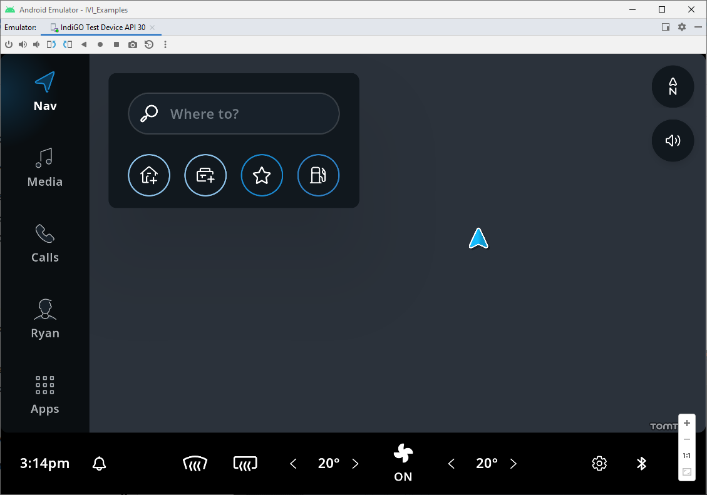
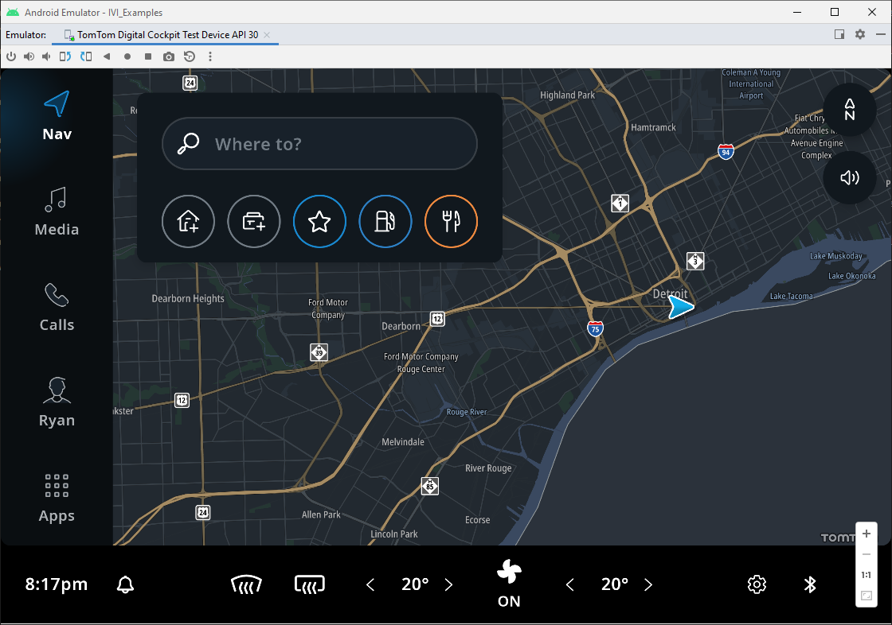

<Blockquote>
    When using TomTom IndiGO version 1.0.3880-1630 or earlier, you should have followed the
    instructions on&nbsp;
    <a href="/tomtom-indigo/documentation/getting-started/getting-the-tomtom-api-key-navkit2">
        Getting the TomTom API Key (NavKit2)
    </a>
    .
    Skip the instructions on this page, and go directly to the&nbsp;
    <a href="/tomtom-indigo/documentation/getting-started/accessing-the-map-data#next-steps">
        Next steps
    </a>
    &nbsp;section.
</Blockquote>

TomTom IndiGO uses an on-board map for its navigation features, but this map is not included in the
SDK package or in the emulator image. You must download and install the map separately.

## Downloading the map

Under the terms of the
[TomTom IndiGO evaluation license](/tomtom-indigo/documentation/getting-started/introduction)
a few demonstration maps are provided in the
[Artifact Repository](/tomtom-indigo/documentation/getting-started/accessing-the-artifact-repository).
Click one of these links and download the map of your choice:

- A map of the USA state of
  [Michigan](https://repo.tomtom.com/#browse/browse:ivi:com%2Ftomtom%2Findigo%2Ftomtom-indigo-maps/usa-michigan).

Each map consists of a keystore file and a tarball with the map data.


## Installing the map

Make sure you have built the `IVI Template App` and running it in the 
[TomTom IndiGO emulator](/tomtom-indigo/documentation/getting-started/the-tomtom-indigo-emulator#running-the-tomtom-indigo-emulator), 
if you are installing the on-board map on an emulator.

<Blockquote>
  The on-board map and keystore file need to be installed for each application individually. In 
  these instructions the target application is the IVI Template App, with the package 
  name <code>com.example.ivi.template.app</code>. For one of the example apps, use the package name 
  from that specific AndroidManifest.xml file.
</Blockquote>

To install a downloaded map on the emulator or on a real device:

- Push the keystore file:

```cmd
adb root
adb shell mkdir /data/media/10/Android/data/com.example.ivi.template.app/files/keystore
adb push NK_AUTO_DEV.NKS /data/media/10/Android/data/com.example.ivi.template.app/files/keystore
```

- Extract the downloaded tarball with map data, and push it to the target device:

```cmd
adb push my-folder-with-map-data /data/media/10/Android/data/com.example.ivi.template.app/files/map/
```

- Restart the `IVI Template App`:
  - Swipe up from the bottom of the device's screen.
  - Click on the _All apps_ menu icon (grid of nine squares).
  - Scroll down and select _Settings_.
  - Scroll down and select _Apps & notifications_.
  - Select _Show all apps_.
  - Scroll down and select _IVI Template App_.
  - Select _Force stop_ on the top right of the screen and click _OK_.
  - Click on the _All apps_ menu icon (grid of nine squares).
  - Scroll down and restart the _IVI Template App_

If the map and keystore file were succesfully installed, you will now see a blue chevron appear.



## Setting the emulator location

The IVI Template App's navigation features only work if the emulator device's location is within
the on-board map's region. 

- Change the device's location:
  - Press the _Extended Controls_ menu icon (three vertical dots) in Android Studio's Emulator window.
  - Select _Location_ from the menu.
  - Enter and select a location within the on-board map's region in the _Search_ bar.
  - Select _Set Location_.

The on-board map should now be visible and navigation features operational.




### Using other map regions

If you need a map for an area not included in these demo maps, please ask your TomTom
representative.

## Next steps

Congratulations, you now have an operational TomTom IndiGO environment.

From here on, you have several options:

- Experience the
  [off-the-shelf features](/tomtom-indigo/documentation/platform-overview/example-apps#off-the-shelf-functionality)
  in the template application.

- Build and execute the example applications, as explained in the
  [Tutorials and Examples](/tomtom-indigo/documentation/tutorials-and-examples/overview) section.

- Use the
  [Debug Menu](/tomtom-indigo/documentation/getting-started/the-debug-menu)
  to explore the TomTom IndiGO platform in more detail. For example, by
  [starting a route demo](/tomtom-indigo/documentation/getting-started/frequently-asked-questions-faq#how-do-i-start-a-route-demo).

- As the TomTom IndiGO platform evolves, you can integrate its newest features by following the
  instructions on the
  [Upgrade to a Newer Version of TomTom IndiGO](/tomtom-indigo/documentation/getting-started/upgrade-to-a-newer-version-of-tomtom-indigo)
  page.

- When you want to learn more about Kotlin or the Android platform, explore the documentation listed
  on the
  [Additional Resources](/tomtom-indigo/documentation/getting-started/additional-resources)
  page.

- If you encounter any issues, please consult our
  [Frequently Asked Questions](/tomtom-indigo/documentation/getting-started/frequently-asked-questions-faq).
