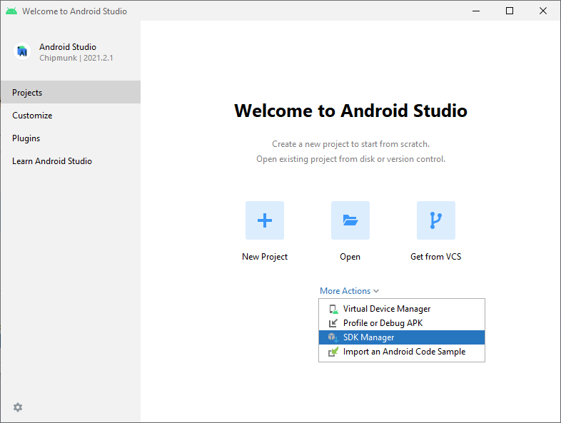
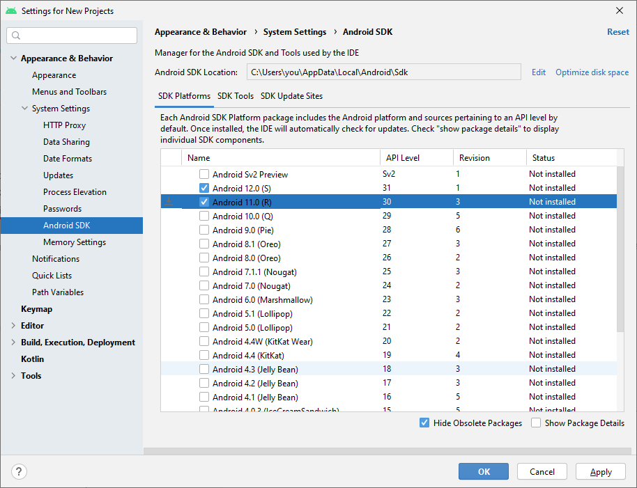
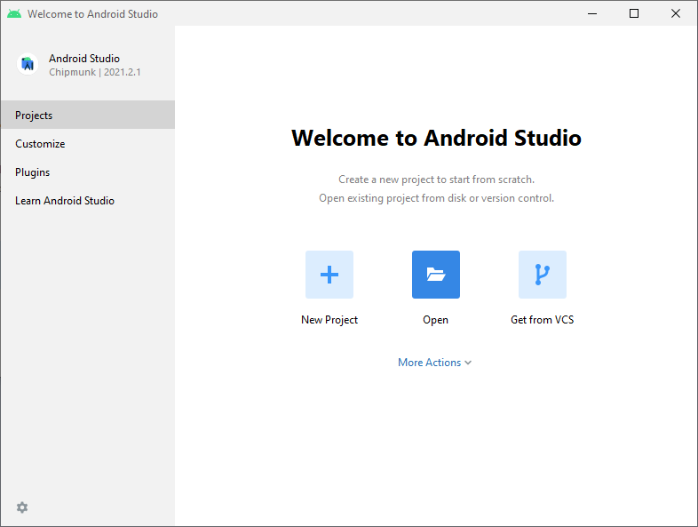
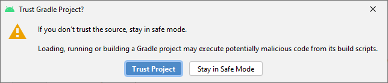
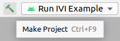

To install the Android Studio IDE, follow the instructions from the
[official Android guide](https://developer.android.com/studio/install).
For TomTom IndiGO you will need Android Studio version Arctic Fox 2020.3.1 or newer.

If you already have this Android Studio version installed, you can proceed to section
[Building with Android Studio](#building-with-android-studio).

When opening Android Studio for the first time, a dialog box `Import Android Studio Settings` may
show. Select `Do not import settings` and click `OK`.


## Gradle plugin for Android Studio

During this installation, or at any time after that, Android Studio may propose upgrading its Gradle
plugin:


__Ignore this upgrade!__ The TomTom IndiGO build files specify the exact version of the plugin that is
needed. The upgrade by Android Studio would change the TomTom IndiGO build files to use a wrong and
hard-coded version of this plugin.

## Building with Android Studio

This section explains how to configure Android Studio for building the
[TomTom IndiGO example app](/tomtom-indigo/documentation/platform-overview/example-app),
and how to build this application.

Install Android 11 (R) SDK:

- In the `Welcome to Android Studio` dialog, select `More Actions` > `SDK Manager`.



- The `Settings for new projects` dialog appears. In tab `SDK Platforms`, verify whether
  `Android 11.0 (R)` is installed. If not yet installed, enable it and click `Apply`.



Now open the TomTom IndiGO example app project:

- In the `Welcome to Android Studio` dialog, select `Open`.



- When this dialog does not show, you can open the project via `File` > `Open`.

- Open the `examples/products_indigo_examples_<version>-sources` folder where you extracted the
  source code.

- Select the `build.gradle.kts` file from this folder, and click `OK`.

- Android Studio may show a popup `Trust Gradle Project?`, on which you must click the `Trust
  Project` button.



Ensure that Android Studio uses `OpenJDK11`:

- Go to `File` > `Settings` then open the tab
  `Build, Execution, Deployment` > `Build Tools` > `Gradle`.
    - __Mac__: Go to `Android Studio` > `Preferences...` then open the tab
      `Build, Execution, Deployment` > `Build Tools` > `Gradle`.

- Under `Gradle JDK` select the OpenJDK version that you downloaded earlier (normally shown under
  `JAVA_HOME`) and click `OK`.

Gradle Sync should start running automatically, then Android Studio will configure the project and
download its dependencies. If it does not, start it manually by clicking on the Gradle Sync icon.
This step takes several minutes, depending on your internet connection and your PC's hardware
configuration.


Now you can browse the source code in the IDE.

Build the application by clicking on the `green hammer` icon:



__Note:__ Building the application may report an error like below. When this happens, open the SDK
Manager via `Tools` > `SDK Manager`, then in tab `SDK Tools` tick `Show Package Details` and
install the required package and/or accept its license terms.

```cmd
License for package Android SDK Build-Tools 30.0.2 not accepted.
```


__Next step:__ [The TomTom IndiGO emulator](/tomtom-indigo/documentation/getting-started/the-tomtom-indigo-emulator).
