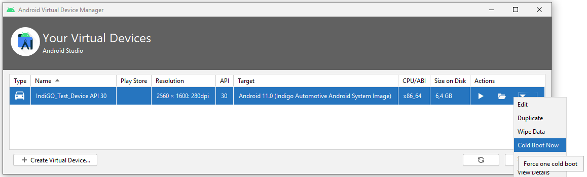

Table of content:

- [When building, there are a lot of unresolved dependencies](#when-building-there-are-a-lot-of-unresolved-dependencies)
    - [Missing credentials](#missing-credentials)
    - [Incorrect Nexus repository credentials](#incorrect-nexus-repository-credentials)
- [There is no map and/or search does not work](#there-is-no-map-andor-search-does-not-work)
    - [Network connection](#network-connection)
    - [TomTom API key](#tomtom-api-key)
- [How to open/close the Debug Menu?](#how-to-openclose-the-debug-menu)
- [How to start a Route Demo?](#how-to-start-a-route-demo)
- [I am using a Mac(book) with an M1 chip and cannot start the android emulator](#i-am-using-a-macbook-with-an-m1-chip-and-cannot-start-the-android-emulator)
- [Insufficient storage when installing the APK](#insufficient-storage-when-installing-the-apk)
- [The Android emulator is slow at starting](#the-android-emulator-is-slow-at-starting)
- [How to cold boot the emulator?](#how-to-cold-boot-the-emulator)
- [RuntimeException: Required support for OpenGL standard derivatives is missing](#runtimeexception-required-support-for-opengl-standard-derivatives-is-missing)
- [Android Studio does not install the application](#android-studio-does-not-install-the-application)
- [Installing on a custom device](#installing-on-a-custom-device)

---

## When building, there are a lot of unresolved dependencies

### Missing credentials

For example, when you get the following compilation errors, then your Nexus credentials may be
stored incorrectly or are missing.

```bash
Execution failed for task ':buildSrc:compileKotlin'.
> Could not resolve all files for configuration ':buildSrc:compileClasspath'.
   > Could not find com.tomtom.ivi.platform.gradle:api_framework_config:1.0.2264.
     Searched in the following locations:
     etc...
```

Check that you have stored the credentials properly in file `~/.gradle/gradle.properties`.

__Windows:__ File `%UserProfile%\.gradle\gradle.properties`

__Note:__ The username and password should __not__ be surrounded by quotation marks.

__Note:__ On some operating systems, a hash character `#` in the username or password must be
escaped as `\#` to be properly recognized.

If your credentials are properly stored, then the environment variable `GRADLE_USER_HOME` may point
to a folder other than `~/.gradle/`. Check this environment variable and move your
`gradle.properties` file to the correct location. You can check where it points to during the build
when compiling with `--debug` and look in the logs for `Gradle user home:`

__Windows:__ Folder `%UserProfile%\.gradle\`

### Incorrect Nexus repository credentials

If your build output contains `Received status code 401 from server: Unauthorized`, then Gradle does
find the credentials, but the server rejects them. So the credentials are incorrect.

For example:

```bash
> Could not GET 'https://repo.tomtom.com/repository/ivi/com/tomtom/ivi/gradle/api_plugins_platform/1.0.1859/api_plugins_platform-1.0.1859.pom'. Received status code 401 from server: Unauthorized
```

---

## There is no map and/or search does not work

### Network connection

When you start the application for the first time, you should see a map of the world as background
to the application. If this is not there, it may mean that the device/emulator cannot connect to a
network.

On the emulator, open the `Settings` and enable `Wi-Fi`. Then cold boot the emulator.  See detailed
instructions in
[The TomTom IndiGO emulator device](/indigo/documentation/getting-started/the-indigo-emulator#the-tomtom-indigo-emulator-device)
under `Enable wifi` and `Now restart the emulator`.

For a real device, make sure that it has a working Internet connection.

### TomTom API key

Another reason for this behavior may be that you have not configured a TomTom API key, or you are
using an API key with limited authorizations.

For more details see
[Getting the TomTom API key](/indigo/documentation/getting-started/getting-the-tomtom-api-key).

---

## How to open/close the Debug Menu?

TomTom IndiGO provides a debug menu giving access to functionality that is not normally available 
to the end-user. For example, starting a route demo.

Opening the debug menu:

- On the emulator, press the backtick ("\`") key on your keyboard.
- On a real device, long press the "volume down" key.

To close the debug menu, perform the same action again.

---

## How to start a Route Demo?

A route demo is a simulation of a drive along a currently planned route on the device, this may be
useful to see what happens at the various points along the route, without the need to go for an
actual drive.

To plan a route, long press on any point on the map, and a route will be planned from the current
position, to this location.

In order to allow position simulation, you first need to enable Developer Options in Android:

- On the emulator, go to the `Settings` menu:
    - Press the Home button (the circle in the sidebar outside the emulator screen).
    - Select `Car Launcher as Home` > `Just Once`.
    - Press the Android application icon (nine dots in a grid) at the bottom of the screen.
    - Scroll down and open `Settings`.
- Scroll down and open `System`, then open `About`.
- Find `Build number` and tap this seven times, after which a `You are now a developer!` toast
  appears to confirm that developer options are enabled.

Enable location mocking:

- Go back to the System menu and scroll down to `Developer options`.
- Scroll down and select `Select mock location app`.
- Select `IVI Example`.
- This setting is persistent until you uninstall the application.

Cold boot the emulator, as explained in the
[How to cold boot the emulator?](#how-to-cold-boot-the-emulator) section.

Start a Route Demo:

- Make sure a route has been planned.
- Open the debug menu.
- Scroll right until you find the `Navigation` tab.
- Press `START ROUTE DEMO`.
- Close the debug menu.

---

## I am using a Mac(book) with an M1 chip and cannot start the Android emulator

Attempting to start the Android emulator results in:

```bash
The emulator process for AVD IndiGO_Emulator was killed.
```

and installing the emulator accelerator package from the Android Update Site results in:

```bash
Your CPU does not support VT-x. Unfortunately, your computer does not support hardware accelerated virtualization.
```

The Apple M1 processor is not an Intel-based chip and the hardware-accelerated virtualization
package does not work on this processor architecture. Special setup is required to get even the
default Android emulator working, so this is not just a TomTom IndiGO-specific problem. Official 
Android support for this chip is still in progress.

The previous instructions on how to configure an Android Virtual Device, specify exceptions for
computers with the M1 processor. Please verify that you have followed those exceptions.

---

## Insufficient storage when installing the APK

You may encounter an `Insufficient storage` message when installing the APK on the emulator. Ensure
that the emulator AVD has sufficient disk storage configured:

- In Android Studio open the AVD Manager via `Tools` > `AVD Manager`.
- Edit the TomTom IndiGO AVD by clicking its pencil icon in the `Actions` column.
- Click `Show Advanced Settings` and scroll down to the `Memory and Storage` section. Ensure these
  fields have at least the following values:
    - `RAM` : `3072 MB`
    - `VM heap` : `192 MB`
    - `Internal Storage` : `2048 MB`


- Click `Finish`.

Cold boot the emulator, as explained in the
[How to cold boot the emulator?](#how-to-cold-boot-the-emulator) section.

---

## The Android emulator is slow at starting

The emulator may be slow at starting up on some configurations, especially the first time and
especially on an Apple Mac.

Locate the `config.ini` file for the AVD you are using for running TomTom IndiGO in the emulator. 
If you have followed the instructions in
[The TomTom IndiGO Emulator](/indigo/documentation/getting-started/the-indigo-emulator), it should 
be at the following location:

__Linux or Mac:__ `~/.android/avd/IndiGO_Test_Device_API_30.avd/config.ini`

__Windows:__ `%UserProfile%\.android\avd\IndiGO_Test_Device_API_30.avd\config.ini`

Otherwise it could be in one of the other `.avd` folders at that location.

When you have found the `config.ini` file, you can try a few things:

- Try disabling sound, as it may cause the emulator to generate a high CPU load:

```bash
hw.audioInput=no
hw.audioOutput=no
```

- Check that you have sufficient RAM:

```bash
hw.ramSize=3072
```

---

## How to cold boot the emulator?

In some situation a cold boot of the emulator is required, for example after changing its
configuration, or as a precaution when unexpected behavior occurs.

To cold boot the emulator, follow these steps:
- If the emulator is running, click the `x` in the upper-right corner of the emulator sidebar.
- In Android Studio go to: `Tools` > `AVD Manager`.
- On the right-hand side of each configured AVD there is a down-arrow that launches a context menu.
  Press the down-arrow (instead of pressing the green Play button), and select `Cold Boot Now`.

- 

Now wait for the emulator to start up.

---

## RuntimeException: Required support for OpenGL standard derivatives is missing

When you launch the application on emulator, it crashes and restarts in a never-ending loop. Look
in the logcat and if you get the following error, you need to set the emulator's OpenGL ES API
level to 3.1:

```bash
com.tomtom.ivi.example.product.exampleapp E/AndroidRuntime: FATAL EXCEPTION: GLThread 667
    Process: com.tomtom.ivi.example.product.exampleapp, PID: 5705
    java.lang.RuntimeException: Required support for OpenGL standard derivatives is missing.
        at com.tomtom.navkit.map.TomTomNavKitMapJNI.SurfaceAdapter_onSurfaceCreated(Native Method)
        at com.tomtom.navkit.map.SurfaceAdapter.onSurfaceCreated(SurfaceAdapter.java:170)
        at com.tomtom.navkit.map.sdk.MapView$Renderer.onSurfaceCreated(MapView.java:320)
        at android.opengl.GLSurfaceView$GLThread.guardedRun(GLSurfaceView.java:1541)
        at android.opengl.GLSurfaceView$GLThread.run(GLSurfaceView.java:1272)
```

To fix this, set the emulator's OpenGL ES API level to 3.1 and restart the emulator, as explained in
[The TomTom IndiGO emulator device](/indigo/documentation/getting-started/the-indigo-emulator#the-tomtom-indigo-emulator-device)
under `Set the Emulator's OpenGL` and `Now restart the emulator`.

---

## Android Studio does not install the application

Sometimes Android Studio does not install your new application after a rebuild but instead launches
a previously installed version present on the emulator or target device. To solve this, enable the
package manager to handle installs:

- Open the `Run/Debug Configurations` dialog via `Run` > `Edit Configurations...`.
- In this dialog tick the box `Always install with package manager`.

Configuration `Run IVI Example` as delivered with the SDK has these settings pre-configured.


---

## Installing on a custom device

Some features of the TomTom IndiGO example application require system permissions. For instance, 
you won't be able to play music using Spotify nor use HVAC features. If you want to install the 
example app on a different emulator or device, you need to make sure that it is signed with the 
corresponding platform key.

The TomTom Indigo platform debug key and password files, used for the pre-created tablet and 
emulator images, are in the `keystore` directory in the example source. Drop in your own platform 
keys, replacing the existing ones in that directory, then rebuild and deploy.
